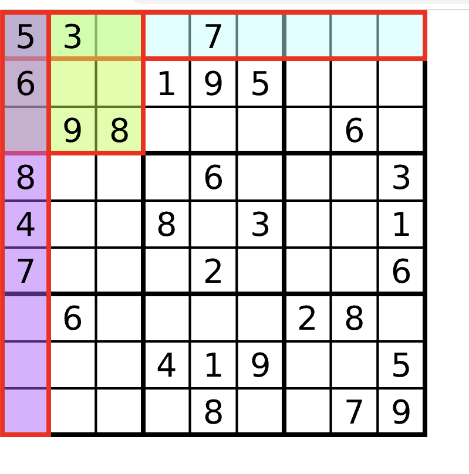

# Sudoku

* $$9X9$$ 행렬에서 아래 그림과 같이 모든 행/열/$$3X3$$ 행렬에서 중복된 숫자가 발생하지 않는 행렬
* 중간에 값이 없는 0으로 된 행렬에 적절한 값 (1~9)을 넣어 Sudoku 행렬을 만드는 문제
* 처음에 check 행렬을 만들어서 각 행/열/부분행렬에 있는 숫자와 없는 숫자를 체크
  * 1차원은 위치를 나타내고, 2차원은 숫자를 나타내는 식으로 구현
  * 부분 행렬의 경우 `3*(i/3)+(j/3)`을 적용하면 0에서 8까지 부분 행렬의 위치를 나타낼 수 있음

* back tracking으로 $$9X9$$행렬의 첫번째 index부터 마지막 index(80)까지 돌면서 적절한 값 대입
* 81번째 index에 도달하면 출력




<div style="text-align: right"> Image ref : https://ko.wikipedia.org/wiki/%EC%8A%A4%EB%8F%84%EC%BF%A0</div>

**Code**

```c++
int arr[10][10];
bool chk_row[10][10], chk_col[10][10], chk_sqr[10][10];

void dfs(int idx){
    if (idx == 81){ // res
        for (int i = 0; i < 9; i++)
        {
            for (int j = 0; j < 9; j++)
                cout << arr[i][j] << " ";
            cout << endl;
        }
      	return;
    }
    int row = idx/9, col = idx%9;
    if (arr[row][col] == 0){
        for (int i=1;i<=9;i++){ // value
            if (!chk_col[col][i] && !chk_row[row][i] && !chk_sqr[3 * (row / 3) + (col / 3)][i])
            {
                arr[row][col] = i;
              	chk_col[col][i] = true, chk_row[row][i] = true, chk_sqr[3*(row/3)+(col/3)][i] = true;
                dfs(idx+1);
                arr[row][col] = 0;
              	chk_col[col][i] = false, chk_row[row][i] = false, chk_sqr[3*(row/3)+(col/3)][i] = false;
            }
        }
    }
    else dfs(idx+1);
}

void implement(){
    for (int i = 0; i < 9; i++)
    {
        for (int j = 0; j < 9; j++)
        {
            cin >> arr[i][j];
            if (arr[i][j]){ // i : 0 ~ 8 / j : 1~9
                chk_col[j][arr[i][j]] = true;
                chk_row[i][arr[i][j]] = true;
                chk_sqr[3*(i/3)+(j/3)][arr[i][j]] = true;
            }
        }
    }
    dfs(0);
}
```

