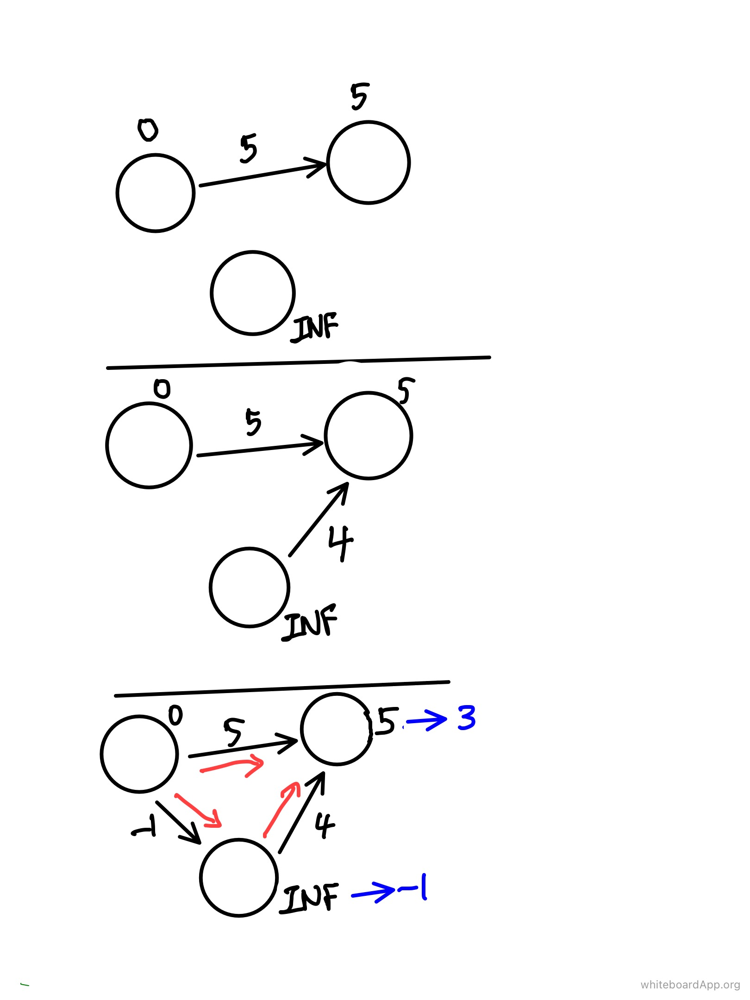

# Bellman Ford

* It is one of the algorithms to find the single source shortest distance.
* It takes longer than Dijkstra in terms of time complexity, but it can also be calculated with negative weights.

* In the process of finding a path, dist can be updated at max n-1 times (the number of nodes).
  * Since the order of update is changed according to the order of node visits, the update can be completed by going through the n-1 loop except for the first node.
* However, if an update occurs on the n times as well, there is a negative cycle.

* So, Time complexity is O(VE)    V : nodecount / E : edgecount

* Below example is 3 nodecount and need 2 loop (maximum loop : nodecount-1)





### Code

```c++
#include <iostream>
#include <vector>
using namespace std;
#define INF 1'000'000'000
#define NODE 10000

struct Edge {
    int src;
    int dest;
    int weight;
};

vector <Edge> edges;
int dist[NODE];
int nodecount, edgecount;

void init(int src)
{
    for (int i = 1; i <= nodecount; i++) dist[i] = INF;
    dist[src] = 0;
}

void bellman_ford(int src) {
    bool cycle = false;
    // opeation
    for (int i=1; i <= nodecount; i++) {
        for (int j=1; j <= edgecount; j++) {
            if (dist[edges[j].src] != INF && dist[edges[j].dest] > dist[edges[j].src] + edges[j].weight) {
                dist[edges[j].dest] = dist[edges[j].src] + edges[j].weight;
                if (i == nodecount) cycle = true; // if update n count
            }
        }
    }
    if (cycle) return;
    for (int i=2; i <= nodecount ; i++) printf("%d ",dist[i] != INF ? dist[i] : -1);
}
```


