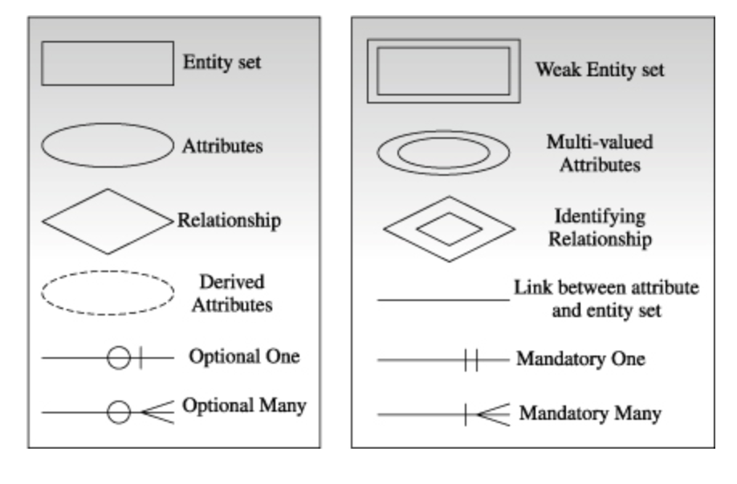
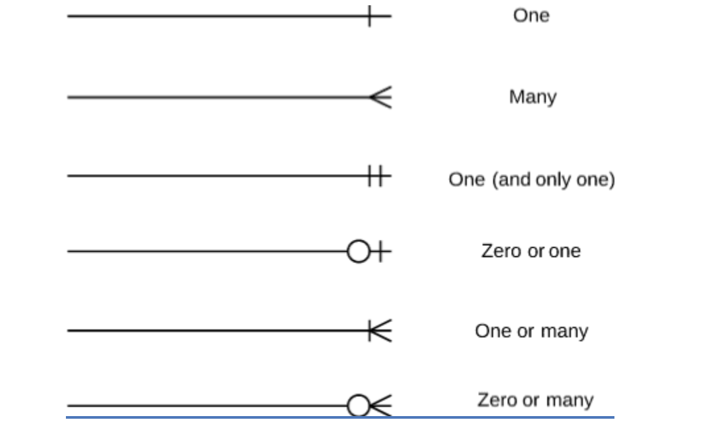
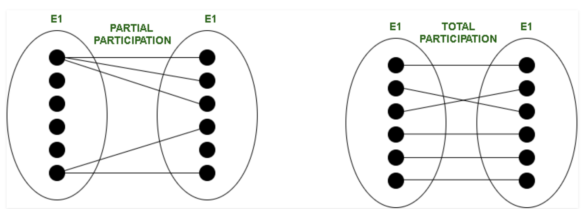
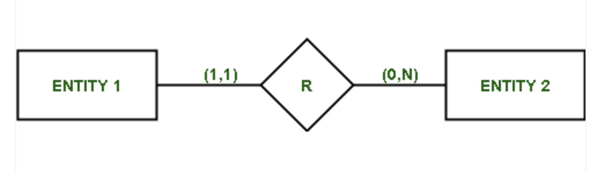

# ER Diagram

**UML (Unified Modeling Language)** : 객체지향 프로그래밍에서 소프트웨어 시스템을 문서화

* 클래스 간 관계를 나타내는 클래스 다이어그램, 개체 간 관계를 나타내는 개체 다이어그램, Deploy 다이어그램 등 다양한 UML 다이어그램이 존재

### ERD (Entity Relationship Diagram)

- UML 중 데이터베이스의 Entity 간 관계를 문서화

* 요구사항이 제대로 충족되었는지 확인할 수 있으며, 개체/속성/관계 3가지 요소를 기반으로 작성

**Entity**

* 데이터베이스에 데이터로 표현하려고 하는 현실 세계의 대상체. 단독으로 존재할 수 있는 객체를 의미
  * ERD에서 개체타입은 직사각형으로 표현

* 약한 개체(Weak Entity) : 개체 중 Key Attribute가 없어서 Attribute만으로는 고유하게 식별할 수 없는 개체
  * 약한 개체는 Partial Key를 가진 Attribute가 존재하는데, 소유자 개체라고 하는 외부 Entity의 Attribute와 조합한 후 식별할 수 있음
  * Partial Key는 단독으로 작성되면 안되고, 소유자 개체의 Key와 함께 구성되어야 함
    * 소유자 개체(주 개체)가 삭제되면 약한 개체(종속 개체)도 삭제 되어야 함
  * 약한 개체는 두개의 직사각형으로 표현

**Attribute**  

* Entity의 특징을 가지는 작은 논리적인 단위로 ERD에서 속성 타입은 타원으로 표현
* 다중값 속성 (Multi-Valued Attiributes) : 하나의 속성이 여러개의 값을 가지는 속성으로 두개의 타원으로 표현
  * 하나의 속성이 하나의 값만 가지는 것을 단일 속성 (Single-Valued Attributes)라고 함
* 키 속성 (Key Attributes) : 특정 Entity를 고유하게 식별할 수 있는 속성
  * 하나의 타원 내 이름에 밑줄을 그어서 표현
* 파생 속성 (Derived Attributes) : 다른 속성으로부터 계산된 속성
  * 연산으로 계산할 수 있기 때문에 물리적 저장장치에 저장되지 않을 수도 있으며 점선 타원으로 표현

**Types of Releationship** 

* 개체 간 연결 관계를 나타내며 개체 사이에서 마름모로 표현
* Relation도 개체처럼 속성을 가질 수도 있음
* 두 개체 중 하나가 약한 개체인 경우, 이중 마름모로 표현
  * 약한 개체와 연결된 제약조건은 전체 참여(2개의 실선)로 표현해야 됨

 Image ref : https://www.oreilly.com/library/view/database-systems-concepts/9788177585674/9788177585674_ch06lev1sec5.html 

**Constraint **

* 카디널리티 (Cardinality) 제약조건

  * Cardinality는 특정 Column 값의 중복도를 나타내며 중복도가 낮으면 Cardinality가 높고, 중복도가 낮으면 Cardinality가 낮음
    * Cardinality가 높을수록 Index에 용이함
  * 하나의 개체가 얼마나 많은 다른 개체를 가질 수 있는 지 표현
  * 1:1 관계 / 1:N 관계 / N:1 관계 /N:N 관계로 구분할 수 있으며, 연결되는 개체에 아래의 기호를 사용
  * 관계선의 경우 점선과 실선으로 구분됨
    * 점선은 비식별 관계로 부모 Entity의 PK가 자식 Entity의 일반 속성으로 사용
    * 실선은 식별 관계로 부모 Entity의 PK가 자식 Entity에서 PK/FK로 사용되는 경우로, 부모 Entity가 반드시 필요함

  

   

 Image ref : https://stephenweiss.dev/erd-line-meaning/ 

* 참여 (Participation) 제약조건
  * 두 개의 개체집합이 있을 때, 집합 내의 모든 개체가 관계에 참여해야 한다면 전체 참여 (Total Participation)
  * 집합 내에서 일부 개체만 참여하는 것이 가능할 때, 부분 참여 (Partial Participation)
  * 전체 참여는 ERD에서 두 개의 실선으로 표현하고, 부분 참여는 하나의 실선으로 표현

 Image ref : https://www.geeksforgeeks.org/structural-constraints-of-relationships-in-er-model/ 

* 구조적 (Structual) 제약조건
  * Cardinality와 함께 참여 제약조건을 사용하는 것
  * DBMS 시스템 요구사항과 일치하기 위해 1:N 같은 표현이 아니라 (min, max)로 정확한 숫자로 관계를 표현
  * Min 값이 0이면 부분 참여이고, 1 이상의 수로 구성되어 있으면 전체 참여

 Image ref : https://www.geeksforgeeks.org/structural-constraints-of-relationships-in-er-model/ 

