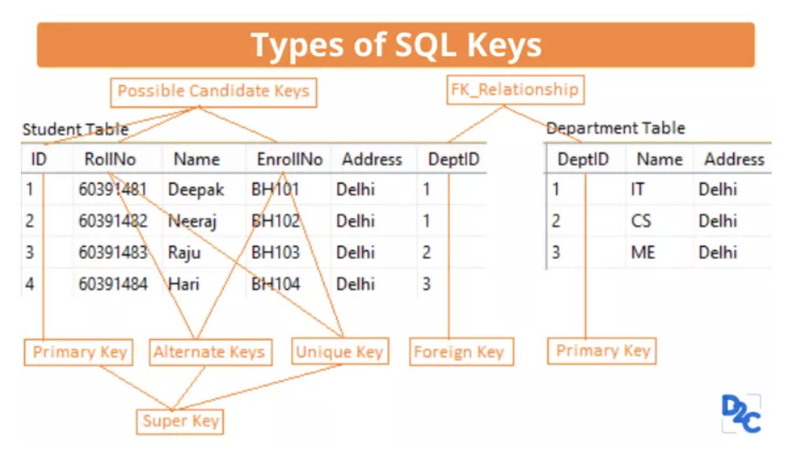

# Key

데이터베이스의 Primary Key는 유일성과 최소성을 만족해야 함

* 유일성 : Key를 이용하여 Tuple을 식별할 수 있음
* 최소성 : 반드시 필요한 최소한의 속성들로만 Key를 구성

Key는 단일키나 복합키로 구성될 수 있음

* 복합키 (Composite Primary Key) : {ID, Name} 과 같이 2개 이상의 속성으로 구성된 Primary Key
* 단일키 (Single Primary Key) : {ID}와 같이 하나의 속성으로만 구성된 Key

 Image ref : https://unstop.com/blog/difference-between-super-key-and-candidate-key 

**슈퍼키 (Super Key)**

* Super Key는 유일성을 만족하는 Key로 하나 또는 여러개의 속성들로 구성됨
* Student 릴레이션을 기준으로 보면 {ID}, {RollNo}, {Name}, {ID, RollNo}, {ID, Name}, {ID, EnrollNo} ... {ID, DeptID}, ... {ID, RollNo, Name, EnrollNo, Address, DepthID} 등이 존재함
* 릴레이션의 각 행을 고유하게 식별할 수 있으며, 후보키를 선택하는 기준이 됨

**후보키 (Candidate Key)**

* Super Key 중 최소성을 만족하는 Key
* Student 릴레이션을 기준으로 보면 {ID}, {RollNo}, {Name}이 Attribute 하나로 구성되어 최소성을 만족함

**기본키 (Primary Key)**

* 후보키 중 하나를 선택하여 Primary Key로 설정할 수 있음
* 후보키와 성질이 동일하기 때문에 유일성과 최소성을 만족
* 기본키로 설정된 값은 NULL 값 및 중복된 값을 가질 수 없음

**대체키 (Alternate Key)**

* 후보키 중 기본키로 선택되지 못한 Key
* 후보키와 마찬가지로 유일성과 최소성의 성질을 가짐

**대리키 (Surrogate Key)**

* Primary Key를 대체하는 Key로 가상의 속성을 생성하여 Primary로 사용
* 복잡한 복합키로 구성되거나 Primary Key가 보안이 필요한 경우 사용
* 복합키로 구성된 Primary Key의 검색/수정시 발생하는 작업시간을 줄여줄 수 있음

**외래키 (Foreign Key)**

* 릴레이션의 속성이 다른 릴레이션에서 Primary로 사용되는 경우, 해당 속성을 FK(Foreign Key)라고 함
* DeptID가 Department Table에서는 Primary Key로 사용되기 때문에, Student Table에서 Department Table에 정의되지 않은 DeptID를 사용할 수 없음
  * Primary Key로 사용하는 Table에 정의가 된 Tuple만 다른 Table에서 FK로 사용할 수 있음
