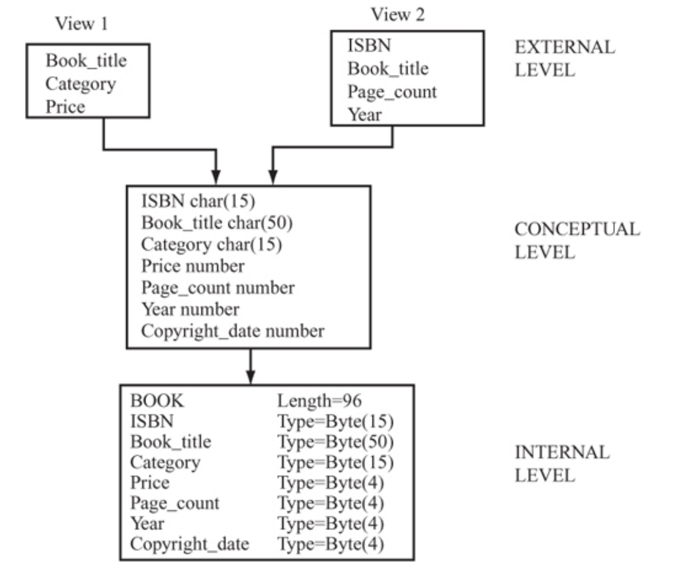
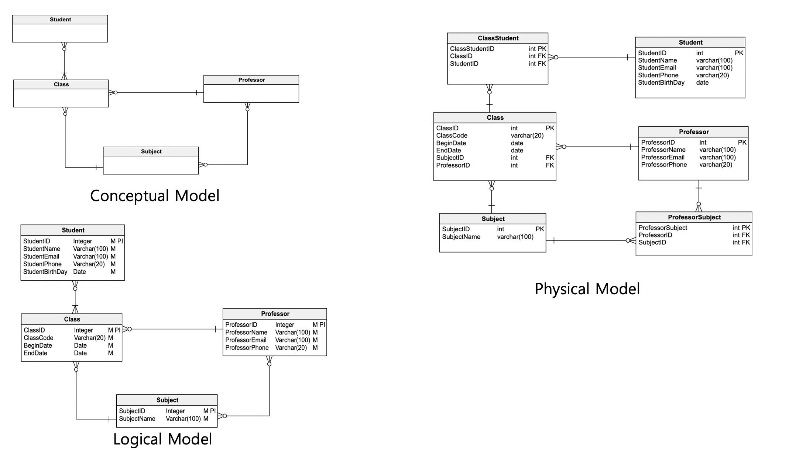
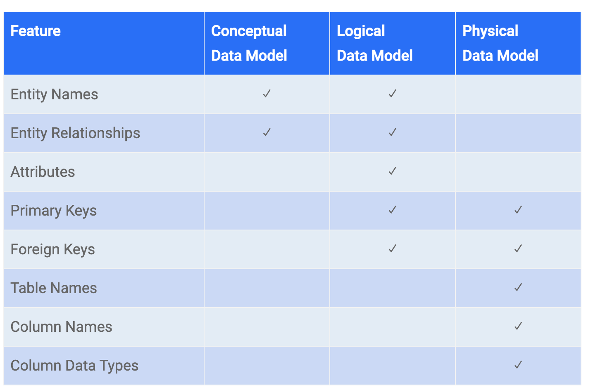

# Schema

* 데이터베이스의 구조, 표현방식, 제약조건  등을 기술한 명세를 기술한 것

* 데이터 모델을 구성하는 요소인 개체(Entity), 속성(Attribute), 관계(Relationship) 및 데이터 값의 제약조건 등을 정의

  * 개체 : 현실 세계에서 정보의 단위이며, 데이터 베이스의 테이블에 해당
    * 현실 세계의 데이터를 데이터베이스에서 표현하기 위한 추상적인 개념

    * 속성 : 사물의 본질적인 성질을 의미하며, 개체(Entity)의 특징을 나타내는 가장 작은 논리적인 단위
      * 개체는 하나 이상의 속성들로 구성되어 있음

    * 관계 : 1:N, N:M 등을 결정짓는 요소로, Entity Type 간 관계를 표현
    * 제약조건 : NOT NULL, UNIQUE, PRIMARY KEY 등 테이블에 부적절한 데이터가 입력되는 것을 방지

| File System | DB Modeling | RDB    |
| ----------- | ----------- | ------ |
| File        | Entity      | Table  |
| Record      | Tuple       | Row    |
| Field       | Attribute   | Column |

스키마는 사용자의 관점에 따라 외부 스키마, 개념 스키마, 내부 스키마로 구분할 수 있음

**외부 스키마 (External Schema)**

* 뷰 스키마라고도 하며, 데이터베이스의 논리적 구조를 정의하는 스키마 
* 사용자 그룹의 권한이 있는 영역의 데이터베이스만 확인할 수 있음
* 사용자나 응용 프로그래머가 보는 관점

**개념 스키마 (Conceptual Schema)**

* 데이터베이스의 전체적인 논리적 구조를 정의하는 스키마로 일반적인 스키마는 개념 스키마를 의미함
* 데이터베이스에 저장되는 데이터 및 데이터 간 관계를 정의
* 프로그래머나 데이터베이스 관리자가 보는 관점

**내부 스키마 (Internal Schema)**

* 물리적 스키마라고도 하며, 물리적 저장장치의 구조를 정의하는 스키마
* 복잡한 Low Level의 데이터 구조로 시스템 프로그래머가 보는 관점

 Image ref : https://courses.aiu.edu/COMPUTERS/10/Lesson10.pdf 

### Modeling

데이터 베이스의 디자인은 개념적 모델링, 논리적 모델링, 물리적 모델링 3단계로 나누어지며 순서대로 진행한 후 데이터베이스를 구현

**개념적 데이터 모델**

* 시스템에 포함될 내용을 정의하는 단계로 Entity와 Entity 간 Relation을 정의
* Entity의 Attribute는 표시하지 않으며, E-R Model의 전체적인 틀을 잡는 단계

**논리적 데이터 모델**

* 개념 스키마를 설계, 평가 및 정제하는 단계

* 트랜잭션의 인터페이스를 설계하며 정규화 단계가 포함되어 있어 중복되는

  목표 DBMS에 맞는 다른 논리적 스키마를 설계  

  트랜잭션의 인터페이스 설계

* 정규화 단계가 포함되며, 

* 관계형 데이터 모델, 계층형 데이터 모델, 네트워크형 데이터 모델, 객체지향형 데이터 모델 등 다양한 종류의 모델이 있음

**물리적 데이터 모델**

* 목표 DBMS에 맞는 물리적 구조의 데이터 변환

 Image ref : https://vertabelo.com/blog/conceptual-logical-physical-data-model/ 

