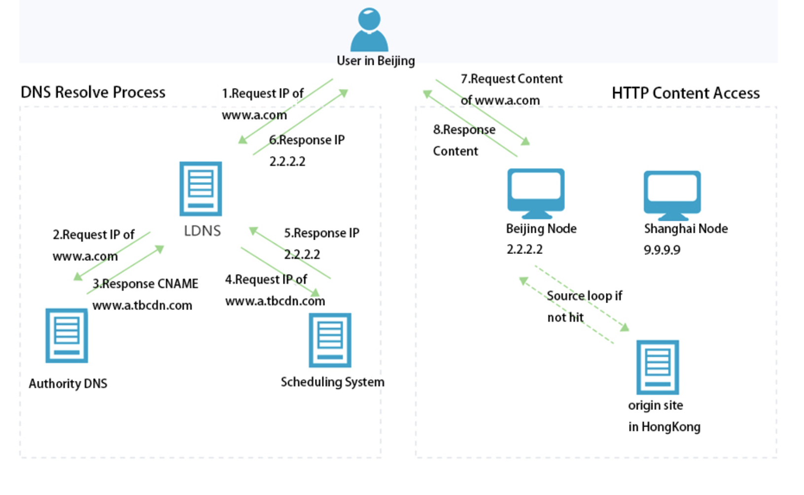

# CDN

* 콘텐츠 전송 네트워크(Content Delivery Network)는 분산된 서버 네트워크
* Origin Server에서 분산된 여러개의 Cache 서버 중 사용자와 가까운 위치의 Cache 서버에서 콘텐츠를 전송하기 때문에 빠른 데이터 전송이 가능
  * Origin Server에 요청이 집중되지 않기 때문에 병목현상을 피할 수 있음
* ISP(인터넷 서비스 제공자) 별로 분산된 Cache Server는 동기화(Synchronization)을 통해 모든 서버에서 동일한 데이터를 제공할 수 있게 함
* 지역별로 각 서버의 Latency Time을 알고 있기 때문에, Latency가 낮은 지역으로 Load Balancing 진행하여 Cache Server를 매칭
* 실시간으로 Streaming을 제공해야되는 Netflix 같은 업체에서 Cache Server를 이용하여 데이터 전송
  * Streaming 서비스는 Client에게 비디오 파일을 지속적으로 전송하는데, 연속된 파일 형태가 아니라 Segment 형태로 전송함

**작동원리**

* 아래 그림은 Alibaba의 CDN Architecture인데, CDN에 대한 설명이 잘 되어 있다고 생각함
* 먼저 사용자는 CDN의 Cache Server를 사용하기 전, DNS를 통해 어떤 Cache Server를 사용할 지 확인해야 됨
* DNS Resolver로 접속하려는 도메인의 CName(Canonical Name, 도메인을 다른 도메인으로 맵핑)을 얻어 Low Latency의 Cache Server에 대한 IP를 획득
* Client는 수신된 DNS로부터 얻은 Cache Server의 IP 주소에 엑세스 요청을 하고 데이터를 전송 받음

 https://www.alibabacloud.com/blog/content-delivery-network-cdn-accelerate-distribution-of-content-globally_597159 

