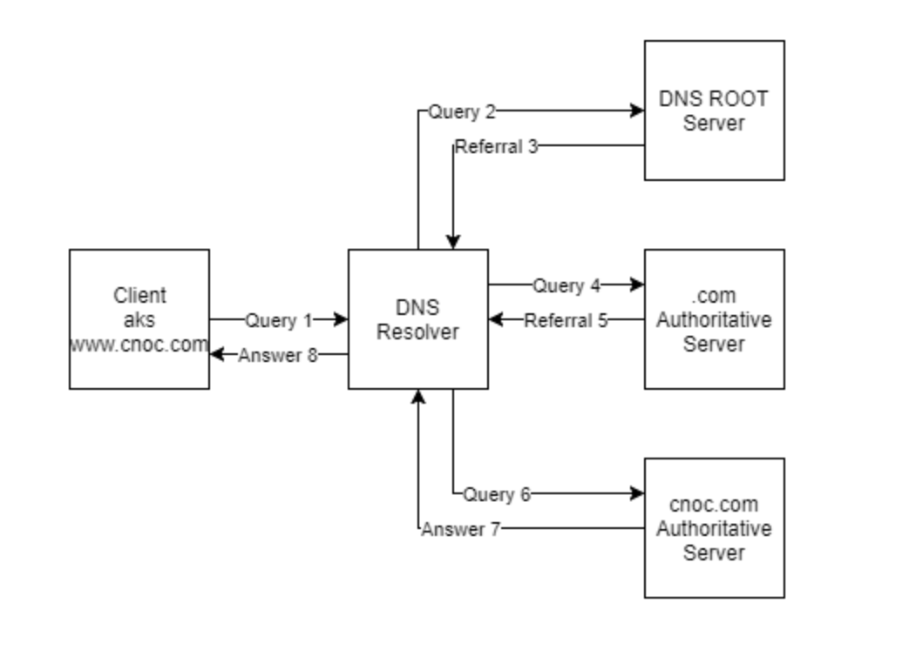

# DNS

* 도메인 네임 시스템(Domain Name System)은 분산 데이터베이스 시스템으로 Domain Name Space, Name Server, Resolver로 구성되어 있음
* Domain Name Space
  * 계층 구조로 구성된 데이터베이스
  * 최상위 DNS Root가 존재하고 Trie 구조로 모든 호스트가 연결되어 있음
    * 상위 노드에 label을 Insert하는 방식으로 구성
  * TLD (Top-Level Domain)
    * Root 바로 아래 존재하는 최상위 도메인으로 '.com', '.kr', '.org' 등과 같이 국가나 기관을 의미하는 도메인
* Name Server
  * 전세계적으로 분산되어 있어, 도메인 정보를 저장 및 관리하는 DNS 서버로 도메인 이름을 IP주소로 변환하는 Service 제공
  * 클라이언트의 DNS Query / Name Server 간 Query에 대한 응답 수행
* Resolver
  * 클라이언트 요청을 Name Server로 Query 형태로 변환하여 전달하고, Name Server로부터 받은 응답을 클라이언트에게 제공
  * IP주소와 호스트 이름을 매핑하기 위해 1개 이상의 Name Server의 정보를 이용
  * UNIX에서는 `/etc/resolv.conf` 에 설정

**Type**

* 재귀 DNS
  * 
* 신뢰할 수 있는 DNS
  * 

**PROCESS**

* 

 Image ref : https://www.websiterating.com/web-hosting/glossary/what-is-dns/ 

