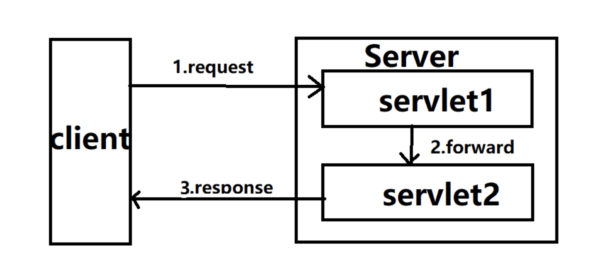
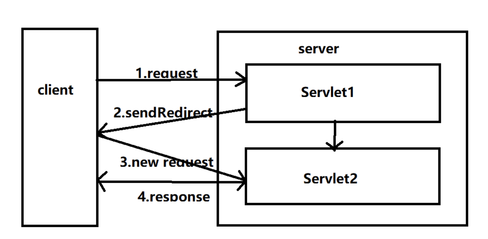

# Forward & Redirect

* Forward와 Redirect는 작업 중인 페이지 같은 Resource를 다른 URL로 전속시키는 기술

### Forward

* Client가 Server에 요청했을 때 리소스의 변경이 필요한 경우, 데이터의 변경 없이 다른 URL에 Request를 전달
* 전달받은 Request를 Client에게 Response하지만, Client 입장에서는 내부적인 Forward를 확인할 수 없음
  * Request / Response 객체를 공유
* 동일한 Web Container에 있는 Resource 간 Forward 가능
* Session의 변화가 불필요한 조회의 경우 Forward를 사용하는 것이 적합

 Image ref : http://www.noobyard.com/article/p-nvtmjjiu-qp.html 

 

### Redirect

* Client가 Server에 요청했을 때 Resource의 URL이 일치하지 않으면 Client에게 Redirect 요청
  * Redirect 요청에는 URL에 대한 정보가 들어있음
* Client는 Redirect에 포함된 URL로 Request
  * 처음 Request 했던 객체는 회수되어 더 이상 사용할 수 없음
    * 의도적인 새로고침(Request)를 수행할 때, 이전의 Request가 회수되기 때문에 중복으로 작업하지 않음
    * Forward의 경우, 지속적인 요청으로 중복으로 Request 작업을 수행
* Session의 변화가 필요한 추가 / 삭제 / 변경의 경우, Redirect가 적합
* HTTP 상태코드 300번대를 반환

 Image ref : http://www.noobyard.com/article/p-nvtmjjiu-qp.html 

**Code 3xx Redirect**

| Code | Text               | Type      | Description                                                  |
| ---- | ------------------ | --------- | ------------------------------------------------------------ |
| 300  | Multiple Choice    | Specific  | 자주 사용되지는 않지만, 단어의 중의성을 해소할 때와 같이 Client에게 자원 선택의 옵션이 있음 |
| 301  | Moved Permanently  | Permanent | Resource에 영구적으로 이동(새로운 URI가 할당)되어 검색 엔진에 알려줘야 함. Migration이나 새로운 웹 페이지를 만들 때나 두 웹 페이지를 연결할 때 사용. |
| 302  | Found              | Temporary | Resource가 일시적으로 이동되어 검색 엔진에 알려줘야 함. 웹 페이지를 ReConstruct하거나 Update 하는 경우 사용. 일시적인 목적으로 사용하기 때문에 301처럼 현재 URI를 대체하면 안 됨. |
| 303  | See Other          | Temporary | 페이지 Redirect 요청할 때 Post/Put 같은 Method를 Get 요청으로 변경. 중복으로 동작하는 것을 방지 |
| 304  | Not Modified       | Specific  | Client의 캐시에 있는 원본과 웹 서버의 Resource가 동일할 때 로컬 캐시를 사용하도록 알려줌 |
| 307  | Temporary Redirect | Temporary | 302와 동일한 역할을 하지만, Request Method / Body는 유지하기 때문에 링크를 갱신하지 않음(302에서는 변경될 수 있음) |
| 308  | Permanent Redirect | Permanent | 301과 동일한 역할을 하지만, Request Method / Body는 유지하기 때문에 링크를 갱신하지 않음(301에서는 변경될 수 있음) |

