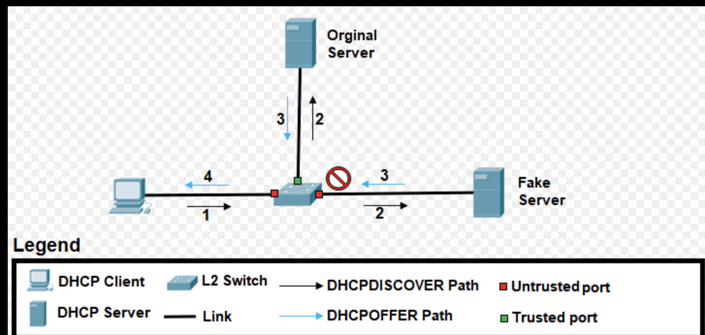

# Hacking

### Spoofing

* 

**공격 방법**

* ARP Spoofing
  * 대응책 :
* IP Spoofing
  * 대응책 : 
* DNS Spoofing
  * 대응책 : 

### Sniffing

* 

https://thecyberteacher.com/sniffing/

https://sonseungha.tistory.com/485

**공격 방법**

* Switch Jamming
* Port Mirroring
* ARP Redirect
* ICMP Redirect

**대응책**

* 능동적 대응책

  * Ping을 이용한 탐지

  * ARP

* 수동적 대응책
  * 암호화

### Snooping

* ㄴㅁㅇ

**공격 방법**

* IGMP Snopping

* DHCP Snooping

 Image ref : https://en.wikipedia.org/wiki/DHCP_snooping/ 

