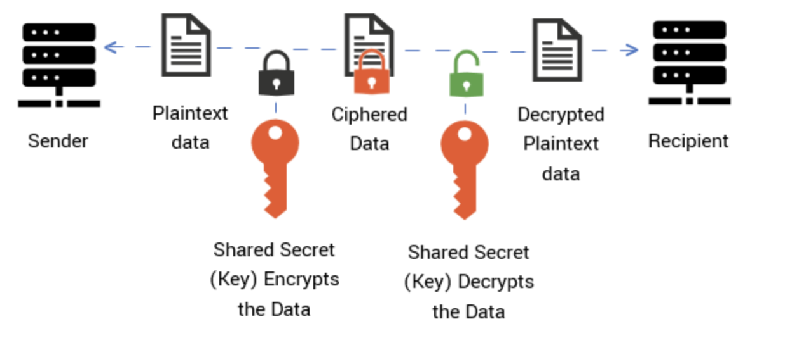
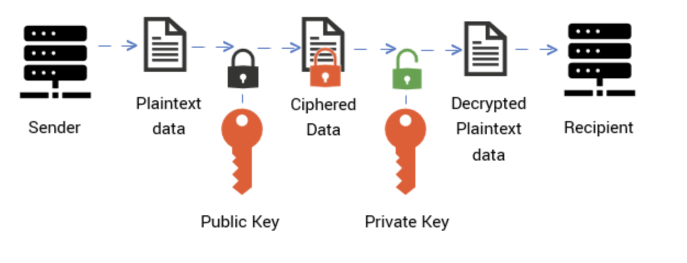

# Key

**공개키(Public Key) & 개인키 (Private Key)**

* **공개키** : 비대칭키 암호화에서 사용되며, 주로 서버에서 정보를 제공하면서 내용을 암호화할 때 사용되는 Key
* **개인키** : 비대칭키 암호화에서 사용되며, 주로 서버에서 암호화된 정보를 복호화할 때 사용되는 Key
* 개인키와 Pair로 동작하기 때문에 개인키로 암호화 된 정보는 공개키로 복호화하고, 역도 성립
* 공개키를 이용하여 복호화하는 방법은 전자서명에서 많이 사용됨
  * 개인키를 이용하여 암호화 한 내용을 생성하고, 수신자는 공개키를 이용하여 복호화
* 공개키로 암호화 된 내용을 수신자에게 전송하면, 수신자는 개인키를 이용하여 해석
* Public Key는 누구나 확인할 수 있지만, 내용을 확인하기 위해서는 Private Key가 필요

 

**비밀키(Secret Key)**

* 대칭 암호화에서 암호화 및 해독에서 동일하게 사용되는 Key
* 사용자들에게만 공유되는 단일 Key
* 동일한 Key를 이용하여 암호화 및 복호화를 하기 때문에 대칭키 암호화에서 사용

---

 

**세션키(Session Key)**

* 통신을 하면서 세션이 유지되는 동안만 사용할 수 있는 임시적인 Key
* 공개키 인증기관(CA)으로부터 생성하는 방법과 KDC로부터 생성하는 방법이 존재
* 공개키 인증기관을 이용하여 Session Key 생성
  * 송신자는 수신자의 Public Key를 인증기관에게 요청하고, 인증기관의 개인키로 암호화 된 정보를 송신자에게 전달
  * 인증기관의 공개키로 복호화를 진행하고, 수신자의 공개키로 암호화하여 정보를 전송
  * 수신자는 송신자의 Public Key를 인증기관에게 요청하고, 인증기관의 개인키로 암호화 된 정보를 수신자에게 전달
  * 인증기관의 공개키로 복호화를 진행하고, 이전에 송신자에게 전송받은 난수와 수신자가 복호화 한 난수를 송신자에게 전송
    * 송신자는 정보가 정상적으로 전달되었는지 Check하는 값을 전송
  * [HTTPS Process](http://127.0.0.1:4000/Computer_Science/Network/HTTP.html#https) - 송신자는 Session Key 생성하고 수신자의 공개키로 암호화 하여 전송 
  * 수신자는 자신의 Private Key를 이용하여 전달받은 Session Key를 복호화. 송신자와 수신자가 동일한 Session Key를 소유

 

**마스터키(Master Key)**

* Session Key를 KDC를 이용하여 생성할 때 사용되는 대칭키(비밀키)

* 키 분배 센터 (KDC, Key Districtbution Center)를 이용

  * 송신자가 수신자와 Session을 연결하기 위해 KDC에 요청
  * KDC는 송신자에게 Session Key/난수/수신자 정보 등을 송신자 마스터키로 암호화
    * 수신자에게도 Session Key/난수/송신자 정보 등을 수신자의 마스터키로 암호화하여 전송

  * 송신자는 KDC로부터 전달받은 Session Key 등 암호화 된 정보를 마스터키를 이용하여 복호화
    * 수신자도 마찬가지로 자신의 마스터키를 이용하여 복호화
  * 동일한 Session Key를 가지고 있기 때문에 Session Key를 이용하여 통신 가능

* 하나의 마스터키로 여러개의 Session Key를 생성할 수 있음

  * 통신을 할 때마다 다른 Session Key를 생성하기 때문 

 

---

### Symmetric Encryption

* 동일한 키(Secrey Key)를 이용하여 암호화 및 복호화 하는 가장 오래되고 간단한 암호화 방법
* 발신자와 수신자는 동일한 Key를 가지고 있어야 메시지를 읽을 수 있음
* 알고리즘으로 SEED, AES이 많이 사용되며, 그 외 CachCha20, DES, 3DES, HIGHT, IDEA, RC5, ARIA 등이 있음
* 연산 속도가 빠르고 암호화할 수 있는 Message의 길이 제한이 없어서 Size가 큰 Data를 암호화하는데 적합
* 기밀성을 제공하고 부분적인 인증 기능/무결성을 제공하지만, 부인방지는 보장하지 않음
* 사용자가 많아질수록 Key를 관리하기 어려워지고 확장성이 떨어짐

 Image ref :https://cheapsslsecurity.com/p/what-is-public-key-and-private-key-cryptography-and-how-does-it-work/ 

 

### ASymmetric Encryption

* 2개의 키를 이용하여 암호화/복호화를 진행하는 최신 암호화 방법
* 비밀키에 비해 속도는 느리지만, 기밀성/무결성/보안방지/인증 기능을 제공함
* 암호화할 수 있는 Message의 길이 제한이 있으므로 Size가 작은 Data를 암호화하는데 적합
* 알고리즘으로 RSA, DSA, ECC 등이 많이 사용되며, 그 외 Rabin, ElGamel, Diff-Hellman 등이 있음
* 키 분배/관리가 용이하며, 사용자가 많아지더라도 관리해야될 Key의 수가 적어짐
  * 사용자가 하나의 키를 보유하고 있고, 나머지 하나의 키는 공개키 관리 시스템에서 관리
* 암호화를 할 때 대칭 암호화에 비해 많은 Resource가 사용됨 

 Image ref :https://cheapsslsecurity.com/p/what-is-public-key-and-private-key-cryptography-and-how-does-it-work/ 

