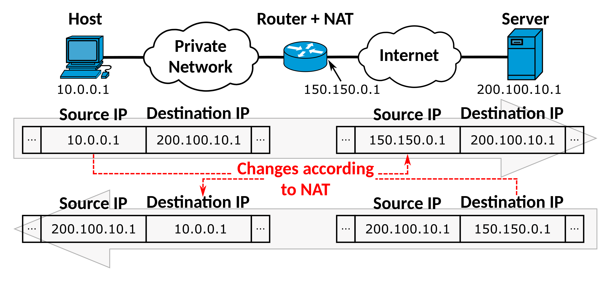

# NAT

* 네트워크 주소 변환(Network Address Translation)으로 방화벽을 통과하기 전이나 라우터를 통한 네트워크 트래픽을 주고받을 때, IP 패킷의 헤더에 있는 TCP/UDP Port 번호나 IP주소 등을 수정하여 다른 주소로 Mapping하는 기술

* IPv4의 주소가 42억 9천(232)개의 주소를 할당할 수 있는데 주소 고갈의 문제를 해결하기 위해 개발됨

* 기본적으로 1:1 변환을 제공하지만, Private Network 내에 여러개의 IP 주소를 Mapping하는 N:1 변환도 가능

  * Private Network에는 다른 IP를 사용해도 되지만, Public Network는 하나의 IP 주소를 가짐
  * PAT(Port Address Translation)
    * Public Network IP의 각 Port에 Private Network의 IP/Port를 Mapping
    * 서로 다른 장비가 동일한 Source Port를 가지는 경우, NAT 장비가 변경하여 처리

* DNAT / SNAT

  * DNAT (Destination) : 도착지 주소를 변경하는 NAT
  * SNAT (Source) : 출발지 주소를 변경하는 NAT

  양방향 지원인 경우, 외부에서 내부로 통신하면 DNAT가 적용되고 내부에서 외부로 통신하면 SNAT가 적용됨

  * 장비에 따라서 지정한 방향으로만 NAT 지원하는 것도 있음

 

 Image ref : https://en.wikipedia.org/wiki/Network_address_translation

 

**Static NAT(Reserve NAT)**

* Private Network 하나의 Local IP와 Public IP를 1:1로 Mapping하여 변환
* Port forwarding 작업이 많을 때 사용하며, Network 경로 관리에 효율적

 

**Dynamic NAT**

* 여러개의 사설 IP를 N:1 or N:M 관계로 Mapping하여 변환
* 라우터 간 통신을 통하여 자동으로 경로를 학습하고 현재 사용중이지 않은 Public IP로 할당
  * global Address Pool에서 동적으로 선택
* 변환이 필요한 내부 주소 / global address pool 2가지 설정이 필요

 

**Redirect NAT**

* 목적지 주소를 재설정할 때 사용
* 서버의 IP/Port에 변경이 발생했을 때, NAT Mapping Table의 Destination Address를 변경

 

**XNAT(Exclude NAT)**

* 특정 Source/Destination Address에 대해 NAT를 제외할 때 사용

**FNAT(Full NAT)**

* 양방향 NAT(SNAT + DNAT)로 L4/L7 스위치에서 많이 사용하는 NAT 방식 중 하나임
* (L4/L7 스위치 정리할 때 DSR과 상세하게 작성)
