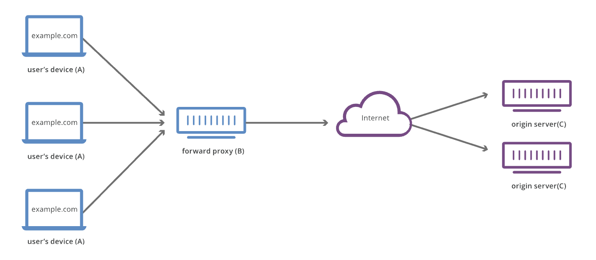
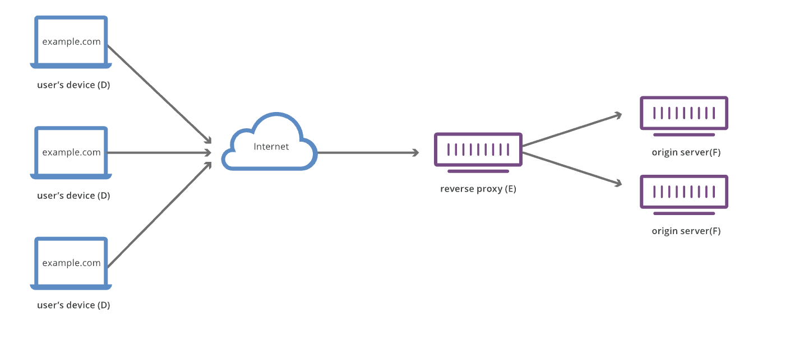
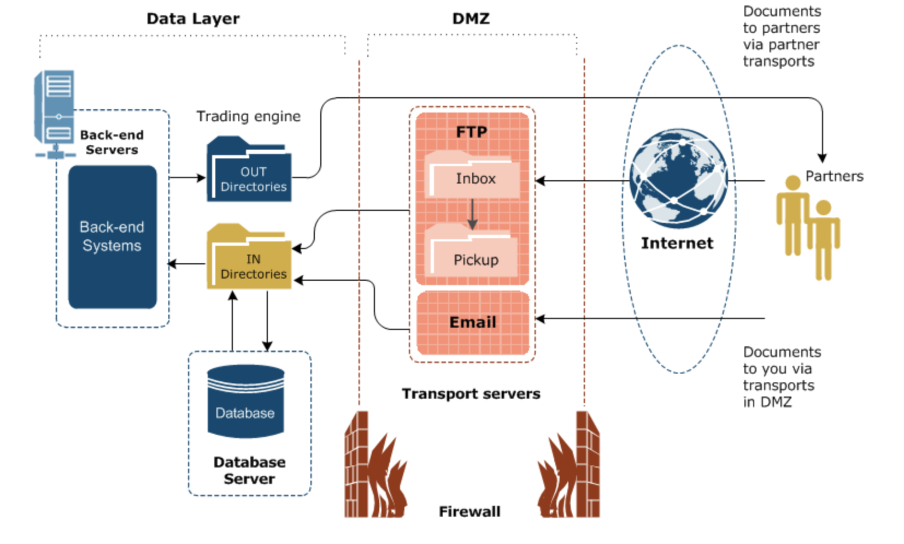

# Proxy

* Client가 Server로 접속할 때, Client는 Server에 직접 접근할 수 없고 Proxy라는 중간 매개체를 통해 간접적으로 접근
  * 방화벽을 가지고 있는 시스템에서 통신할 때 사용됨
* Proxy 역할을 하는 Server를 Proxy Server라고 함
* Proxy를 도입한 이유는 인터넷 속도의 향상이었지만 현재 [CDN](https://jeothen.github.io/Computer_Science/Network/CDN.html)으로 대체되었고, 데이터 전송시 IP 주소를 우회하여 숨길 수 있음
  * VPN에서는 전송 내용(Traffic)을 암호화하여 보안성을 향상했지만, Proxy는 전송 내용을 암호화를 하지 않음
* 내부 보안이 필요한 다수의 기업에서 Proxy Server를 구축하여 외부 망에 접속 
* Web Cache 기능을 제공하는 경우가 많아서 Cache에 데이터가 없는 경우 origin Server에서 데이터를 받아오고 Cache에 저장
  * Cache를 이용함으로써 빠른 응답속도, Server Traffic 감소 효과

**Cache Server** : 빠른 응답속도를 위해 Client와 가까운 곳에 데이터를 임시 저장하여 빠르게 제공해주는 Proxy Server

 

**Forward Proxy**

* Client가 인터넷에 접근할 때 직접 접근하는 것이 아니라 중간에 있는 Forward Proxy Server를 이용하여 접근
* Proxy Server는 Cache 기능이 있으므로 성능 향상
* 많은 기업에서 인트라넷으로 사용하고 있는 방법으로 웹 사용 환경을 제한할 수 있음
* Client는 Forward Proxy Server를 이용하여 Server에 Request를 보내기 때문에 Client의 정보를 숨길 수 있음
  * Server 입장에서는 Proxy Server에서 요청한 것으로 보임

 Image ref :https://www.cloudflare.com/learning/cdn/glossary/reverse-proxy/ 

**Reverse Proxy**

* Client가 인터넷을 통해여 Server에 Request 하였을 때, 내부 서버에 직접 접근하지 못하고 중간에 있는 Reverse Proxy Server를 통해 접근
  * Reverse Proxy Server가 내부 서버(WAS 등)에 접근하여 요청된 내용을 수행하고, 서버로부터 받은 응답을 Client에게 전달
* Forward Proxy에서는 Client를 숨길 수 있었지만, Reverse Proxy에서는 Server를 숨길 수 있음
* Proxy Server에 주로 Web Server가 많이 사용되며, 이를 이용하여 Load Balancing을 할 수 있음
  * 내부 Server 확장성도 뛰어남

 Image ref :https://www.cloudflare.com/learning/cdn/glossary/reverse-proxy/ 

 

**DMZ**

* External Network와 Internal Network 사이에 존재하는 Zone
* 외부에 정보를 제공해야 되는데 보안을 유지하기 위해 내부 네트워크와 분리
  * 1차 방화벽에 문제가 있어서 DMZ에 있는 Server가 보안상 위험해졌을 때, 2차 방화벽을 이용하여 내부 네트워크를 보호
* DMZ 내에 존재하는 Server로는 Web Server / Email Server / FTP Server 등이 있음
  * 일반적으로 Reverse Proxy Server를 이용하고 특정 Port만 내부망에 접근할 수 있도록 설정
  * 보안이 필요한 서버들을 Internal Server에 배치

 Image ref :http://61.19.221.114/help/Content/Interchange_512/security/security_firewall_and_prxy_srvr.htm 

