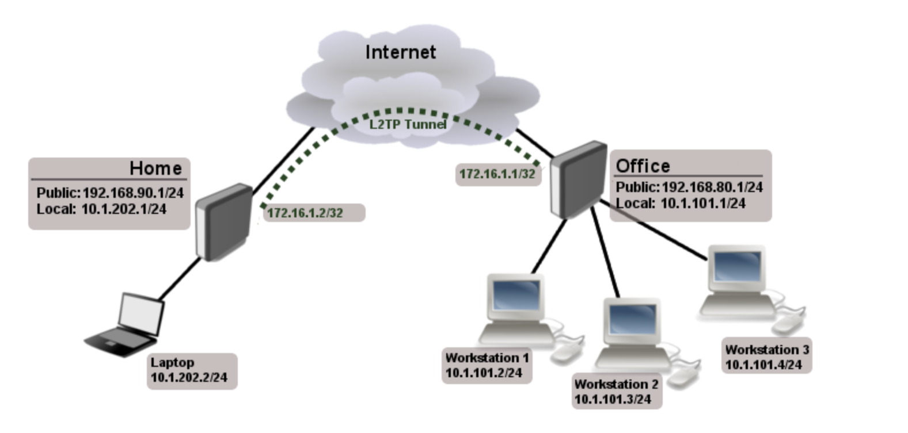

# VPN

* VPN(Virtual Private Network)은 물리적으로 전선을 설치하여 망을 구성하지 않고, 암호화 기술을 이용하여 통신 시스템을 구축하는 것을 의미
  * 특정 집단에서 

**재택근무**

 Image ref : https://namu.wiki/w/%EA%B0%80%EC%83%81%20%EC%82%AC%EC%84%A4%EB%A7%9D?from=VPN 

