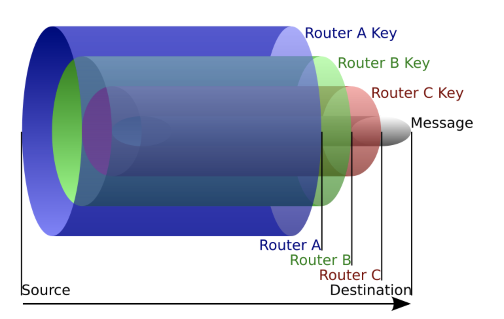

# VPN

* VPN(Virtual Private Network)은 물리적으로 전선을 설치하여 망을 구성하지 않고, 암호화 기술을 이용하여 통신 시스템을 구축하는 것을 의미
* VPN은 전체 네트워크 수준에서 Routing 및 암호화를 하기 때문에 모든 Traffic을 Redirection 할 수 있음
  * Proxy는 특정 프로그램 수준에서 Routing 및 암호화

* 원하는 Server에 접속 시, 터널링 프로토콜을 통해 SSL로 암호화되어 보안성이 우수함
* 대칭키 / 비대칭키 / 해시를 이용한 암호 등 크게 3가지 암호 알고리즘을 사용

**VPN 터널링**

* Public Network Routing의 모든 경로를 거치지 않고, 특정한 2개의 Router에서 터널을 형성하여 연결시켜줌
  * 터널링을 사용하기 위해서는 터널링을 제공하는 프로토콜을 사용하여 구현 필요

* 기기에서 다른 네트워크와 연결시 데이터를 암호화하여 Snoop 방지
* 방문하는 웹 사이트나 인터넷 제공업체에게 VPN 제공업체의 IP 주소로 제공되어 보안성 향상
* L2TP, PPTP, OpenVPN, SSTP, IPSec 등의 프로토콜이 있으며, OSI 2계층~4계층 사이에서 사용됨

**특징**

* **기밀성** : 기밀성을 위해 데이터를 암호화하여 전송
* **무결성** : 패킷의 무결성을 위해 인증 프로토콜을 이용
* **근원인증 및 접근 통제** : 인증된 사용자에게만 데이터 접근을 허용하고, 수신된 데이터가 알맞은 송신자에게서 전송되었는지 보장

 Image ref : https://namu.wiki/w/%EA%B0%80%EC%83%81%20%EC%82%AC%EC%84%A4%EB%A7%9D?from=VPN 

### Tor

* The Online Router의 약자로, "토어"라고 읽음. 네트워크 우회 및 익명을 위해 사용되는 Free Software
* 암호화는 비대칭키를 기반으로 하며, Router를 거치면서 순차적으로 공개키로 암호화하여 메시지를 전송함
  * 여러 네트워크를 경유하여 전송하기 때문에 속도는 느림
* ISP를 통해 데이터를 전송할 때는 쉽게 검열당할 수 있지만, Tor를 이용하면 중간에 거쳐간 모든 node를 확인해야 Source를 확인할 수 있음
* 이용자들간 자신의 PC를 라우팅 Node로 사용할 수 있게 설정함으로써 네트워크 속도 및 보안성 향상

 Image ref : https://namu.wiki/w/Tor(%EC%9D%B5%EB%AA%85%20%EB%84%A4%ED%8A%B8%EC%9B%8C%ED%81%AC)?from=%ED%86%A0%EB%A5%B4%20%EB%B8%8C%EB%9D%BC%EC%9A%B0%EC%A0%80 

