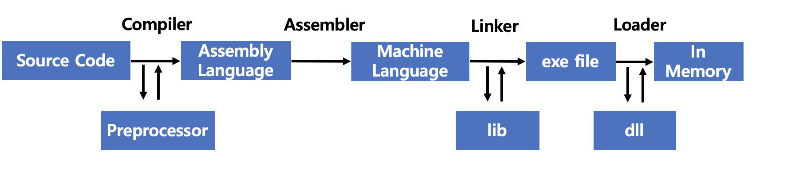

# Compile & Interpreter

## Compile

* 사전적인 의므로는 특정 언어로 작성된 소스 코드를 다른 언어로 변경해주는 것을 컴파일라고 함

* 

#### Compiler

#### Assembler

#### Linker

#### Loader

**BootStrap & porting** 

* Bootstraping
  * 
* Porting
  * Asdas

 

## Interpreter

