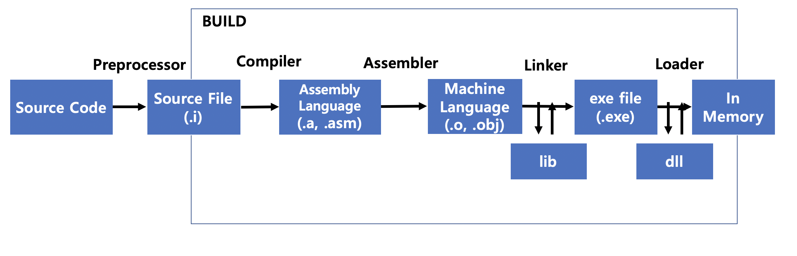

# Compile & Interpreter

## Compile

* 사전적인 의므로는 특정 언어로 작성된 소스 코드를 다른 언어로 변경해주는 것을 컴파일라고 함
* Compile은 사용자가 작성한 Source Code를 CPU가 이해할 수 있는 기계어로 변경하는 과정
* 아래는 Build 과정으로, 소스 코드를 실행 가능한 소프트웨어 output으로 변경하는 과정
  * Compile은 Build의 부분 과정임을 알 수 있음

* Compile 언어의 Build는 크게 Compiler, Assembler, Linker, Loader 과정으로 나눌 수 있음

#### 전처리기 (Preprocessor)

* 컴파일 직전에 사용되는 프로그램으로, 지시자(directives, c++기준 #으로 시작하는 코드)를 처리
  * #include : 설정된 경로를 현재 파일에 추가하여 하나의 파일처럼 사용
  * #if/else/ifdef/error 등 : 조건부 컴파일로, 조건에 포함되지 않으면 소스 코드에서 제외
  * #define : 특정 변수, 함수를 다른 형태로 변환 
  * #pragma : 컴파일 옵션 제어 지시자로, warning, once 등의 명령을 사용할 수 있음

#### Compiler

* 전처리가 적용된 Source File을 Assembly 언어로 변경하는 프로그램
* 상수값 (const)이나 inline 변수/함수를 In-place하여 적용함
  * inline 함수의 경우, 호출이 되는 local 함수마다 적용이 되기 때문에 Compile 시간 및 File의 크기가 증가함
    * 함수의 크기가 작고 호출이 많이 될수록 효과적
    * 함수가 호출될 때마다 Stack에 접근하는데 이때 발생하는 OverHead를 줄일 수 있음
    * 가상함수나 재귀 함수는 Inline되지 않음
  * 최신 Compiler는 비용/효율을 고려하여 자동으로 Inline 함수 적용
* Assembly Language는 고급언어를 기계어로 번역하기 전에 이해할 수 있는 언어로 변경한 것
  * Assembly 언어를 이용하여 기계어로 변경만 하기 때문에 Assembly 언어도 H/W에 종속적임
    * 만약, Assembly Language를 CPU 맞춤형 기계어로 번역할 수 있다면, Assembly 언어도 H/W로부터 독립적일 수 있음
  * CPU 간  ISA가 호환되는 경우에만 동일한 파일을 사용할 수 있음

#### Assembler

* Assembly 언어를 기계어로 변역해주는 과정으로 오브젝트 파일을 생성
  * Assembly Language는 LABEL, OPCODE, OPERANDS, COMMENTS로 구성됨
    * LABEL : 메모리 주소에 이름을 붙여 가독성을 높임
    * OPCODE : ISA의 opcode와 매핑
    * OPERAND : 피연산자에 대한 정보를 기입
    * COMMENTS : LABEL에 대한 추가 설명
* Symbol은 오브젝트 파일에서 사용되는 변수나 함수를 의미하고, Symbol이 저장되는 Symbol 파일은 ".pdb"나 ".dbg" 확장자로 디버깅 할 수 있는 정보를 저장함
* Assembler Process는 크게 2가지로 구분되며, 주로 이중 패스를 사용함
  * 단일 패스 (Pass-1) 
    * Assembly 파일을 한번의 Scan을 통해서 Object 파일을 생성
      * 읽는 즉시 기계어로 번역함
    * 실행속도가 빠르며, 잘못된 명령어가 포함된 경우 실행할 수 없는 파일을 생성하기 때문에 관리하기 어려움
  * 이중 패스 (Pass-2)
    * Assembly 파일을 두 번 Scan함
    * 첫번째 Scan에서 LABEL과 Memory 주소를 Mapping한 Symbol Table을 생성
    * 두번째 Scan에서 Assembly 파일을 기계어로 번역함
    * 첫번째 Scan에서 잘못된 명령어나 주소가 포함된 경우, 오류 메시지를 출력할 수 있어 관리에 용이함

#### Linker

* 여러개의 오브젝트 파일을 연결하여 하나의 실행 가능한 파일을 생성
* 실행 가능한 오브젝트 파일에는 필요로 하는 오브젝트에 대한 정보들이 기입되어 있음
  * 재배치 가능한 오브젝트 파일들과 라이브러리를 링킹하여 실행 파일 생성
* 오브젝트 파일 종류
  * 실행 가능한 오브젝트 파일(Executable object file) :  Linking의 결과로 생성되며, 메모리에 로드하여 실행할 수 있는 오브젝트 파일
  * 재배치 가능한 오브젝트 파일(Relocatable object file) : 실행 가능한 오브젝트 파일을 만들기 위해 재배치 가능한 심볼의 정보를 저장하고 있어 컴파일 타임에 사용됨
  * 공유 오브젝트 파일(Shared object file) : 재배치 가능한 오브젝트 파일과 비슷한 속성을 가지고 있지만, 동적으로 링킹할 수 있는 코드와 데이터를 가지고 있어 프로그램 로딩이나 런타임 중 사용됨
* **Linking Type**
  * 묵시적 링킹(Implicit Linking) : 실행파일에 dll의 함수 정보를 포함시킴
    * dll의 헤더파일을 소스코드에 포함하고, lib 파일을 링킹한 후, dll 파일의 경로를 추가함
    * 실행할 때 필요한 dll을 확인하여 안정적으로 프로그램을 실행할 수 있음
  * 명시적 링킹(Explicit Linking) : 특정 dll을 로드하고, 호출할 함수의 포인터를 이용하여 함수를 호출
    * 원하는 시점에 dll을 사용하고, Process Counter가 0이 되는 시점에 메모리에서 삭제
    * 필요할 때마다 Load하기 때문에 dll에 접근하지 못하는 경우가 발생하면 프로그램에 문제가 생길 수 있음

#### Loader

* Linker에서 생성한 실행파일을 DISK에서 메모리로 적재하는 프로그램

* 가상 메모리를 지원하는 경우, 메모리에 올리지 않고 가상메모리에 저장했다가 런타임 중 메모리에 적재하기도 함

* Process

  * Allocation : 프로그램이 실행하기 위해 필요한 메모리 공간 확보

  * Linking : 프로그램 로딩 시 필요한 오브젝트 파일과 링킹
  * Relocating : 실행 프로그램을 확보한 메모리 공간에 맞춰 재배치 
  * Loading : 확보한 메모리 공간에 재배치한 프로그램 적재

* 종류
  * 컴파일 즉시 로더(Compile and Go) : 컴파일 과정에서 메모리에 적재됨. 실행할 때마다 컴파일이 필요 
  * 절대 로더(Absolute Loader) : 재배치나 링킹 과정 없이 지정한 메모리 주소에 프로그램을 적재함
  * 재배치 로더(Relocating Loader) : 메모리 상태를 확보하고 재배치하여 로딩
  * 링킹 로더(Linking Loader ) : 로더에 의해 자동으로 메모리 공간 확보와 프로그램 간 링킹이 이루어짐.
  * 동적 로더(Dynamic Loader) : 메모리 공간에 적재하지 않고, 런타임 중 링킹과 로딩을 진행함

#### Library Type

* 정적 라이브러리(lib, Static Link Library)
  * 링킹 단계에서 실행 파일에 포함시키기 때문에, 실행 파일의 크기가 커짐
  * lib를 수정한 후, 실행파일도 컴파일을 해야 변경점이 반영됨
  * 동일한 로직을 여러 프로세스에서 사용할 때, 프로세스마다 메모리에 적재해야되기 때문에 비효율적으로 사용될 수도 있음
* 동적 라이브러리(dll, Dynamic Link Library)
  * 실행파일에 포함되지 않고, 런타임 중 참조함
  * dll 함수의 기능 변경시 dll만 변경하여도 됨
    * 메모리에 적재된 실행파일에서 Mapping을 이용하여 참조하기 때문에, 실행파일을 다시 빌드할 필요는 없음
  * dll을 생성할 때 lib 파일도 만들어지는데, 실행에 필요한 정보가 들어있음
  * 동일한 로직을 여러 프로세스에서 사용하는 경우, 하나의 Library만 로드하고 Linking을 이용하여 효율적으로 사용할 수 있음

 

## Interpreter

