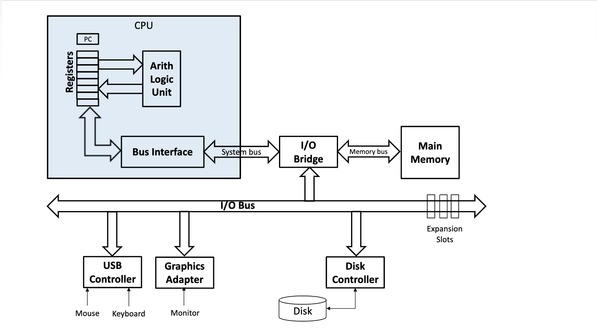

# Computer Architecture

* 컴퓨터 시스템의 구조는 크게 CPU, Memory, Disk, Input/Ouput으로 구성되며 각 모듈간 Bus를 통해 명령을 전달함

**CPU**

* ALU (Arithmetic Logic Unit) : 산술 논리 연산장치로 CPU 내부에서 CPU로 들어온 데이터를 산술/논리 연산을 처리
* Contrul Unit : CPU의 부품으로서 Binary 디코더를 이용하여 명령을 다른 장치의 작동을 지시하는 제어 신호로 변환
  * 대부분의 컴퓨터 Resource는 Control Unit이 관리하고 있으며, 입출력 장치 간 통신 및 CPU와 다른 장치 사이의 데이터 흐름을 제어 
* Register : CPU 내에 존재하여 가장 빠른 속도로 접근할 수 있는 Binary 데이터 저장장치로 현재 계산중인 값을 저장하는데 사용. 메인 메모리의 데이터를 Register로 이동한 후 연산을 수행하고 메인 메모리에 다시 저장하는 방식
* Clock Pulse : 동일한 System 내에 존재하는 장치와 회로의 동작을 동일한 주파수로 사용(동기화). 단위는 Hz로 1초당 수행하는 연산의 횟수를 의미
  * 입력과 출력의 속도에 간극이 생기면, 정상적인 output을 발생시키지 못함

**BUS**

* System Bus : 하드웨어 간 데이터를 주고 받을 때 사용하는 통로로 데이터 버스, 주소 버스, 제어 버스로 구성됨 (단방향)
* I/O Bus : 시스템 버스에서 사우스브릿지 칩셋(I/O 컨트롤러)으로 전달한 명령을 입출력 장치로 전송하는 통로 (양방향)
* Memory Bus : 시스템 버스에서 노스브릿지 칩셋(메모리 컨트롤러)으로 전달한 명령을 메모리에 전송하는 통로 (양방향)

**Cache**

* 데이터에 접근하는 데 많은 시간이 소요되는 경우, 필요한 데이터나 계산된 결과를 Cache에 저장하여 빠른 속도로 접근 가능 

* CPU 캐시 : Register와 Main Memory 사이에 존재하는 저장 공간. 데이터에 접근하는 속도가 빨라지기 때문에 CPU 처리속도가 증가
* 디스크 캐시 : 디스크에 내장되어 있는 입출력 데이터를 저장하는 공간. 
* Level1 Cache, Level2 Cache 등 다수의 캐시가 존재하며 숫자가 적을수록 CPU에 가깝고 속도가 빠르지만 용량은 적어짐

**Memory**

* RAM(Random Access Memory) : 전원이 끊어지면 데이터가 소멸하는 휘발성 메모리로 일반적으로 PC의 주기억장치를 의미
* ROM(Read-Only Memory) : PC의 BIOS와 같이 전원이 끊어져도 기록이 남아있는 비휘발성 메모리. 일반적으로 한번 저장하면 새로운 값으로 대체할 수 없지만, 값이 대체되는 ROM도 있음 (반영구적 저장 장치)

**DISK**

* HDD : 액추에이터 암을 이용하여 데이터의 위치를 알려주고, 엑추에이터 암 끝에 있는 Read/Write Head를 이용하여 회전 디스크 드라이버 플래터에 데이터를 읽고 작성
  * 데이터를 읽고 쓰는데 기계적인 동작이 필요하므로 속도가 느리고 외부 충격에 의해 민감하여 대용량 데스크탑에 적절
  * Arm은 실린더의 폭만큼 이동할 수 있으며 특정 트랙에 도달하기 위해서는 회전을 같이 수행해야됨
  * 탐색시간(Seek Time) : 특정 섹터에 있는 데이터를 읽기 위해 특정 섹터까지 헤드가 이동하는데 필요한 시간 (Arm을 이동)
  * 회전 지연 시간 (Rotate Latency Time) : 플래터가 원하는 섹터에 도달하기 위해 회전할 때 걸리는 시간
  
* DISK Scheduling
  
  * FCFS (First Come First Served): 요청된 순서대로 처리. 비용이 많이 발생하여 비효율
  * SSTF (Shortest Seek time First) : 헤드에서 가장 가까운 트랙의 요청을 처리하기 때문에 처리량을 높일 수 있음. 가장 바깥쪽에 있는 트랙에서 Starvation 발생 가능성
  * SCAN : 안쪽 방향으로 움직이며 모든 요청을 처리하고, 가장 안쪽에서 반대쪽으로 이동하며 남은 요청을 처리
    * 추가되는 요청이 있는 위치를 지날 때 곧바로 처리함
  
  * C-SCAN : 안쪽 방향으로 움직이며 요청을 처리하고, 가장 바깥쪽에서 안쪽으로 이동하며 요청을 처리
    * 추가되는 요청은 Queue에 담은 후, 탐색이 끝난 후 다시 가장 바깥쪽에서 안쪽으로 이동하며 처리
  
  
  * LOOK(C-LOOK) : SCAN(C-SCAN)에서 요청이 없더라도 끝단까지 이동하는 현상을 개선. 불필요한 이동을 제거하나 이동 유무 판단을 위한 Overhead 발생
  * SLTF (Shortest Latency Time First) : 동일한 실린더에서 가장 인접한 섹터의 요청을 처리하여 회전지연시간이 가장 짧은 처리. 헤드의 위치 변화가 거의 없음
    * 탐색 시간 최소는 SSTF, 회전지연 시간 최소는 SLTF
  
* SSD : 컨트롤러, 낸드플래시, D램 버퍼로 구성되어 있으며 기계적인 동작을 하는 부품이 없어 HDD보다 내구성이 좋고 속도가 빠름
  * 컨트롤러 : 페이징으로 파일을 저장하여 사용하지 않는 셀에 빠르게 접근할 수 있게 함
  * 낸드플래시 : OR 플래시보다 Write/Delete 기능이 우수한 플래시 메모리로, 고도로 집적될수록 데이터 용량이 향상. 최근 3D 적층구조로 설계
  * D램 버퍼 : 작업 부하가 많은 입출력의 캐시 역할을 수행하며 reading 성능을 높여줌

* RAID (Redundant Array of Inexpensive(Independent) Disk ) : 여러개의 DISK를 연결하여 하나의 DISK처럼 사용

  * Struct / 동작 방식에 따라 Level 0~6까지 분류하며 RAID0~ RAID6라고 함
    * 각 모델에서 데이터 입출력 병렬화로 성능 향상, 데이터 복제시 안정성 향상 등을 추구함

  * Nested RAID : 여러개 Level을 가진 의 RAID 모델을 묶어서 하나의 RAID처럼 사용
    * RAID 10( 하위 배열은 Level1 상위 배열은 Level 0) 등과 같이 표현

 Image ref : https://slideplayer.com/slide/5893173/

