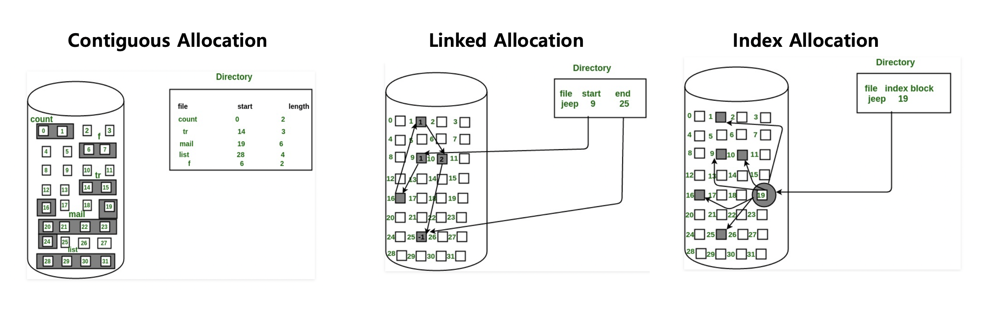
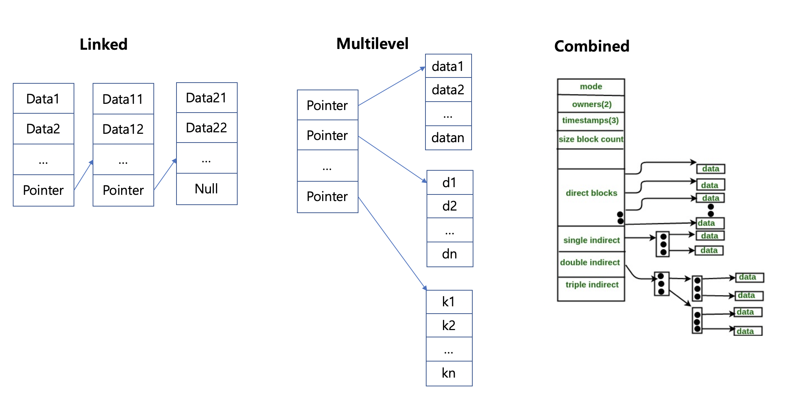

# File System

* 파일 시스템이란 파일을 저장하고 검색하기 위해 논리적으로 배치하는 시스템
  * 운영체제가 디스크나 파티션의 데이터 구조 및 파일을 추적하는 방법

* 저장된 정보를 개별 파일로 분리하여 관리할 수 있음
* 파일시스템은 사용자나 사용자 그룹에 권한을 할당하여, 허가된 사용자만이 데이터에 접근할 수 있음

**Partition**

* 

**Mount**

* 

**File System Metadata**

* asd

**Directory**

* 

**Allocation**

디스크에 파일을 저장할 때는 연속할당, 연결할당, 색인할당 등의 방법을 사용할 수 있음

* Contiguous Allocation : 디스크의 연속된 공간에 선형 순서대로 블록을 할당하여 데이터를 저장해서 탐색 속도가 빠르지만, 파일을 지우고 다시 쓰는 과정에서 외부 단편화 현상이 발생할 수 있고, 파일의 크기를 예측하는 것이 어려움
* Linked Allocation : 연속 할당에서 발생한 외부 단편화 문제와 파일의 크기 예측 이슈를 해결할 수 있지만, 특정 블록을 검색해야 될 때 파일의 첫 블록부터 탐색 필요. Linked 된 블록 중 하나라도 손상이 있을 때 파일 전체를 사용할 수 없음. 여러개의 Block을 Cluster 단위로 묶고, Cluster를 Linked List로 연결하여 탐색 시간을 개선할 수 있으나 내부 단편화 발생.
* Index Allocation : 하나의 블록을 Index로 설정하고, Index 블록에 파일이 저장된 블록의 위치를 저장. Index 블록에 할당된 블록은 순서대로 저장하기 때문에 직접 접근이 가능하지만, Index 블록에 저장할 수 있는 데이터의 크기가 작다
  * 하나의 블록 크기가 128Byte인 경우, Pointer 크기인 4Byte로 나누면 32개의 블록을 저장할 수 있음.
  * 하나의 블록 크기를 늘리게 되면 전체 블록의 수가 줄어드니 쉽게 늘릴 수 없음.
  * Linked, Multilevel 두가지 방법으로 문제를 개선 (예시로 하나의 인덱스 블록이 512Byte인 경우, 128개의 4Byte를 저장할 수 있음)
    * Linked : 하나의 Index 블록에서 다음에 연결되는 Index 블록을 연결시켜줌 (31 + 31 + 31 ...,  마지막 4Byte에는 주소가 저장됨)
    * Multilevel : 인덱스 블록에 저장된 모든 블록에서 Linked 시켜주면서 실제 파일이 저장된 블록까지 진행 (128 * 128 * 128 * ...)
      * 이중 간접 접근인 경우 128 * 128 * 4Byte의 크기의 데이터까지 접근할 수 있음
  * Unix 기반 파일 시스템에서는 직접 데이터 접근과 Multilevel을 혼합한 Combined 기법을 사용
    * 15개의 색인 블록을 가지고 있고, 12개의 블록은 직접 데이터 접근으로 실제 데이터를 저장하는 주소를 저장하고 있음.
    * 3개의 블록은 간접 접근 Multilevel 블록으로 단일 간접(128), 이중 간접(128 * 128), 삼중 간접(128 * 128 * 128)으로 구성되어 있음

Image Ref : https://www.geeksforgeeks.org/file-allocation-methods/
 

**Journaling**

* 

**Windows Registry**

* File System과 다름

### DISK

**HDD**

**SSD**

**RAID**

**Scheduling**

### Distributed File System

**HDFS**

**GFS**

### OS

**Windows**

* FAT(MS-DOS - Linked Allocation), NTFS

**Linux/Unix**

* ZFS

**MacOS**

* HFS

https://namu.wiki/w/%ED%8C%8C%EC%9D%BC%20%EC%8B%9C%EC%8A%A4%ED%85%9C#s-2.3
