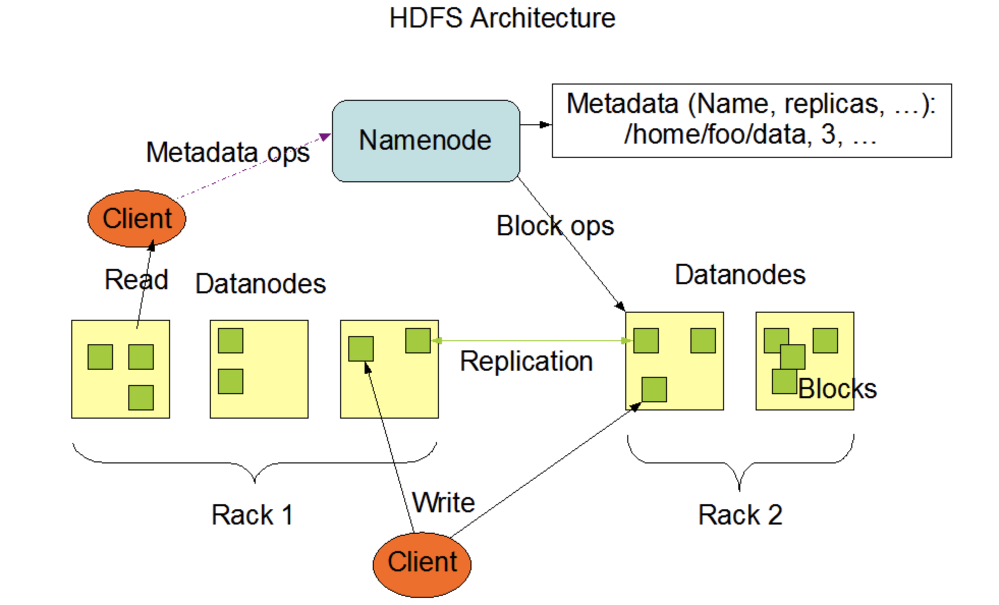

# File System

* 파일 시스템이란 파일을 저장하고 검색하기 위해 논리적으로 배치하는 시스템
  * 운영체제가 디스크나 파티션의 데이터 구조 및 파일을 추적하는 방법

* 저장된 정보를 개별 파일로 분리하여 관리할 수 있음
* 파일시스템은 사용자나 사용자 그룹에 권한을 할당하여, 허가된 사용자만이 데이터에 접근할 수 있음

**Partition**

* 영구 저장장치 드라이버를 설정한 데이터 크기로 분할했을 때 생기는 영역
* 파티션으로 생성된 영역을 파일 시스템으로 포맷하여 접근할 수 있는 저장 공간을 볼륨이라고 함
* Partition을 구분하여 데이터 보호 및 관리 용이
* 하나의 Disk에 여러개의 OS를 사용할 수 있게 함
* 주파티션을 4개까지 설정할 수 있으나, 추가 파티션이 필요한 경우 마지막 파티션을 확장 파티션으로 지정
  * 확장 파티션은 여러개의 파티션으로 분할할 수 있으며, 분할된 각 파티션을 논리파티션이라고 함
* Windows에서는 각 Partition이 Root Directory를 가지고 있어서 C드라이브 D드라이브 등으로 구분됨
* Linux에서는 /dev/sda2, /dev/sdb1 등으로 Root Directory 하위 Directory로 추가됨
  * sda2는 첫번째 Disk의 두번째 Partition, sdb1은 두번째 Disk의 첫번째 Partition 

Image Ref : https://unix.stackexchange.com/questions/501883/does-this-refer-to-a-file-system 

**Mount**

* 파일시스템이나 디스크 드라이브를 OS가 인식할 수 있는 Directory에 연결시켜주는 작업
* Windows에서는 외부 드라이브가 연결 되었을 때 자동으로 Mount를 시켜주지만, Unix 환경에서는 사용자가 직접 특정 Directory에 연결시켜야 함
  * Unix는 Root Directory에서 시작하는 Single Directory 구조를 가지고 있고 Windows는 볼륨마다 Root Directory를 가짐
* Linux에서는 /etc/fstab에 설정된 내용으로 부팅시 마운트 적용
  * 파일시스템 장치명, Directory 경로, 파일시스템 종류, 옵션 등을 설정
* Mount를 할 때 -o 옵션을 적용하여 마운트 된 파일 시스템의 권한 등을 설정할 수 있음

**File System Metadata**

* 파일 이름, 저장된 위치, 사이즈, 접근 권한 등 파일에 관련된 정보가 저장되어 있음

* 파일과 별도로 저장되며, Directory에 저장될 수도 있으나 주로 FCB에 저장
  * inode : 파일, Directory 등 파일 시스템에 관한 정보를 가지고 있는 Unix 계열에서 사용하는 디스크 상의 자료구조
    * Unix 외 OS에서는 FCB(File Control Block) 라고도 함
* 파일을 삭제 하더라도 DISK에서 지워진 게 아니라면 Metadata를 이용하여 복구

* inode에 저장된 Metadata를 Memory에 적재하고 Process에서 Memory를 참조
  * Root Directory의 Metadata에서 파일의 Metadata까지 Directory 경로를 하나씩 추가하며 최종 파일 위치로 찾아감
  * 파일의 Metadata를 찾으면 Memory에 적재하고, PCB에 Memory 상 파일의 Metadata가 저장된 위치를 저장
  * 메타데이터에는 파일의 데이터가 저장된 주소가 포함되어 있으니, 파일의 데이터를 이용할 수 있음
  * 이후 Process에서 파일에 접근할 때 Root부터 실행하는 게 아니라, PCB에 저장된 Metadata 정보를 이용하여 바로 접근할 수 있음

**Allocation**

디스크에 파일을 저장할 때는 연속할당, 연결할당, 색인할당 등의 방법을 사용할 수 있음

* Contiguous Allocation : 디스크의 연속된 공간에 선형 순서대로 블록을 할당하여 데이터를 저장해서 탐색 속도가 빠르지만, 파일을 지우고 다시 쓰는 과정에서 외부 단편화 현상이 발생할 수 있고, 파일의 크기를 예측하는 것이 어려움
* Linked Allocation : 연속 할당에서 발생한 외부 단편화 문제와 파일의 크기 예측 이슈를 해결할 수 있지만, 특정 블록을 검색해야 될 때 파일의 첫 블록부터 탐색 필요. Linked 된 블록 중 하나라도 손상이 있을 때 파일 전체를 사용할 수 없음. 여러개의 Block을 Cluster 단위로 묶고, Cluster를 Linked List로 연결하여 탐색 시간을 개선할 수 있으나 내부 단편화 발생.
* Index Allocation : 하나의 블록을 Index로 설정하고, Index 블록에 파일이 저장된 블록의 위치를 저장. Index 블록에 할당된 블록은 순서대로 저장하기 때문에 직접 접근이 가능하지만, Index 블록에 저장할 수 있는 데이터의 크기가 작다
  * 하나의 블록 크기가 128Byte인 경우, Pointer 크기인 4Byte로 나누면 32개의 블록을 저장할 수 있음.
  * 하나의 블록 크기를 늘리게 되면 전체 블록의 수가 줄어드니 쉽게 늘릴 수 없음.
  * Linked, Multilevel 두가지 방법으로 문제를 개선 (예시로 하나의 인덱스 블록이 512Byte인 경우, 128개의 4Byte를 저장할 수 있음)
    * Linked : 하나의 Index 블록에서 다음에 연결되는 Index 블록을 연결시켜줌 (31 + 31 + 31 ...,  마지막 4Byte에는 주소가 저장됨)
    * Multilevel : 인덱스 블록에 저장된 모든 블록에서 Linked 시켜주면서 실제 파일이 저장된 블록까지 진행 (128 * 128 * 128 * ...)
      * 이중 간접 접근인 경우 128 * 128 * 4Byte의 크기의 데이터까지 접근할 수 있음
  * Unix 기반 파일 시스템에서는 직접 데이터 접근과 Multilevel을 혼합한 Combined 기법을 사용
    * 15개의 색인 블록을 가지고 있고, 12개의 블록은 직접 데이터 접근으로 실제 데이터를 저장하는 주소를 저장하고 있음.
    * 3개의 블록은 간접 접근 Multilevel 블록으로 단일 간접(128), 이중 간접(128 * 128), 삼중 간접(128 * 128 * 128)으로 구성되어 있음

Image Ref : https://www.geeksforgeeks.org/file-allocation-methods/
 

**VFS**

* Virtual File System은 실제 File System과 OS 사이의 Interface를 제공
* 디스크의 종류에 관계 없이 동일한 System Call을 method를 제공
  * VFS에서 동일한 method를 제공하더라도 파일 시스템에서 Customizing하여 직접 구현해줘야함

**Journaling**

* DISK에 시스템 변경사항을 저장하기 전에 Journal Log를 작성
  * 변경사항이 Commit 되지 않고 시스템이 종료 되었을 때, Journal Log를 참조하여 복구
  * FSCK(File System Check)보다 빠르고 안전하게 복구할 수 있음
* Linux는 ext3부터 기능 제공

**Buffer Cache**

* 최근에 사용된 DISK Block을 메모리에 캐싱
* File이 저장되는 Block들은 Locality가 있기 때문에 이후에 접근할 때 응답 시간을 줄일 수 있음

### Distributed File System

**NFS / CIFS**

* SMB (Server Message Block) : Client-Server 간 접근을 통해 원격 통신할 수 있는 Protocol이었지만, Server의 Directory를 Client는 마치 Local에 있는 것처럼 엑세스 할 수 있게 지원함
  * Windows의 경우 공유 폴더로 설정된 Directory를 Network Driver로 연결하여 접속

* CIFS (Common Internet File System) : Internet 환경을 고려하여 MS에서 도입한 SMB 버전
  * Windows95 등 초기 Windows 버전에서 CIFS를 사용했으나 성능 부족 및 사이버 보안 이슈로 사용하지 않음.
    * 이후 나온 버전에서 다시 SMB라는 명칭을 사용 (Windows10에서 SMB 3.1.1을 사용)
* NFS (Network File System) : Unix/Linux에서 로컬 파일 시스템을 공유하는 프로토콜
  * Export 된 File System을 Client가 Mount하여 Local Directory처럼 사용
* 다수의 사용자가 함께 사용하는 네트워크 저장 공간인 NAS(Network Attached Storage)를 사용할 때, CIFS/SMB나 NFS가 프로토콜로 사용됨
  * NAS를 이용하면 서로 다른 OS(File System)에서도 동일한 Storage를 공유할 수 있음
  * NFS와 CIFS/SMB는 서로 통신할 수 없기 때문에 Server와 Client가 통신하기 위해서는 Protocol을 일치화해야됨
  * 예) Windows와 Linux에서 공유할 때, SMB Protocol은 Linux와 Windows 환경을 지원하는 Samba 프로토콜 이용
    * Linux에 Samba Server를 설치하고 Windows에서 Linux 계정의 Home Directory를 공유 폴더로 설정
    * Samba : Unix System을 고려한 SMB 프로토콜, Windows/Apple OS 등 서로 다른 OS 간 Resource를 공유할 수 있는 SMB Server

**HDFS**

* 하둡의 대용량 파일을 분산된 서버에 저장하고, 대용량 데이터를 처리할 수 있는 파일 시스템
* Master 역할을 하는 NameNode와 Slave 역할을 하는 DataNode로 구성되어 있으며 TCP/IP 프로토콜을 이용하여 통신
* 블록 단위로 데이터를 저장하며, 하나의 블록의 크기는 128MB에서 512MB 등으로 대용량 블록임
  * 블록의 크기가 300MB인 경우, 128MB/128MB/44MB 3개의 블록이 생성됨

* NameNode : File System의 Namespace를 관리
  * File System Tree 및 Tree에 포함되는 File/Directory의 Metadata를 관리
  * Metadata 스냅샷인(영속적 CheckPoint) fsimage, 체크포인트 이후 Update 된 edits log는 DISK에 저장
    * 트랜잭션이 발생할 때마다 대용량 파일인 fsimage를 업데이트 할 수 없기 때문에 설정한 조건을 만족할 때 edits 내용을 fsimage에 반영
    * fsimage와 edits를 이용하여 메타데이터를 복구할 수 있음

  * Datanode는 주기적으로 Block에 대한 정보를 Namenode에 전송하기 때문에, Namenode는 블록들의 위치를 매핑하여 메모리에 저장
  * Client가 HDFS의 File에 접근하려고 할 때 Namenode에서 접근 권한 여부를 확인
  * Datanode로부터 주기적으로 Heart Beat / Block Report를 전송받아 Datanode / 블록의 상태를 지속적으로 관리

* Datanode : Client의 요청을 받은 Namenode가 Data를 저장할 때 블록 단위의 데이터를 저장하고 있는 개체
  * Client는 Primary datanode에 데이터를 블록 형태로 작성
    * Primary datanode는 Secondary datanodes에 블록을 복제
      * 하나의 Block에 문제가 생겼을 때, 복제된 다른 datanode의 Block을 이용하여 Recovery
    * 복제가 완료되면 Primary node는 Client에게 데이터 작성 완료를 응답
  * Client가 데이터를 읽을 때는 Namenode에서 어떤 datanode에 원하는 데이터 블록이 있는지 확인한 후 Datanode에 접근
  * 블록 지역성(Locality)를 보장하기 때문에 데이터가 있는 Node에서 Map Task를 수행
    * 해당 Node에서 처리를 못할 경우 동일 Rack의 Node를 확인하여 수행
    * 동일 Rack에서 사용할 수 있는 Node가 없는 경우 외부 Rack의 Node를 이용하기 때문에 네트워크 전송 발생

Image Ref : https://hadoop.apache.org/docs/r1.2.1/hdfs_design.html
 

### OS

**Windows**

* FAT(MS-DOS - Linked Allocation), NTFS

**Linux/Unix**

* ZFS

**MacOS**

* HFS

https://namu.wiki/w/%ED%8C%8C%EC%9D%BC%20%EC%8B%9C%EC%8A%A4%ED%85%9C#s-2.3

