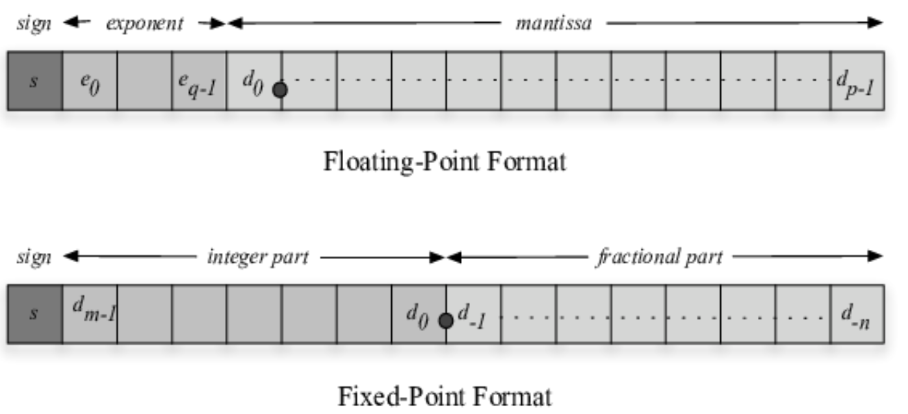

# Floating Point

* 고정 소수점(Fixed Point)

  * 고정 소수점은 첫 부호를 나타내는 비트와 Integer Part, 그리고 fractional part로 구성됨
  * Sign bit는 0은 양수, 1은 음수
  * 그리고 Sign부터 Pont의 중간 index까지 interger part임
  * 32bit floating인 경우, Integer part는 $$-2^{15}$$ 에서 $$2^{15}-1$$ 의 범위까지 표현할 수 있음
    * fractional part는 $$1 \over 2$$  + $$({1 \over 2})^{2}$$ + ... +  $$ ({1 \over 2})^{16}$$ 까지 표현할 수 있음
  * 간단하게 표현할 수 있지만, 정밀도 및 범위가 비효율적이라 거의 사용되지 않음

* 부동 소수점 (Floating Point)

  * 고정 소수점과 마찬가지로 첫 부호는 나타내는 Sign bit는 양수:0 , 음수:1로 동일

  * point의 비트마다 지수부와 가수부의 범위가 다름

    * 16bit : 지수 5자리, 가수 10자리, bias : 15
    * 32bit : 지수 8자리, 가수 23자리, bias : 127
    * 64bit : 지수 11자리, 가수 52자리, bias : 1023
    * 128bit : 지수 15자리, 가수 112자리, bias : 16383

  * 정수부와 소수부를 각각 2진수로 표현하고 정수가 1만 남을때까지 왼쪽으로 이동 (정규화)

    * 정수가 0이고 소수부가 0으로 시작하는 경우, 오른쪽으로 이동

  * 가수부는 가장 왼쪽의 1을 제외한 binary 숫자를 입력

    * -17.625이라는 수가 있을 때, - 1001.101로 나타낼 수 있고, -1.001101 * $$2^3$$ 으로 표현할 수 있음
    * 지수 e는 3으로 3칸 이동했다는 의미이고, 지수부 E = e + bias로 표현할 수 있음
      * e가 음수인 경우를 고려하여 bias 설정 (오른쪽으로 이동)
    * 32bit로 표현할 때, E = 3 + 127 = 130 = 10000010으로 나타낼 수 있음

    * -1.001101로 표현된 경우, 가수부는 001101이고 뒤에 남은 공간을 0으로 채움
    * 따라서 1,10000010,0011010000...0000 으로 표현됨

  * 0.1 같은 소수 부분은  $$({1 \over 2})^{4}$$ + ... +  $$ ({1 \over 2})^{n}$$ 으로 정확히 표현되지 않아 오른쪽 가수 부분이 0으로 가득 채워지지 않음

    * 즉, 정확한 0.1을 나타내지 못하고 근사값으로 표현됨
    * 그렇기 때문에 0.1 * 0.1의 근사값이 0.01이 안 될 수 있음

Image Ref : https://www.researchgate.net/figure/Representation-of-the-floating-point-and-fixed-point-formats_fig1_225139564
 

