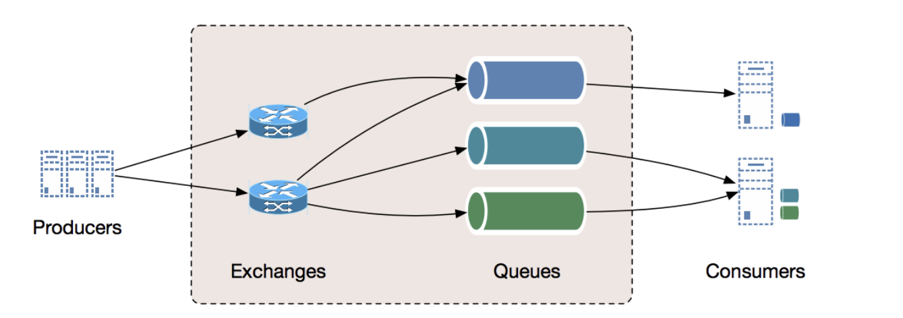

# Inter Process Communication (IPC)

### PIPE

* FIFO(First In First Out) 구조로 동작
* PIPE는 Blocking을 지원하기 때문에 반이중(Half-Duplex) 통신
  * 반이중 : 양방향 전송은 가능하나, 동시에 양쪽 방향에서 전송할 수 없음
* 한쪽 방향으로만 통신이 가능하고 각각의 PIPE는 Read(수신)/Write(송신) 중 하나의 기능만 제공함
  * 하나의 Process는 Read만 하고, 다른 하나의 Process는 Write만 할 때 유용하게 사용할 수 있음
  * Process 간 송수신을 하기 위해서는 2개의 Pipe를 구현해야 됨
* 익명 PIPE인 경우, 동일한 PPID인 부모와 자식 Process 간 통신할 때 사용
  * Fork 함수를 이용하여 자식 Process를 만든 후 PIPE를 이용하여 통신
* Named PIPE인 경우, 부모/자식 Process 외 모든 프로세스 간 통신을 지원
  * mkfifo 함수를 이용하여 이름과 Mode를 가지는 FIFO파일을 생성
* FIFO는 파일 이름을 통해 접근할 수 있고, PIPE는 이름을 가지지 못함

### Message Queue

* PIPE와 동일하게 FIFO(Queue) 자료구조를 기반으로 통신 
* 여러 프로세스에서 커널에서 관리하는 공유 메모리에 접근할 수 있음
* 비동기 Message를 사용하는 프로세스 간 데이터 통신하는 것을 MOM(Message Oriented Middleware)이라고 하는데, Message Queue는 MOM을 구현한 것임
  * AMQP(Advanced Message Queuing Protocol)는 MOM을 위한 표준 프로토콜로 Queuing, Routing, Security 등의 기능이 있음
* RabbitMQ, MSMQ 등 AMQP를 이용한 Software들을 주로 사용
* Producer Process에서 생성한 Message를 Queue에 Routing을 하고, Consumer Process는 Queue에 있는 Message를 가져옴
  * msqid로 Message Queue를 식별

 Image ref : https://medium.com/must-know-computer-science/system-design-message-queues-245612428a22 

**Apache Kafka**

* LinkedIn에서 개발한 분산 메시지 시스템으로 대용량의 실시간 로그 처리에 특화되어 있음
* TPS(Transaction Per Second)가 우수하지만, 특화된 시스템으로 다양한 기능은 제공하지 않음
* 메모리에 저장하는 기존 Message System과 다르게, 파일 시스템을 저장하여 Durability 보장
  * 기존 Message System에서 문제가 된 메시지가 많아질 때 성능 저하를 개선함

* Publish-subscribe(pub-sub) 모델로 동작
  * Publish Model에서 Producer는 Message를 Kafka Cluster에 Push 
  * Subscribe Model에서 Consumer는 Message를 Kafka Cluster에서 Pull

* Partition과  Consumer Group은 1:N 관계로 매칭하여 사용
  * 여러개의 Consumer Group에서 특정 Partition에 접근할 수 있음
    * Consumer Group 내에서 Consumer를 Partition과 Mapping

  * Consumer Group에서 Consumer가 추가/제거 되면, Consumer의 Partition 참조를 Rebalancing 

* Producer는 Message를 생성하여 Kafka Cluster인 Topic에 전송
  * Topic은 하나 이상의 Partition을 가지고 있는데, 분산된 Broker(Kafka Server)에 Partition을 저장
    * Partition을 다른 Broker로 Replication. Broker에 문제가 생긴 경우, 다른 Broker의 Partition이 동작
    * Topic 내에서 Partition을 병렬로 처리하여 효율은 증가하지만, Partition의 수를 줄일 수 없음
  * Partition은 뒤에서부터 작성
* Consumer도 Topic에 대한 정보를 이용하여 Partition에 접근
  * Consumer Group에서는 Partition을 마지막으로 참조한 Offset을 설정한 기간동안 저장하고 있음
    * Consumer Group에서는 Partition에 저장된 읽지 않은 Message에 접근할 수 있음
    * Message를 읽어오는 중에 문제가 생긴 경우 이전 Offset부터 읽기 때문에 중복 Reading이 발생할 수 있음
* Zookeeper는 Metadata로 분산 Message Queue에 대한 정보를 저장하고 있음
  * Cluster 정보를 최신으로 업데이트하여 Broker/Producer/Consumer 에 대한 정보를 최신으로 유지하고 관리
  * 사용하려는 Broker에 문제가 있을 때 다른 Broker로 Control
  * 이전에는 Offset에 대한 정보도 저장하고 있었으나, 최신 버전에서는 Consumer Group에서 관리

 Image ref : https://www.researchgate.net/figure/Kafkas-architecture-illustrated-with-3-partitions-3-replicas-and-5-brokers_fig2_326564203 

### Shared Memory

* 

**[Semaphore](https://jeothen.github.io/Computer_Science/OS/Synchronization.html#semaphore)**

* Process 간 데이터 전송을 담당하지 않고, 프로세스 간 동기화를 담당
  * 여러개의 Process에서 동일한 메모리에 접근할 때, 하나의 Process만 접근할 수 있게 함

### Socket

* IP주소/Port 를 특정하여 Process 간 통신

* Client / Server에 존재하는 Process에서 IP/Port를 지정하고 아래와 같이 진행

  *  Server

    * Socket() : System Call로 Socket 생성
    * Bind() : Socket을 IP와 Port에 Binding
    * Listen() : System Call과 연결 수신 대기 상태
    * Accept() : System Call과 연결이 된 상태. Client와 연결될 때까지 Blocking

  * Client

    * Socket() : System Call로 Socket 생성

    * Connect() : System Call로 Socket을 Server 주소로 연결

  * 이후 Read/Write를 통해 데이터 수송신

 Image ref : http://www.it.uom.gr/teaching/distrubutedSite/dsIdaLiu/labs/lab2_1/sockets.html

### RPC (Remote Procedure Call)
