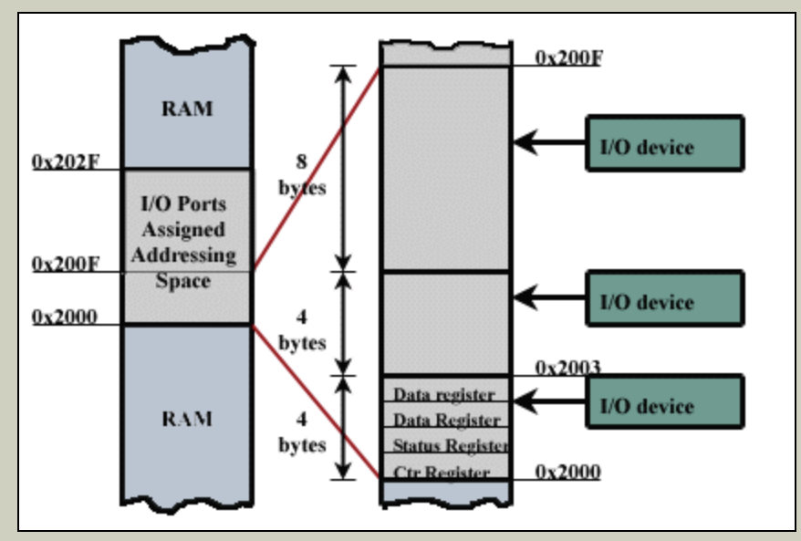

# Polling & Interrupt & PIO & DMA

### Poilling

* 충돌을 피하거나 동기화를 하기 위해 CPU에서 Device의 상태를 주기적으로 검사하며 제어함. 

* I/O Port는 메모리에 Mapping되지만, Port에 해당하는 메모리에서 직접 I/O Transaction을 담당하지 않음
* CPU에서 I/O 명령을 처리할 때는 다른 작업을 수행하지 못해 비효율적이나 구현이 간단함
  * I/O를 처리할 때까지 Process를 사용하지 못함
  * I/O의 Latency가 충분히 낮아 Interrupt 대기 시간보다 짧은 경우 유용함

* 실시간으로 명령을 처리해야 될수록 주기를 짧게 설정해야 되는데, 주기가 짧아질 수록 부하는 증가
* Device의 데이터 처리가 완료되더라도 지속적으로 Device Status를 확인
  * Device의 Status Register를 확인하여 수신 여부 확인
  * 수신이 된 경우, 데이터를 Data Register로 옮긴 후 Instruction Register에서 데이터를 처리
    * Data Register는 데이터의 저장/이동을 담당하기 때문에 일반적으로 2개 이상 존재

 Image ref : https://www.cs.mcgill.ca/~cs573/fall2002/notes/lec273/lecture20/20_1.html 

### Interrupt

* Device에서 Kernel로 신호를 보낼 수 있는 Mechanism

* 커널 프로그램인 장치 드라이버 내 존재하는 Interrupt Handler를 이용하여 비동기 콜백 방식으로 처리
* Device마다 고유한 Interrupt를 할당하여 사용하고, Kernel은 IRQ(Interrupt Request)에 포함된 정보를 이용하여 Device와 Mapping
  * Interrupt를 처리하기 위해서는 Interrupt Vector 테이블을 참조하여 ISR의 주소값을 얻음
* Interrupt Handler(**ISR**, Interrupt Service Routine)는 인터럽트 요청을 처리하기 위한 기계어 코드로, Interrupt 원인에 따라 각각 존재함
  * 커널에 존재하기 때문에, 응용 프로그램에서 구현할 필요 없음
  * [MCU](https://jeothen.github.io/Computer_Science/OS/Processor.html)에서는 소스 코드 내에서 Assembly or C언어로 구현

**Type**

* 외부 인터럽트 : Power Cable(전원), I/O Interrupt, 외부 신호 Interrupt, CPU의 기계적 오류 등
* 내부 인터럽트 :  Division by Zero, OverFlow, Trap, SVC(SuperVisor Call, 감시를 목적으로 프로그램이 발생시킨 명령어 ) 등 

**Exception**

* 동기식 Event로 CPU 내부에서 발생시킴
* OverFlow/DownFlow, Division by Zero, Page Fault 등 

**Trap**

* 특정한 조건을 설정하여 Interrupt, Exception 등이 발생할 때 Catch
* 조건에 부합하는 Event를 Trap Handler를 이용하여 상황에 맞는 Handler를 호출

 Image ref : https://care4you.in/l-7-interrupts-in-8085-and-interrupt-cycle/ 

* I/O Request가 발생한 후, Transferring에서 I/O Data를 Read 함
* I/O Data Read가 완료되면 CPU에서 Transfer Done(gap, I/O Device에서 Data Read가 끝났다고 CPU에 알려주는데 시간이 소요됨)
* Interrupt signaled 동안 Interrupt가 진행(ISR 처리)

 Image ref : https://www.slideshare.net/VaibhavKhanna21/os-concepts-2-handling-of-interrupts 

### PIO & DMA

**PIO**(Program Input/Output, 프로그램 입출력) 

* Device와 CPU 사이에서 데이터를 주고 받는 방식
* Device에 PIO Mode를 선택할 수 있는데, 각 모드마다 전송 속도가 다름
  * 특정 Device의 속도를 높여야 되는 경우, 속도가 높은 Mode로 변경 필요
* Device Data는 Device Controler에 의해 Local Buffer로 데이터를 전송하는데, 데이터 전송량이 많아질 때 CPU 성능에 BottleNeck이 발생할 수도 있음
  * 이를 해결하기 위해 DMA가 고안됨

**DMA**(Direct Memory Access, 직접 메모리 접근) 

* Device에서 CPU의 개입 없이 직접 메모리에 접근하여 Read/Write를 할 수 있는 기능
* CPU의 I/O 작업을 줄여주기 때문에, CPU 효율 향상

* PC 내부의 Main BUS가 지원하는 기능임
  * ISA 버스 표준에서는 16MB까지 지정할 수 있고, EISA나 MCA 표준에는 전체 메모리 범위 엑세스 가능
* Multi-Core에서 칩 내부 데이터 전송에서 사용되고, 메모리 간 데이터 이동에도 사용됨

 Image ref : https://www.pcmag.com/encyclopedia/term/pio-mode 

