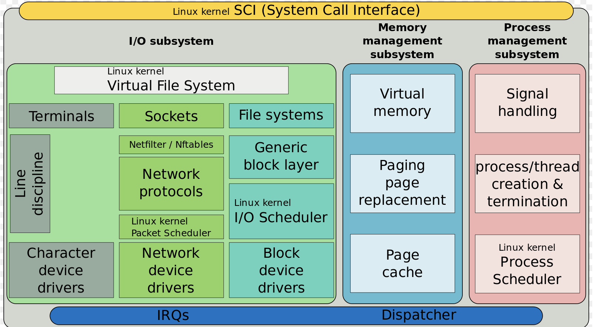

# Kernel

* 운영체제의 핵심으로 시스템을 통제하여 서비스를 제공

* User Process는 H/W에 직접 명령을 줄 수 없기 떄문에, Kernel 이라는 Interface를 이용하여 연결
  * Memory Management, Process Management, Device Driver, Network, File System, IPC 등 영역에서 User Process와 System Call을 통해 명령을 수행
* 추상화 계층 (HAL) : HW의 차이를 숨겨서 프로그램의 일관성 유지

 

### System Call

* 운영체제는 User Mode와 Kernel Mode로 나뉘어서 구동됨
* 고급 프로그래밍 언어로 작성된 프로그램에서 직접 Kernel에 접근할 수 없기 때문에, API를 이용하여 System Call이라는 Interface에 접근

 Image ref : https://www.cs.uic.edu/~jbell/CourseNotes/OperatingSystems/2_Structures.html

 

**역할**

* Process Management  - Process/Thread의 CPU 스케줄링
* Memory Management  - 가상메모리, 페이징, 캐시 등
* Device Driver - Character Device, Block Device, Network Device
  * Character Device : 키보드, 마우스와 같이 캐시 버퍼를 사용하지 않고, device의 raw data를 제공
  * Block Device : HDD, SSD와 같이 Random Access가 가능한 Block 단위로 데이터를 읽고 쓰는 장치
  * Network Device : 이더넷처럼 네트워크를 통해 패킷을 송수신 할 수 있는 장치 
* FIle System - 파일 권한 설정, Mapping을 지원하여 효율적으로 파일 사용/저장, 계층적 Directory 구조로 파일 관리
* Network - PC 간 통신 연결 지원
* IPC - 한 PC 내에서 내부 프로세스 간 통신 기능을 제공

 Image ref : https://ko.m.wikipedia.org/wiki/%ED%8C%8C%EC%9D%BC:Simplified_Structure_of_the_Linux_Kernel.svg

 

### Kernel Types

**Monolithc Kernel**

* 단일형 커널로, 운영체제에서 발생하는 모든 작업을 하나의 커널이 처리하여 성능이 좋음
  * 사용자 서비스 영역과 커널 서비스가 동일한 주소 공간에 보관됨

* 모든 모듈이 같은 주소 공간에 있어 Kernel의 크기가 크며, 코드의 집적도가 높아 유지보수가 어려움
* 하나의 Service에 문제가 생기면 전체 Kernel에 영향을 주며, Device Driver에 변경이 있는 경우 Kernel 재빌드 필요
* UNIX, LINUX 등에서 사용

**Micro Kernel** 

* 핵심적인 기능(IPC, Memory, Scheduling)만 남겨서 Kernel의 크기를 줄이고, Device Driver, File System 같은 제외된 Service 영역은 Kernel 위에 Server 형태로 제공
* 하나의 Server에 문제가 생기더라도 Kernel에는 영향이 없으며, 장치에 변경이 있어도 Kernel 재빌드 안 해도 됨
* 서버 형태로 통신을 하기 때문에 Context Switching으로 인한 overhead 발생 가능성이 높음
* Process를 관리하는 핵심적인 기능이 중요한 RealTIme OS에서 주로 사용
  * Monolithic과 다르게 Service 영역에 문제가 생기더라도 Kernel이 동작할 수 있음

 Image ref : https://ko.wikipedia.org/wiki/마이크로커널

 

**Hybrid Kernel**

* Monolithic Kernel에 Micro Kernel을 조합한 Kernel로 일반적으로는 Micro Kernel로 수행하지만, 성능이 느린 코드들은 Monolithic으로 동작
  * Monolithic과 Micro의 장점을 적절하게 사용
* 커널 사이즈도 적절하고, 장치에 변경이 있어도 Kernel을 재빌드 안 해도 됨
* 성능에 있어서도 Monolithic보다는 느리지만, Micro보다는 뛰어나서 양호하게 사용 가능
* Windows, MacOS, IOS 등에서 사용

 Image ref : https://ko.wikipedia.org/wiki/하이브리드_커널

 

**Exo Kernel**

* 기존의 Kernel은 애플리케이션을 빌드할 때 Kernel이 추상화 계층을 이용하여 H/W에 접근하지만, Exo Kernel에서는 최소한의 추상화만 제공하고 사용자가 H/W에 직접 접근할 수 있게 함
* Exo Kernel 위에 구현된 라이브러리 OS를 이용하여 프로그램이 H/W의 리소스를 사용 가능 여부 및 권한을 확인
* 자원에 대한 Protection 및 Multiplexing만 제공하기 때문에 Kernel의 크기가 상당히 작고 간단함

 Image ref : https://ko.wikipedia.org/wiki/엑소커널

