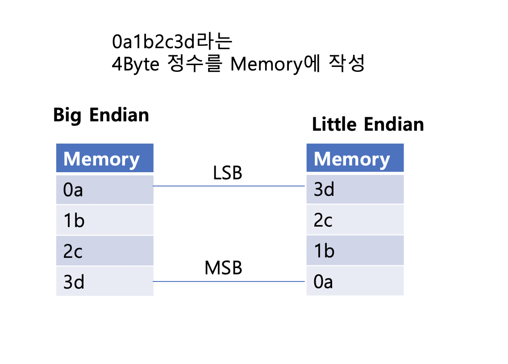
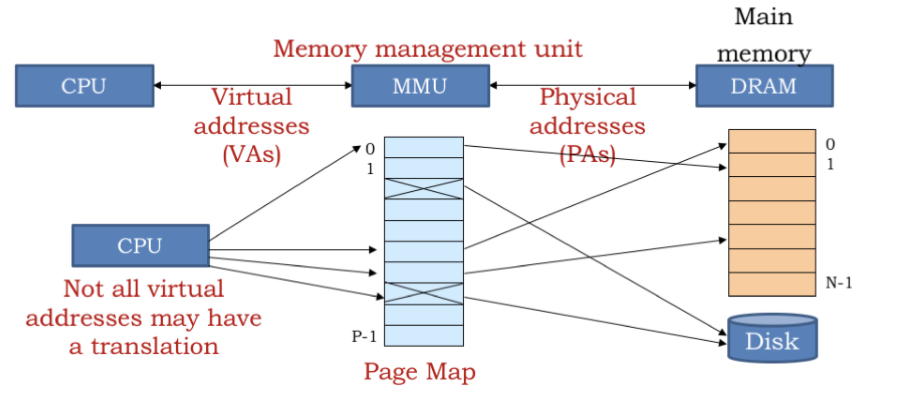
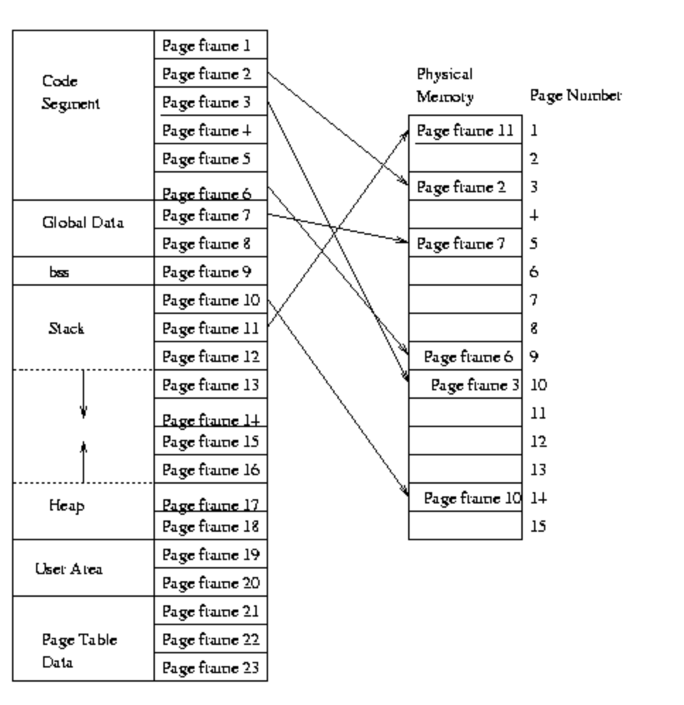
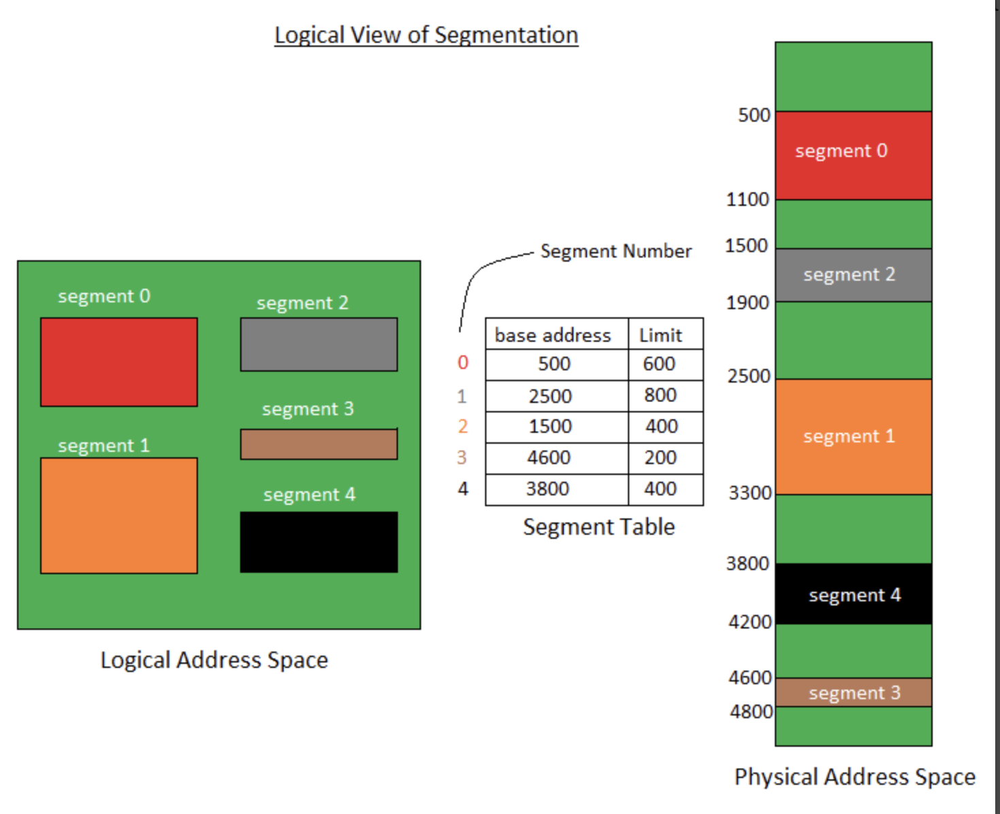
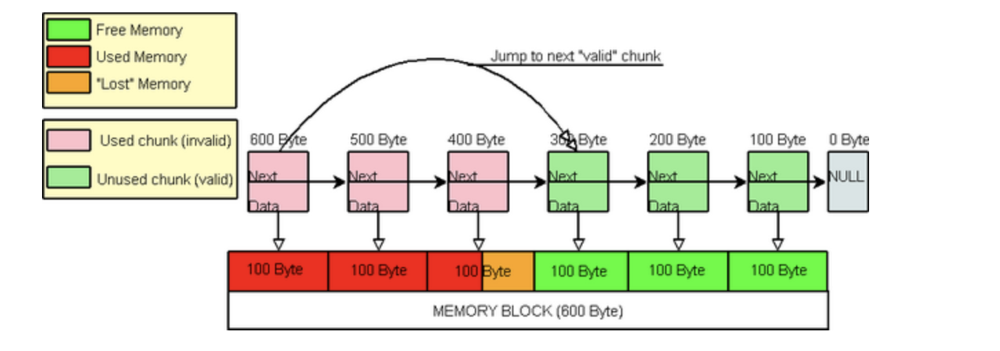

# Memory

주기억장치를 의미하는 메모리는 일반적으로 휘발성 메모리인 RAM(Random Access Memory)을 표현할 때 사용됨

* Memory operand : Load-Store 구조로, Register operand를 위해 Memory의 데이터를 Register로 Load 및 operating하고 다시 Memory에 Store

* 메모리 Allocation에는 Placement(Where? Disk to Memory), Fetch(When? Disk to Memory),Replacement(Not Space to Allocated, Which Process Removed from the Memory) 3가지 운영정책이 있음

32bit/64bit은 Word Size를 의미하는데, 32bit System은 Register에서 데이터 처리 단위가 32bit이고, 64bit System은 Register에서 데이터 처리 단위가 64bit임

메모리 주소 모드는 바이트 당 주소를 하나 할당하는 방식으로 동작하기 때문에 32bit와 64bit에서 사용할 수 있는 메모리 영역이 다름

* 64bit OS인 Windows10의 인식 가능 메모리는 128GB ~ 6TB까지 여러가지 버전이 있음
  * 이론상으로는 $$2^{64}$$byte = 18.4Eb까지 인식할 수 있지만, 메인보드에서 지원하는 범위까지 인식할 수 있음
* 32bit Application의 최대 사용 가능 메모리는 4GB($$2^{32}$$ byte)
  * Process를 실행하게 되면 Memory가 4GB 증가하지 않는 이유는, 4GB로 설정한 Memory는 가상주소공간(Virtual Memory Space)영역에 추가됨
  * 4GT : 일반적으로 Process에게 할당해주는 가상 메모리는 Kernel 영역 2GB, User 영역 2GB을 사용하는 4GB(/2GB) 로 사용하지만, 사용자 설정에 따라 Kernel 영역 1GB, User 영역 3GB를 사용하는 4GB(/3GB)를 사용할 수 있음
  * 실제 사용할 수 있는 메모리를 4GB보다 적은데 Memory Section이 Memory-Mapped Interface를 위해 별도로 설정됨
    * MMIO 외에도 PCI Bus, BIOS 등이 Memory 최상단 영역을 차지하게 되어 사용할 수 있는 메모리가 전체 메모리보다 작아짐
    * DMA로 통신하는 Device는 바로 Memory에 접근할 수 있으니 MMIO를 사용하지 않아 메모리 공간을 차지하지 않음
  * PAE : 리눅스 Kernel에서 PAE(Physical Address Extension)를 지원하는 버전에서는 32bit System을 36bit까지 확장할 수 있어서 최대 64GB 메모리에 접근할 수 있음 (Windows에서는 128GB까지 가능한 OS도 있다고 함)
    * OS가 PAE Mode를 사용할 때만 가능하며, 이때 Virtual Memory의 Address에서 PDPT(Page Directory Pointer Table)이 추가됨

**Endian**

* 1차원 공간에 연속된 대상을 배열하는 방법으로, 일반적으로 Memory에 적재하는 순서를 의미
* Big Endian / Little Endian / Middle Endian으로 구성되며, Middle Endian은 Big Endian과 Little Endian에 속하지 않는 순서
* Big Endian
  * 메모리 주소가 증가하는 방향으로 순서대로 작성
  * 일반적인 작성 방법과 동일하기 때문에 Debugging에 용이
* Little Endian
  * 메모리 주소가 감소하는 방향으로 순서대로 작성
  * 하위 비트를 참고할 때, LSB(Least Significant Bit)에서 추가적인 연산 없이 바로 참고할 수 있음

### MMU

* 프로그램이 실행될 때, CPU에 의해 Logical Address가 생성됨
* Logical Address는 물리적으로 존재하지 않기 때문에 Virtual Address라고 하며, 메모리 위치를 참조하는데 사용됨
  * Logical Address : p 와 d 영역의 bit : p는 page를 나타내고 d는 offset을 나타내어 page map Table(page-Frame Mapping) Search
  * Virtual Address : f 와 d 영역의 bit, f는 frame을 나타내고 d는 offset을 나타내어 offset을 이용하여 Physical Memory에 접근

* 각 프로그램은 Entry Point를 가지고 있으며, MMU에서 Logical Address + Entry Point = Physical Address를 계산
* Memory에 접근하기 위해서는 Virtual Address를 Physical Address로 변환해야됨
  * TLB(Translation Lookaside Buffer) : Page Map을 이용하여 Frame 위치를 찾는 작업을 Caching
  * TLB에서 Page-Frame Search Fail 시 Page Map에서 Frame 위치를 찾음
* Page Frame : 가상 메모리를 특정한 크기로 나눈 것
  * 가상 Memory는 Physical Memory와 Logical Memory를 나눈 것으로 실제 Physical Memory보다 큰 Virtual Memory를 확보할 수 있게 해줌.  가상 메모리는 기존의 Physical Memory 영역 외 DISK도 사용 가능
    * LRU, FIFO 등 알고리즘을 사용하여 메모리와 DISK 간 Swap In/Out 진행
* Page Map Table : Process별로 존재하며, 가상 주소와 물리 메모리를 Mapping하기 위해 가상 메모리 시스템에서 사용하는 구조
  * [Process Memory](https://jeothen.github.io/Computer_Science/OS/Process.html#memory-struct) 도 Physical 메모리에 바로 Load하면 비효율적이라 가상 메모리로 사용됨
  * Process Memory는 Frame 단위로 나누어 가상 메모리에 저장되며, Page Map을 이용하여 Physical Memory와 Mapping

Image Ref : https://ocw.mit.edu/courses/electrical-engineering-and-computer-science/6-004-computation-structures-spring-2017/c16/c16s1/

### Fragmentation 

* 메모리를 작은 공간으로 나누는 과정에서 비효율적으로 공간이 낭비되는 현상으로 외부 단편화와 내부 단편화가 있음

**내부 단편화(Internal Fragmentation)**

* Process가 실행되는 시점, Process를 메모리에 할당하기 위해 빈 공간을 만드는데, Process가 필요로 하는 Memory의 크기와 빈 공간의 크기 차가 발생할 때 내부 단편화 발생
* 메모리의 빈 공간 중 Process의 메모리와 차이가 가장 적은 곳으로 할당하여 내부 단편화 최소 필요

**외부 단편화(External Fragmentation)**

* Process를 할당하려고 하는데, Memory에 연속된 Process Memory가 들어갈 빈 공간이 없는 경우, 외부 단편화 발생할 수 있음
  * 여러 Process를 실행하면서 발생하는 내부 단편화의 합이 Process가 필요로 하는 Memory를 충족하는 경우 외부 단편화 발생
  * 연속적인 공간이 아니라서, Process를 Memory에 할당하지 못함

### Paging

* Virtual Memory를 Page라는 단위로 나누고, Physical Memory 영역도 Page와 동일한 크기인 Frame이라는 단위로 나눔
  * 동일한 크기의 Page로 나누다보니 Process의 모든 데이터를 완벽하게 담지 못하고 빈 공간이 생기게 됨(Internal Fragmentation)
* Page Map Table의 Page-Frame Mapping을 이용하여 Physical Memory 위치를 확인 및 할당
* 연속적이지 않은 공간에도 메모리를 추가할 수 있기 때문에 외부 단편화를 해결할 수 있음
* Page크기가 작아질수록 내부 단편화가 개선될 수 있지만, Mapping을 해야되는 수가 배로 늘기 때문에 비효율적임

* 외부 단편화는 해결되나, 내부 단편화가 존재

* Virtual Memory 영역에서는 Page, Physical Memory 영역에서는 Frame으로 사용하지만 공통으로 Page Frame 사용하는 경우도 있음

Image Ref : https://www.cs.rpi.edu/academics/courses/fall04/os/c12/

### Segmentation

* Process를 고정된 크기인 Page가 아닌, Logical Address에 맞춰 가변 크기로 분할
  * Logical Address에 맞춘 가변 크기라 내부 단편화가 발생하지 않음
* Logical Address Space에 가변 크기의 Segment들을 Segment Table(LDT, Local Descriptor Table)을 이용하여 Physical Memory에 Mapping
  * segment table은 base와 limit으로 구성되어 있는데, base는 Segment가 시작되는 Physical Address의 주소이고, Limit은 크기
  * Limit의 범위를 침범하는 Segment를 Physical Memory에 적재하려고 할 때는 Segment Fault(Segment Violation) 발생
* Segment는 논리적인 내용을 범위로 구성되기 때문에 Process Memory 내 같은 영역으로 구성될 수 있기 때문에 보호/공유 기능을 수행하기 용이
* Segment가 Load/Unload를 반복하는 과정에서 동일한 크기의 공간을 할당하지 못하기 때문에 외부 단편화 발생 

* 내부 단편화는 해결되었으나, 외부 단편화가 존재

Image Ref : https://www.geeksforgeeks.org/segmentation-in-operating-system/ 

### Memory Pool

* 내부 단편화와 외부 단편화를 해결하기 위한 방법
* Object Pool : 동일한 사이즈의 Memory Block을 미리 확보해놓은 것을 Memory Pool이라고 함
  * 프로그램 런타임 중 Memory Pool에서 메모리 공간을 받아와서 사용하고 반납
  * 가변 Size를 사용하게 된다면 new / delete를 지속적으로 반복 사용해서 시스템 성능 저하에 영향을 줌 
  * 프로세스 동작 중 Memory 사용이 완료된 공간을 삭제하지 않고, Memory Pool에 반환해서 재사용
  * 연속된 메모리 공간을 사용하기 때문에 빠른 속도로 탐색할 수 있음

* Multi Process/Thread 환경에서는 Lock을 걸어주어 동기화 문제를 해결해야됨
* 아래 예시에서는 Memory Pool을 100Byte로 Block들로 만들었고, Process가 250Byte를 사용함
  * 이 때 남은 50Byte는 Memory Pool에 그대로 둠 (메모리 풀의 메모리 오버헤드)
    * ex) 40Byte Process가 실행될 때, 40Byte보다 큰 Size를 Memory Pool에서 탐색
  * 다음 Process에서 Memory를 사용하게 될 때는 사용하지 않은 Block(300Byte)부터 메모리 사용

Image Ref : https://www.codeproject.com/Articles/15527/C-Memory-Pool

