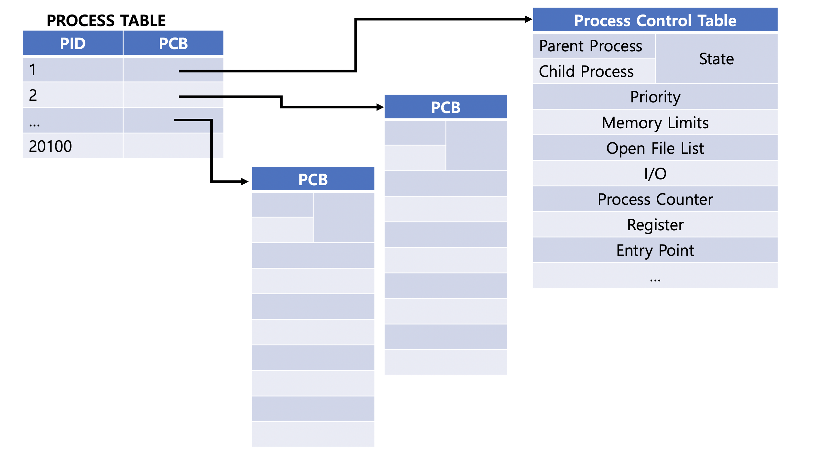
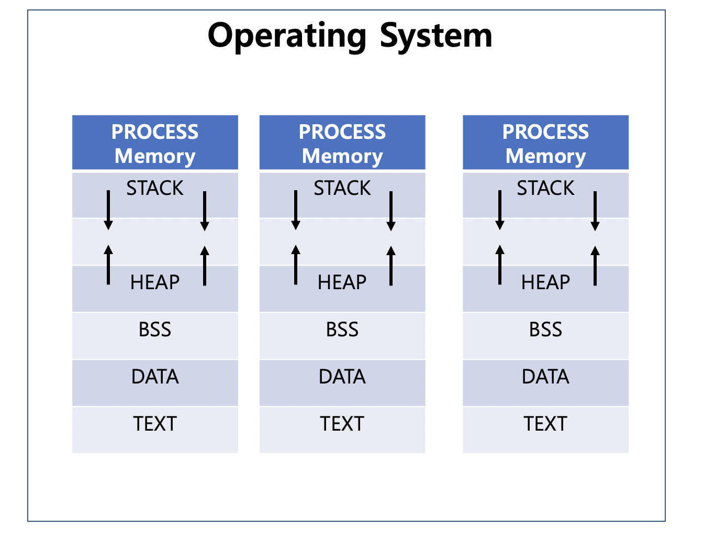
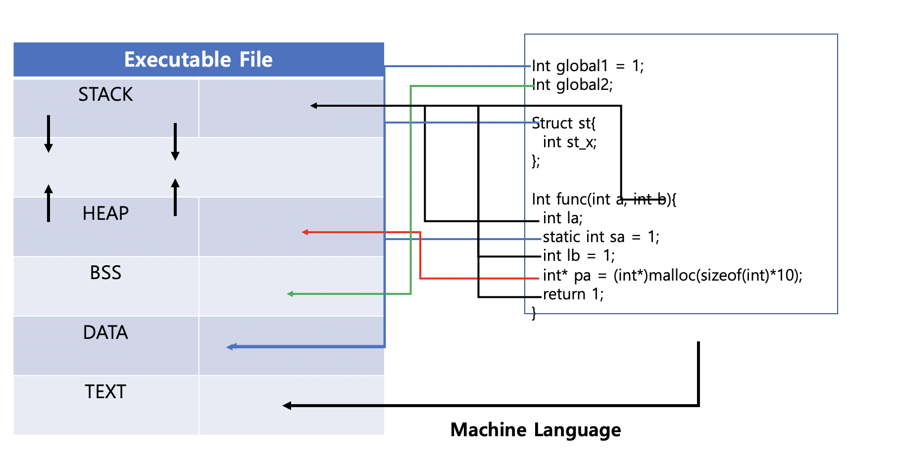

# Process

**Multi Programming**

* 하나의 CPU가 메모리에 적재된 다수의 프로세스를 처리
* Running 중인 프로세스가 대기 상태로 변경되었을 때, 대기중인 프로세를 처리
* CPU를 지속적, 효율적으로 사용

**Multi Tasking**

* 스케줄링을 이용하여 다수의 프로세스를 처리
  * 스케줄링은 Multi Programming, Time-Sharing, Real-Time 방법을 이용함

* CPU가 스케줄링을 통해 다수의 Task를 돌아가면서 처리하기 때문에 동시에 실행되는 것처럼 보임

---

**Multi Processing**

* 다수의 CPU(Core)가 여러 개의 Process를 병렬 처리

* 여러개의 CPU가 Process들을 처리하기 때문에, 하나의 CPU가 정상적으로 작동하지 않아도 다른 CPU에서 작업을 처리할 수 있음
* 다수의 프로세스에 Memory/Resource를 할당하기 때문에 Process 간 자원이 공유되지 않음. 독립적으로 작업이 필요할 때 사용

**Multi Threading**

* 하나의 프로세스 내에 속한 여러개의 Thread를 병렬 처리
* Thread 간 자원 공유가 되며, Multi Processing보다 작은 자원을 사용하기 때문에 효율적임

---

**Process**

* 프로세스란, 컴퓨터에서 실행중인 프로그램을 의미

* Memory에 올라간 프로세스는 OS로부터 독립된 Resource를 할당받기 때문에, 프로세스 간 자원이 공유되지 않음
  * IPC를 이용하여 프로세스 간 통신 및 자원 공유를 수행해야됨

**PCB**

* 프로세스 제어 블록(Process Control Block)은 프로세스를 관리할 때 필요한 정보가 들어있는 데이터베이스
* Process Table로 관리하며 프로세스가 생성될 때 Process Table에 PCB가 생성되고, 삭제될 때 PCB가 삭제됨

#### Memory Struct

* 프로세스는 독립적인 메모리 구조를 가지며, 아래와 같이 Stack, Unused, Heap, BSS, Data, Text(Code) 영역을 가짐
* Stack : 지역변수, 리턴값, 매개변수 등을 저장하는 공간으로, 함수 호출 시 추가되고 재귀 후 삭제가 됨
* Heap : 동적으로 생성한 메모리를 저장하는 영역으로, Run-Time 중 메모리를 할당. 사용 후 해제를 안 하면 Memory Leak 발생
* Unused : Stack 영역과 Heap 영역이 공유하며, 실시간으로 변하는 양측의 공간이 부족한 경우 사용할 수 있는 공간
* BSS(Block Started By Symbol) : 초기화 하지 않은 전역변수/static 변수를 저장하는 공간으로 0/NULL로 초기화
* Data : static 변수, 전역 변수, 구조체, 클래스 등이 저장되는 공간
* Text : Source Code를 기계어로 Compile한 코드를 저장하는 공간

#### Management

* Context Swithching
  * Running 중인 Process가 완료되기 전 Interrupt로 인해 다른 Process를 실행하는 작업
  * I/O Request, Child Process Fork,  Scheduling Time 만료, Interrupt를 기다리는 경우 발생

* Ready vs Block State
  * Ready는 프로세스에 필요한 자원을 할당 받은 상태에서 CPU 할당을 기다리는 상태
  * Block은 프로세스에 필요한 자원을 할당받지 않은 상태

* Dispatch : Ready 상태의 Process를 Running 상태로 전이
* Preemption : Running Process의 Scheduling Time이 끝나거나, 우선순위가 높은 Process를 Running 해야되는 경우, Ready 상태로 전이
* Wake Up : 프로세스에 필요한 자원을 할당하여 Ready 상태로 전이
* Swap In : Backing Space에서 Main Memory로 전이
* Swap Out : Main Memory에서 Backing Space로 전이
* Sleep : Process Running 중 다른 Process를 Running 해야 될 때, 대기 상태로 전이
* Exit : Process의 Running이 종료된 후 프로세스를 종료하는 과정

