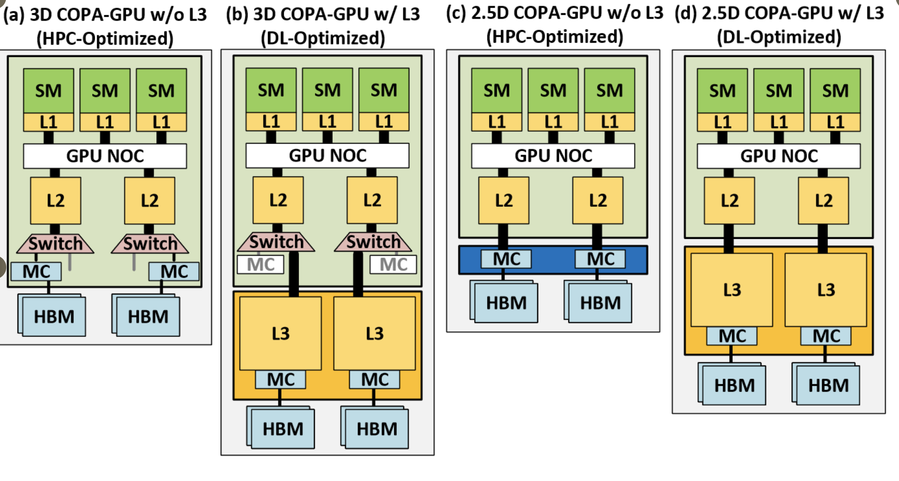
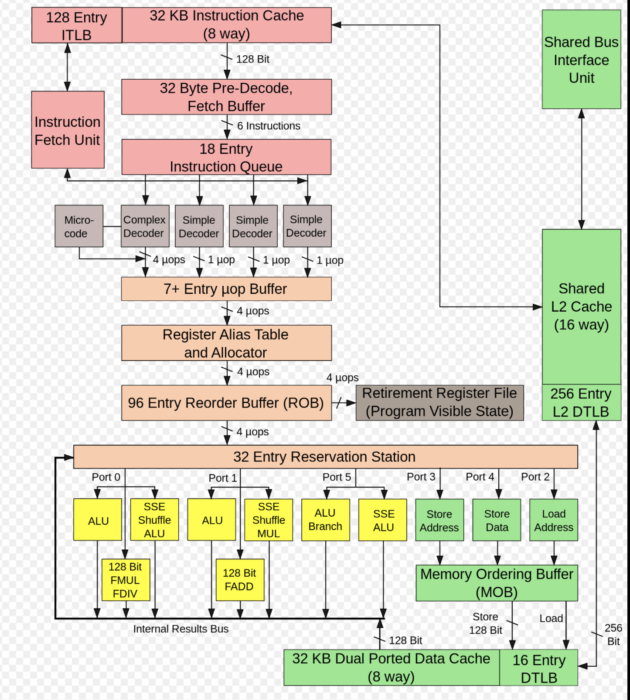

# Processor

* Processor는 명령어를 처리하고 반응하기 위한 논리 회로로 Control Unit과 ALU로 구성됨
  * CPU : Memory, 연산, Control 3가지 기능을 수행하는 PC의 가장 중요한 부품으로 클럭 구동 방식을 사용
    * MicroProcessor는 CPU의 기능을 하나의 작은 칩에 집적회로로 내장된 형태
    * MPU : ALU와 Register를 하나의 칩으로 구성한 연산 전용 CPU
    * MCU : MicroProcessor와 Interface, Memory 등을 하나의 칩으로 구성한 제어 목적 CPU
    * CPU 내에 있는 임시기억장치를 Register라고 하는데, 32bit System인 경우 Register의 처리값이 32bit이므로 표현 가능한 최대 수는 $$2^{32}$$  이고,  64bit System은 Register 처리값이 64bit
* Core는 Processor의 Cache, Controller, Interface를 제외하고 실제 연산을 수행하는 핵심 요소
  * Core는 Control Unit, ALU와 같은 직접 연산을 수행하는 부품과 자체 Cache Memory로 구성
  * Multi Core(두 개 이상의 Core를 단일 집적회로로 하나의 칩으로 만듦) 프로세서를 이용하여 CPU 성능을 향상

Image Ref : https://www.sciencedirect.com/topics/computer-science/core-processor 

 

### Instruction Set Architecture (ISA)

* 하드웨어와 소프트웨어의 Interface로, 상호작용할 수 있는 명령어 집합
* MicroProcessor가 실행할 수 있는 기계어로 된 명령어를 HW에 전달
* CPU마다 기계어의 코드가 달라서 호환의 어려움이 있고, 명령어는 opcode, operand로 구성됨
  * opcode(operation code) : Control Signal Table에서 ALU의 명령어를 관리하는 ADD, SUB, AND 등 3bit(or 4bit)로 구성
  * Operand : 상수, 메모리 주소, register 등 opcode가 연산을 수행하는 대상을 의미
  * 명령어에 따라 opcode / opcode + operand / opcode + 2 * operand / opcode + 3 * operand 등으로 구성될 수 있음
* Intel의 x86, AMD x86-64는 CISC로 설계되었고,  ARM의 v8, MIPS는 RISC로 설계됨
  * 제조사마다 Architecture가 다르기 때문에 CPU의 명령어 해석구조도 다름
* **CISC** (Complex Instruction Set Computer)
  * 가변 형식 명령어를 사용하고 명령어가 많고 복잡하고, 디코딩하여 사용하기 때문에 속도가 느림
  * 다양한 명령어와 다양한 Addressing mode를 사용하여 많은 메모리 참조 연산을 수행
  * 메인 메모리를 효율적으로 사용할 수 있고, 명령어가 복잡하기 때문에 새로운 명령을 쉽게 추가할 수 있음
  * 다양한 명령이 클럭에 영향을 줄 수 있기 때문에 기계 성능 저하
* **RISC** (Reduced Instruction Set Computer)
  * 고정된 명령어를 사용하고 명령어가 적으며 간단한 Addressing mode를 사용
  * Register 기반 명령을 사용하기 때문에 Context Swiching의 속도가 향상됨
  * 컴파일러에 많은 복잡성을 부여하여 프로세서 성능에 영향을 줄 수 있음
  * CISC를 사용하는 x86에서도 복잡한 명령을 내부에서 RISC처럼 간단한 명령으로 나누어 처리하기 때문에 경계가 모호해지고 있음 
* CISC는 적은 수의 Assembly Code로 작업을 완료하고, RISC는 각 명령이 실행되는데 걸리는 시간을 줄이는 데 장점

 

### MicroArchitecture

* CPU나 GPU 같은 H/W의 작동 방식 및 회로를 세부적으로 서술한 프로세서 설계도
* 일반적으로 마이크로 아키텍처가 다르면 ISA도 다르지만, 비슷한 명령을 갖는 경우도 있음
* 아래 2가지 예시

 

**NVIDIA COPA GPU**

 

Image Ref : https://arxiv.org/pdf/2104.02188.pdf 

**Intel 2 Core**

 

Image Ref : https://en.wikipedia.org/wiki/Intel_Core_(microarchitecture) 

