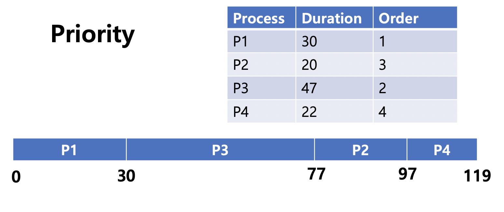

# Scheduling

* CPU가 Idle 상태가 되었을 때, Ready Queue에 있는 프로세스를 선택하여 실행하는 기법

### NonPreemptive

* CPU에서 Running Process를 강제로 중지하고, 다른 Process를 할당할 수 없는 스케줄링
* 이미 할당된 자원을 다른 프로세스가 뺏을 수 없음
* 종료시간을 비교적 잘 예측할 수 있으나, 중요한 프로세스를 즉시 실행할 수 없음
* 아래 예시에서는 P1, P2, P3, P4 순으로 Ready Queue에 적재됨

**FCFS (First Come First Served)**

* Ready Queue에 적재된 순서대로 Process를 실행하는 기법
* 상당히 많은 시간이 소요되는 Process가 있는 경우, 대기중인 Process 지연 발생 (Convey Effect)

**SJF (Shortest Job First)**

* Ready Queue에서 Duration이 가장 짧은 Process부터 실행하는 기법
* Duration이 상당히 큰 경우 Process를 실행하지 못함 (Starvation)
* SJF에 Preemptive 기능을 추가한 것을 **SRTF** (Shortest Remaining Time First)
  * 새로운 Process가 Ready Queue에 들어왔을 때, 현재 진행중인 Process의 남은 시간보다 Duration이 짧은 경우 새로운 Process를 실행
    * 진행중이었던 Process는 Ready Queue에 삽입
  * 잦은 Process 시간 계산 및 Context Switching으로 인해 Overhead가 증가하여 선호되는 기법은 아님

**Priority**

* Ready Queue에서 우선 순위가 높은 Process를 실행
* 사용자가 설정한 기준으로 우선순위를 결정할 수 있음
* 계속해서 높은 우선순위의 Process가 들어왔을 때, 우선순위가 낮은 Process에서 Starvation 발생할 수 있음
* Preemptive 기능을 추가한 Priority인 경우, Ready Queue에 Running 중인 Process보다 우선순위가 높은 Process가 추가되면 Context Switching 발생

### Preemptive

* CPU에서 Running 중인 Process를 강제로 중지시키고, 다른 Process에 CPU를 할당할 수 있는 스케줄링
* 우선순위가 높은 Process가 있는 경우, 자원을 뺏어서 빠르게 처리할 수 있음
* Context Switching이 자주 발생하여 Overhead가 큼

**RR (Round Robin) **

**Multilevel Queue**

**Multilevel Feedback Queue**

