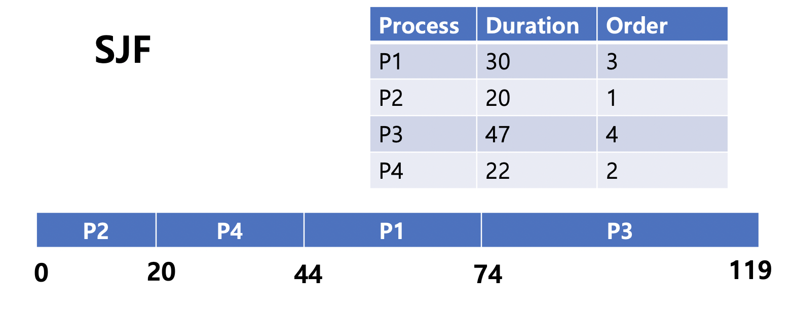
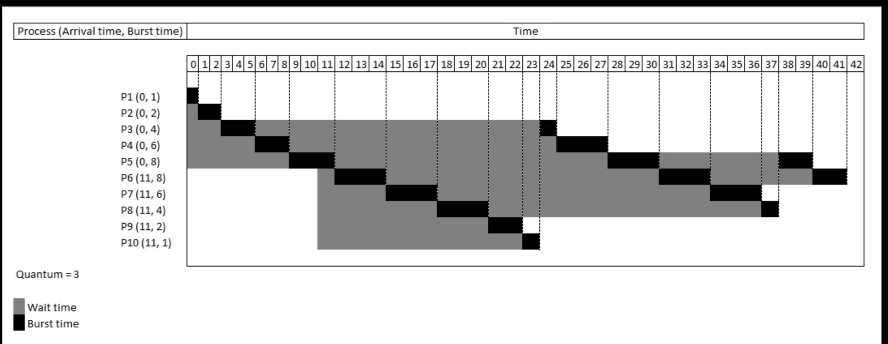
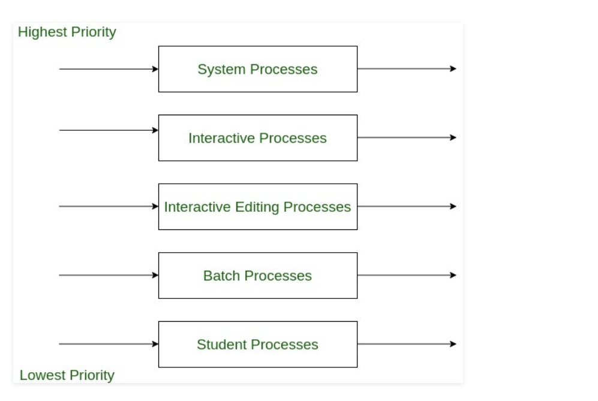
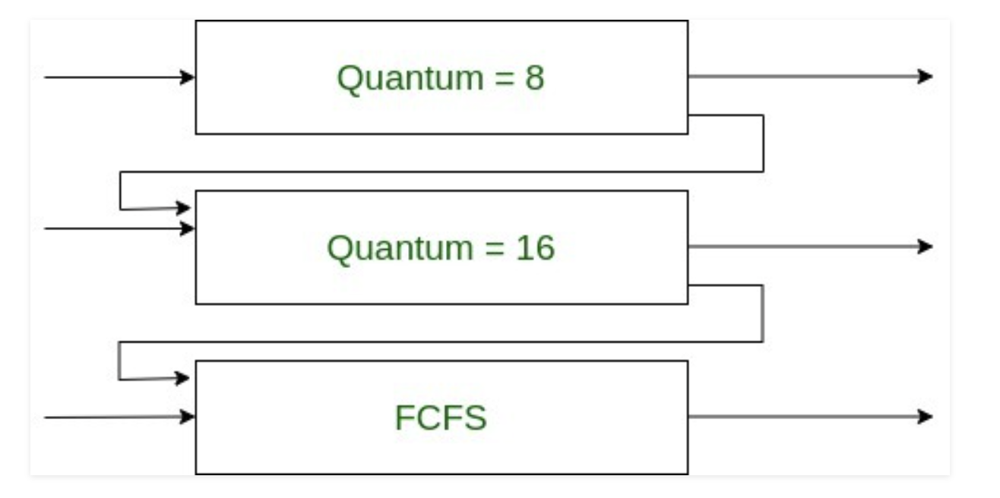

# Scheduling

* CPU가 Idle 상태가 되었을 때, Ready Queue에 있는 프로세스를 선택하여 실행하는 기법

### NonPreemptive

* CPU에서 Running Process를 강제로 중지하고, 다른 Process를 할당할 수 없는 스케줄링
* 이미 할당된 자원을 다른 프로세스가 뺏을 수 없음
* 종료시간을 비교적 잘 예측할 수 있으나, 중요한 프로세스를 즉시 실행할 수 없음
* 아래 예시에서는 P1, P2, P3, P4 순으로 Ready Queue에 적재됨

**FCFS (First Come First Served)**

* Ready Queue에 적재된 순서대로 Process를 실행하는 기법
* 상당히 많은 시간이 소요되는 Process가 있는 경우, 대기중인 Process 지연 발생 (Convey Effect)

**SJF (Shortest Job First)**

* Ready Queue에서 Duration이 가장 짧은 Process부터 실행하는 기법
* Duration이 상당히 큰 경우 Process를 실행하지 못함 (Starvation)
* SJF에 Preemptive 기능을 추가한 것을 **SRTF** (Shortest Remaining Time First)
  * 새로운 Process가 Ready Queue에 들어왔을 때, 현재 진행중인 Process의 남은 시간보다 Duration이 짧은 경우 새로운 Process를 실행
    * 진행중이었던 Process는 Ready Queue에 삽입
  * 잦은 Process 시간 계산 및 Context Switching으로 인해 Overhead가 증가하여 선호되는 기법은 아님

**Priority**

* Ready Queue에서 우선 순위가 높은 Process를 실행
* 사용자가 설정한 기준으로 우선순위를 결정할 수 있음
* 계속해서 높은 우선순위의 Process가 들어왔을 때, 우선순위가 낮은 Process에서 Starvation 발생할 수 있음
* Preemptive 기능을 추가한 Priority인 경우, Ready Queue에 Running 중인 Process보다 우선순위가 높은 Process가 추가되면 Context Switching 발생

 

### Preemptive

* CPU에서 Running 중인 Process를 강제로 중지시키고, 다른 Process에 CPU를 할당할 수 있는 스케줄링
* 우선순위가 높은 Process가 있는 경우, 자원을 뺏어서 빠르게 처리할 수 있음
* Context Switching이 자주 발생하여 Overhead가 큼

**RR (Round Robin) **

* FCFS에 Time Sharing System을 적용
* Process는 할당된 시간동안 CPU를 할당받고, Remaining Time이 존재하는 경우 Ready Queue 가장 뒤에 추가
  * 할당된 시간이 적을 경우 Context Switching이 자주 발생

Image Ref : https://ko.wikipedia.org/wiki/라운드_로빈_스케줄링#/media/파일:Round_Robin_Schedule_Example.jpg 

**Multilevel Queue**

* 프로세스를 특정 그룹으로 분류할 수 있을 때, 그룹별로 Ready Queue가 존재
* Group에 따라 우선순위가 있으므로, 우선순위 큐에 프로세스가 추가되면 Preemptive 기능으로 CPU 할당
* 각 Ready Queue는 RR이나 FCFS 등 독자적인 스케줄링 기법을 사용
* Ready Queue 간 Process를 이동하지 못함
* 우선순위가 낮은 Ready Queue에서 Starvation 발생 가능성 있음

Image Ref : https://www.geeksforgeeks.org/difference-between-multilevel-queue-mlq-and-multi-level-feedback-queue-mlfq-cpu-scheduling-algorithms/ 

**Multilevel Feedback Queue**

* Multilevel Queue에 동적 Priority 적용하여 Ready Queue 간 Process가 이동할 수 있음
* 우선순위가 높은 Queue에서 Quantum 동안 진행한 후, 다음 Queue로 이동
  * 다음 Queue에서 설정된 Quantum 동안 진행한 후, 그 다음 Queue로 이동
* 각 Ready Queue는 우선순위가 정해져있는 상태기 때문에 Round Robin으로 Process를 실행
* 우선순위가 가장 낮은 Ready Queue는 FCFS로, Aging 기법이 적용되어 있음
  * Aging 기법 : 무한 연기 / Starvation을 방지하기 위해 기다린 시간에 비례하여 우선순위를 높여줌

Image Ref : https://www.geeksforgeeks.org/difference-between-multilevel-queue-mlq-and-multi-level-feedback-queue-mlfq-cpu-scheduling-algorithms/ 

