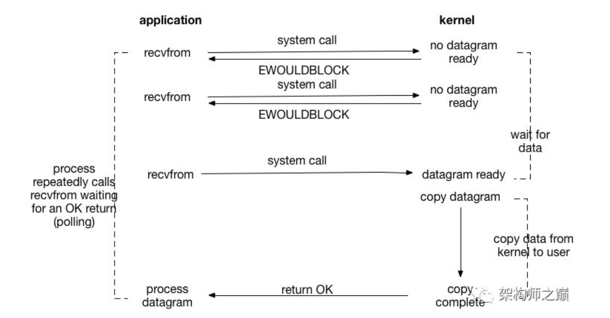

# Synchronization

* 사전적인 의미로 동기화란 동일 시간대에 데이터베이스 데이터를 일치화하는 작업

### Synchronization vs Asynchronization

**Synchronous**

* OS에서 Process/Thead 동기화인 경우, Request와 Response가 동시에 일어남을 의미
  * Request 후 일부 시간이 소요되더라도, Response 받고 나서 Process/Thread를 진행

**Asynchronization**

* 비동기는 Process/Thread의 Request와 Response가 동시에 발생하지 않는 것을 의미
  * Request를 요청하고 작업을 계속 수행하는 병렬 처리 방식

Image Ref : https://www.koyeb.com/blog/introduction-to-synchronous-and-asynchronous-processing 

### Blocking vs Non Blocking

**Blocking**

* asdasd
* asdasdas
* dasdas

Image Ref : https://www.codestudyblog.com/cnb08/0815230754.html

**Non Blocking**

* asdasd
* asdasdasd
* Asdasd

Image Ref : https://www.codestudyblog.com/cnb08/0815230754.html

### Synchronous / Blocking Model

---

### Critical Section

* 둘 이상의 Thread가 동시에 공유자원에 접근하는 현상을 방지하기 위해, 하나의 Thread만 접근할 수 있도록 보장하는 영역
* 요구조건
  * Mutual Exclusion : Process가 Critical Section에서 실행될 때, 다른 Process가 Critical Section에 진입할 수 없음
  * Progress : 임계구역에서 실행되는 Process가 없고 진입하려는 Process들이 있을 때, 제한된 시간 내 Critical Section에 진입할 Process를 선택해야 됨
  * Bounded Waiting : Process가 Critical Section에 진입하려고 요청을 하고 ACK 되기 전까지, 다른 Process들의 Critical Section 진입 횟수를 제한하여 Starvation을 방지

### DeadLock

### Peterson's Solution

### Mutex Locks

### Semaphore 

### Problems

**Producer and Consumer (유한버퍼, The Bounded Buffer)**

**Readers-Writers**

**Dining Philosophers**

