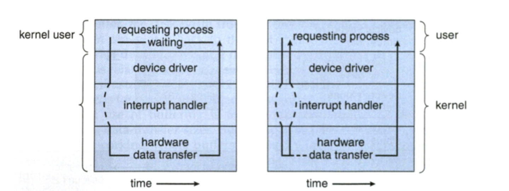

# Synchronization

* 사전적인 의미로 동기화란 동일 시간대에 데이터베이스 데이터를 일치화하는 작업

### Synchronization vs Asynchronization

**Synchronous**

* OS에서 Process/Thead 동기화인 경우, Request와 Response가 동시에 일어남을 의미
  * Request 후 일부 시간이 소요되더라도, Response 받고 나서 Process/Thread를 진행 (Transaction을 동시에 맞춤)

**Asynchronization**

* 비동기는 Process/Thread의 Request와 Response가 동시에 발생하지 않는 것을 의미
  * Request를 요청하고 작업을 계속 수행하는 병렬 처리 방식


<div style="text-align: right">Image Ref : https://www.koyeb.com/blog/introduction-to-synchronous-and-asynchronous-processing </div>

### Blocking vs Non Blocking

**Blocking I/O**

* 호출된 함수가 작업을 마칠때까지 호출한 함수에게 제어권을 넘기지 않음
  * 호출된 함수에게 제어권을 넘긴 상태로 유지하고, 실행이 종료되면 제어권 반납
* Response를 받기 전까지 호출한 함수는 대기 상태로 유지되며 프로세스를 진행할 수 없음
* Kernel Mode로 Context Switching하면서 System Call을 진행하고, Return을 받으며 User Mode로 돌아옴

**Non Blocking**

* 호출한 함수가 호출된 함수에게 제어권을 넘기지 않음
* 호출한 함수는 제어권을 가지고 있기 때문에, 계속해서 Process를 실행
  * 호출된 함수가 바로 Return하여 제어권 반납



<div style="text-align: right">Image Ref : http://faculty.salina.k-state.edu/tim/ossg/Device/blocking.html </div>

### Synchronous / Blocking Model

* 동기/비동기는 Process의 동시성, Blocking/NonBlocking은 Process의 즉각적인 Return이 중심

* A 함수 : 호출한 함수 / B 함수 : 호출된 함수

* Synchronous - Blocking

  * B함수에게 제어권을 넘겨주고 값을 response하기 전까지 대기 상태

  * A 함수가 return 값과 제어권을 돌려받으면 Process 진행

* ASynchronous - Blocking
  * Blocking이므로, A함수가 B함수에게 제어권과 Callback 함수를 넘겨줌
  * A함수는 제어권이 없기 때문에,  Response 받을때까지 대기 상태
    * Callback함수와 Return을 같이 Response하기 때문에 Synchronous - Blocking과 비슷하게 동작함

* Synchronous - NonBlocking
  * A함수는 B함수에게 제어권을 주지 않기 때문에, A함수를 계속 실행함
    * B함수는 Request를 받을 때마다 즉시 Response함
  * A함수가 Synchronous라서 지속적으로 B함수에게 Return 값을 전송할 수 있는 상황인지 확인
  * B함수가 실행을 완료하고 A함수의 Request를 받게 되면 Return 값을 Response

* ASynchronous - NonBlocking
  * A함수는 B함수에게 제어권을 넘겨주지 않기 때문에, A함수를 계속 실행함
  * A함수가 ASynchronous라서 B함수의 상태를 확인하지 않음
  * B함수 실행이 완료된 후 Callback을 통해 Response


---

### DeadLock

* 다중 프로그래밍 환경에서 발생하며, 2개의 Process가 서로 상대방의 작업이 끝나기를 기다리기 때문에 아무것도 진행되지 않는 상태
* 대부분 운영체제에서 교착상태를 막는 것은 불가능하기 때문에, 교착 상태의 조건을 파악해서 대응


* 발생조건

  * Mutual Exclusion : 자원에 대해 배타적인 통제권을 요구하여, Resource를 사용할  수 있는 Process는 하나만 존재. 다른 Process가 Resource를 사용중이라면 대기
  * Hold & Wait : Process는 자원을 최소한 하나 이상 보유. 자원을 가진 상태에서 다른 자원을 기다림
  * No Preemption : Process가 특정 Resource를 사용중일 때, 자원을 강제로 뺏을 수 없음
  * Circular Wait : 각 Process는 다음 Process가 필요로 하는 자원을 순환 구조로 가지고 있음.
* Prevention : 4가지 발생 조건 중 하나라도 충족하지 못하게 막는다면 Deadlock이 발생하지 않음

  * 상호배제의 조건 제거 : 하나의 Resource를 여러 Process가 동시에 사용할 수 있게 함
  * 점유 & 대기 조건 제거 : 하나의 프로세스가 사용하기 전, 필요로 하는 모든 자원을 미리 할당. 자원 과다 사용으로 효율성이 떨어짐
  * 비선점 조건 제거 : 선점 가능한 프로토콜을 만들어서 우선순위에 따라 Resource를 강제로 뺏을 수 있게 함
  * 환형 대기 조건 제거 : 자원에 순서를 매겨 Process가 순환 구조를 구성하지 않음

  * 의도적인 변경으로 자원 사용의 효율성을 떨어뜨리고, 비용이 많이 들어 시스템 효율에 영향을 줄 수 있음
* Avoidance : Deadlock이 발생할 수 있는 상황을 피하기 위해 Safe State에서만 자원 분배를 실행

  * 자원할당 그래프 알고리즘 (단일 인스턴스)
    * Resource를 할당하기 전에 예약 간선을 만듦
    * Process1이 Resource1을 사용하고 있고, Process2가 Resource1 Waiting 상태가 전제 조건
    * Process1과 Process2가 Resource2를 요청하게 되었을 때, 바로 할당을 하지 않고 예약 간선을 추가
    * Process2에 할당을 하게 된다면 Cycle이 발생하기 때문에 Process1에 할당 대기 
  * 은행원 알고리즘 (다중 인스턴스)
    * Safe State와 Unsafe State를 나누고, 각 Process가 사용할 수 있는 최대 자원의 갯수(Allocation + Need)를 확인
    * Available한 자원을 이용하여 Process를 순차적으로 사용할 수 있는 시뮬레이션 동작
      * Safe State 영역 내에서 자원을 할당할 Process의 순서를 정함
      * Process가 실행이 완료되면 Allocation된 자원을 회수하여 다음 Process에서는 기존의 Available한 자원 + Allocation 자원을 사용할 수 있음
    * 다중 프로그래밍 환경에서는 Process의 수가 계속 변경되기 때문에, 지속적으로 Process의 변화를 Trace하기 어렵고, Unsafe State의 영역에서 Resource를 사용하지 못하기 때문에 Resource 활용성 감소
    * 각 Process의 최대 자원의 갯수를 파악하고, 시뮬레이션으로 시스템 부하 증가
* Detection & Recovery : Deadlock이 발생했는지 확인하고, 발생 시 복구

  * Prevention / Avoidance를 적용하지 않았을 때 데드락이 발생할 수 있는데, 데드락을 탐지하고 복구하는 방법이 필요
  * Prevention : 자원을 요청했을 때 할당되지 못하거나, 주기적으로 탐색을 하는 방법 등을 이용하여 탐지
    * 단일 인스턴스인 경우 방향 그래프인 wait-for graph를 이용하여 Cycle 탐색
    * 다중 인스턴스인 경우 은행원 알고리즘을 이용하여 Safe/Unsafe를 확인
  * Recovery : Deadlock인 Process를 종료하거나 Preemption을 적용 

---

### Critical Section

* 둘 이상의 Thread가 동시에 공유자원에 접근하는 현상을 방지하기 위해, 하나의 Thread만 접근할 수 있도록 보장하는 영역
* 요구조건
  * Mutual Exclusion : Process가 Critical Section에서 실행될 때, 다른 Process가 Critical Section에 진입할 수 없음
  * Progress : 임계구역에서 실행되는 Process가 없고 진입하려는 Process들이 있을 때, 제한된 시간 내 Critical Section에 진입할 Process를 선택해야 됨
  * Bounded Waiting : Process가 Critical Section에 진입하려고 요청을 하고 ACK 되기 전까지, 다른 Process들의 Critical Section 진입 횟수를 제한하여 Starvation을 방지

**Peterson's Solution**

* 병렬 프로그래밍 중 두 개의 이상의 Process가 하나의 Resource를 사용할 때, 동기화를 해결하는 방법
* flag, turn 2개의 변수를 사용하여 Mutex 생성

```c++
P1
flag[1] = true, turn = 1;
while (flag[1] && turn == 1){
  // critical section 
  // running code
}
flag[2] = false;

P2 
flag[2] = true; turn =2;
while (flag[2] && turn==2){
  // running code
}
flag[2] = false; 
```

* Critical Section에 들어가기 전과 후를 flag로 구분하고, turn을 통해 두개의 Process가 같이 사용되지 못하게 함

**Mutex**

* Mutual Exclusion의 약자로 두 개 이상의 Process에서 동일한 Resource의 Critical Section에 동시에 접근할 수 없게 막아주는 객체

* lock / Unlock 두가지 기능을 이용하여, 다른 Process의 접근 권한을 제어
  * lock : Critical Section을 실행중인 Process가 없는 경우, Critical Section을 실행할 권한을 가져옴 (**Acquire**)
  * unlock : Critical Section의 실행이 완료된 후, 대기중인 Process의 접근을 가능하게 함 (**Release**)
* Process1이 Critical Section을 실행중이라면 Process2가 접근하더라도 대기 상태가 됨
  * Process1의 Critical Section 실행이 종료되면 Unlock 실행. 이후, Process2의 lock을 하고 Critical Section에서 실행
    * mutex 생성자에서 lock을 호출하는 경우에는 소멸자에서 unlock을 호출
    * Mutex를 변수로 사용하는 경우 lock을 통해서 Critical Section에 진입하지만, unlock이 되어 있지 않는 상태라면 무한 대기
  * WinAPi인 경우, Waitforsingleobject() 같은 대기함수를 이용하여 Mutex의 상태를 Nonsignaled로 변경
    * Nonsignaled인 경우 다른 Process/Thread가 접근하지 못하고 대기, ReleaseMutex 함수를 이용하여 Signaled 상태로 변경
    * 대기함수에 지정한 시간을 초과하는 경우, return 하므로 무한 대기 방지
* 아래 코드에서는 m2 unlock을 하지 않은채로 m2 lock을 걸었을 때, "m2 unlock"부터 출력되지 않음

```c++
#include <iostream>
#include <mutex>
#include <thread>

std::mutex m1, m2;

void f1(){
    std::cout <<"m1 Lock\n";
    m1.lock();
    std::cout <<"m2 lock\n";
    m2.lock();
    std::cout <<"m1 unlock\n";
    m1.unlock();
    std::cout <<"m1 lock\n";
    m1.lock();
    std::cout <<"m2 lock\n";
    m2.lock();
    std::cout <<"m2 unlock\n";
}

void test_mutex(){
    std::thread t1(f1);
    t1.join();
}
```

**Semaphore** 

* Mutex와 결정적인 차이는 동기화 대상의 수
  * Mutex는 동기화 대상이 하나일 때 적용하고, Semaphore는 동기화 대상이 하나 이상일 때 적용
    * Semaphore는 Mutex가 될 수 있지만, Mutex는 Semaphore가 될 수 없음
    * Mutex는 Binary 상태를 가진 Binary Semaphore
      * Mutex는 자원에 접근 가능한 Process/Thread의 갯수가 하나이므로 lock,unlock으로 Process/Thread가 Resource를 소유할 수 있으나, Semaphore는 불가능

* Semaphore는 자원에 접근 가능한 Process/Thread의 갯수를 설정하고, Count가 0이 될 때 NonSignaled 상태로 변경
  * Count의 초기 값은 자원에 접근 가능한 Count가 1 이상인 경우 Signaled(unlock) 상태로 유지
  * Count가 0으로 되는 순간 NonSignaled(lock)로 변경되어 다른 Process/Thread에서 접근하지 못하고, 1 이상으로 되는 순간 Signaled

### Problems

**Producer and Consumer (유한버퍼, The Bounded Buffer)**

* Producer에서 Item을 생성하고, Consumer에서 소비할 때 발생할 수 있는 동기화 문제를 해결

* Mutex를 형성하지 않으면, Producer에서 Buffer의 Size가 가득 찼을 때 여러개의 Producer가 동작할 수 있고, 동일한 Item에 여러개의 Consumer가 접근할 수도 있음
* Producer
  * Buffer에 추가하기 전, Buffer의 여유공간을 확인하고, Buffer가 Signaled 상태인지 확인하여 생성하지 못할 상황에서는 대기
  * Item을 버퍼에 추가할 때, Mutex를 생성해서 다른 Producer/Consumer에서 접근하지 못하게 함
  * Item 추가가 완료된 후, NonSignaled 상태로 변경하고 Buffer에 추가된 내용은 전달
* Consumer
  * 필요한 Item이 Producer로부터 Buffer에 추가되었다는 것을 확인하기 전까지 대기
  * Item이 Buffer에 있는 것이 확인되면, Buffer가 Signaled 상태인지 확인
  * Signaled 상태일 때, Mutex를 생성하고 Buffer에 여유 공간이 있는 내용을 전달


**Readers-Writers**

* 여러 명의 Reader가 동시에 Item에 접근할 때 Mutual Exclusion을 보장하기 위한 동기화 문제 해결 방법

* Writer의 작성이 완료되면 Reader는 하나씩 돌아가면서 Item에 접근
* Writer
  * 작성하기 전 Signaled 상태인지 확인하고, 작성 가능할 때 Mutex를 생성하여 NonSignaled 상태로 변경
  * Item 작성이 완료되면, NonSignaled 상태로 변경
* Reader
  * Reader는 Reader Mutex가 Signaled 상태인지 확인하고 Nonsignaled로 변경하고 Readcount를 1 증가
  * 처음으로 Read를 한 경우 Readcount가 1이기 때문에, Readcount가 1인 경우에는 Writer Mutex의 상태가 Signaled인지 확인(작성완료)
  * 다른 Reader도 접근을 해야되기 때문에 Reader Mutex를 Signaled로 변경
  * 읽기 작업을 처리
  * Reader Mutex가 Signaled 상태가 될 때까지 대기한 후, Nonsignaled 로 변경
  * readcount를 1 감소하는데 readcount가 0이 된 경우 Writer에게 전달
  * Reader Mutex를 Signaled 상태로 변경


**Dining Philosophers**,  **Sleeping Barber** 등 다양한 문제들이 있는데 Semaphore로 접근을 하여 문제를 해결할 수 있다

* 주어진 문제에서 다양한 Thread들이 동시에 접근하는 상황에서는 Mutex를 생성해서 동기화 문제를 해결
* 동기화 문제가 해결되지 않으면 Deadlock이 발생하여 아무것도 진행되지 않는 상황이 발생할 수 있음
