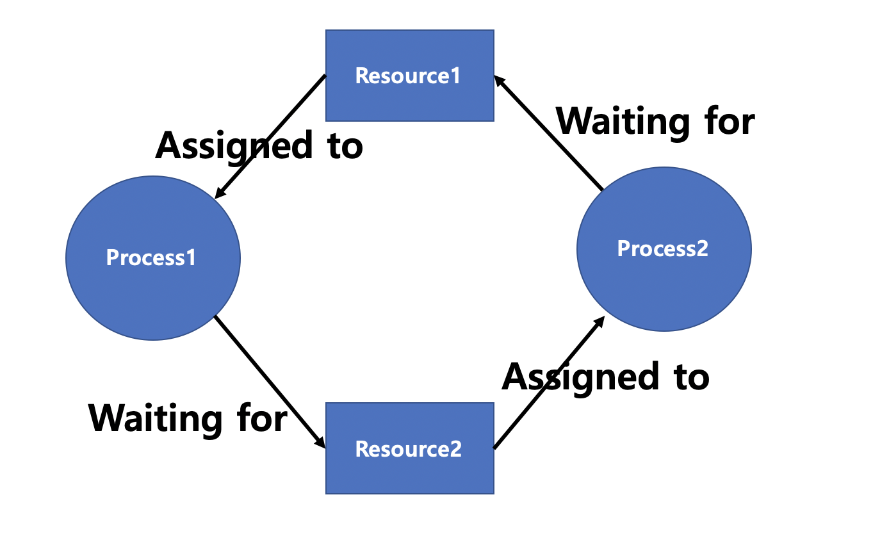

# Synchronization

* 사전적인 의미로 동기화란 동일 시간대에 데이터베이스 데이터를 일치화하는 작업

### Synchronization vs Asynchronization

**Synchronous**

* OS에서 Process/Thead 동기화인 경우, Request와 Response가 동시에 일어남을 의미
  * Request 후 일부 시간이 소요되더라도, Response 받고 나서 Process/Thread를 진행 (Transaction을 동시에 맞춤)

**Asynchronization**

* 비동기는 Process/Thread의 Request와 Response가 동시에 발생하지 않는 것을 의미
  * Request를 요청하고 작업을 계속 수행하는 병렬 처리 방식

Image Ref : https://www.koyeb.com/blog/introduction-to-synchronous-and-asynchronous-processing 

### Blocking vs Non Blocking

**Blocking I/O**

* 호출된 함수가 작업을 마칠때까지 호출한 함수에게 제어권을 넘기지 않음
  * 호출된 함수에게 제어권을 넘긴 상태로 유지하고, 실행이 종료되면 제어권 반납
* Response를 받기 전까지 호출한 함수는 대기 상태로 유지되며 프로세스를 진행할 수 없음
* Kernel Mode로 Context Switching하면서 System Call을 진행하고, Return을 받으며 User Mode로 돌아옴

**Non Blocking**

* 호출한 함수가 호출된 함수에게 제어권을 넘기지 않음
* 호출한 함수는 제어권을 가지고 있기 때문에, 계속해서 Process를 실행
  * 호출된 함수가 바로 Return하여 제어권 반납

Image Ref : http://faculty.salina.k-state.edu/tim/ossg/Device/blocking.html 

### Synchronous / Blocking Model

* 동기/비동기는 Process의 동시성, Blocking/NonBlocking은 Process의 즉각적인 Return이 중심

* A 함수 : 호출한 함수 / B 함수 : 호출된 함수

* Synchronous - Blocking

  * B함수에게 제어권을 넘겨주고 값을 response하기 전까지 대기 상태

  * A 함수가 return 값과 제어권을 돌려받으면 Process 진행

* ASynchronous - Blocking
  * Blocking이므로, A함수가 B함수에게 제어권과 Callback 함수를 넘겨줌
  * A함수는 제어권이 없기 때문에,  Response 받을때까지 대기 상태
    * Callback함수와 Return을 같이 Response하기 때문에 Synchronous - Blocking과 비슷하게 동작함

* Synchronous - NonBlocking
  * A함수는 B함수에게 제어권을 주지 않기 때문에, A함수를 계속 실행함
    * B함수는 Request를 받을 때마다 즉시 Response함
  * A함수가 Synchronous라서 지속적으로 B함수에게 Return 값을 전송할 수 있는 상황인지 확인
  * B함수가 실행을 완료하고 A함수의 Request를 받게 되면 Return 값을 Response

* ASynchronous - NonBlocking
  * A함수는 B함수에게 제어권을 넘겨주지 않기 때문에, A함수를 계속 실행함
  * A함수가 ASynchronous라서 B함수의 상태를 확인하지 않음
  * B함수 실행이 완료된 후 Callback을 통해 Response

---

### DeadLock

* 다중 프로그래밍 환경에서 발생하며, 2개의 Process가 서로 상대방의 작업이 끝나기를 기다리기 때문에 아무것도 진행되지 않는 상태
* 대부분 운영체제에서 교착상태를 막는 것은 불가능하기 때문에, 교착 상태의 조건을 파악해서 대응

* 발생조건

  * Mutual Exclusion : 자원에 대해 배타적인 통제권을 요구하여, Resource를 사용할  수 있는 Process는 하나만 존재. 다른 Process가 Resource를 사용중이라면 대기
  * Hold & Wait : Process는 자원을 최소한 하나 이상 보유. 자원을 가진 상태에서 다른 자원을 기다림
  * No Preemption : Process가 특정 Resource를 사용중일 때, 자원을 강제로 뺏을 수 없음
  * Circular Wait : 각 Process는 다음 Process가 필요로 하는 자원을 순환 구조로 가지고 있음.

* Prevention : 4가지 발생 조건 중 하나라도 충족하지 못하게 막는다면 Deadlock이 발생하지 않음

  * 상호배제의 조건 제거 : 하나의 Resource를 여러 Process가 동시에 사용할 수 있게 함
  * 점유 & 대기 조건 제거 : 하나의 프로세스가 사용하기 전, 필요로 하는 모든 자원을 미리 할당. 자원 과다 사용으로 효율성이 떨어짐
  * 비선점 조건 제거 : 선점 가능한 프로토콜을 만들어서 우선순위에 따라 Resource를 강제로 뺏을 수 있게 함
  * 환형 대기 조건 제거 : 자원에 순서를 매겨 Process가 순환 구조를 구성하지 않음

  * 의도적인 변경으로 자원 사용의 효율성을 떨어뜨리고, 비용이 많이 들어 시스템 효율에 영향을 줄 수 있음

* Avoidance : Deadlock이 발생할 수 있는 상황을 피하기 위해 Safe State에서만 자원 분배를 실행

  * 자원할당 그래프 알고리즘 (단일 인스턴스)
    * Resource를 할당하기 전에 예약 간선을 만듦
    * Process1이 Resource1을 사용하고 있고, Process2가 Resource1 Waiting 상태가 전제 조건
    * Process1과 Process2가 Resource2를 요청하게 되었을 때, 바로 할당을 하지 않고 예약 간선을 추가
    * Process2에 할당을 하게 된다면 Cycle이 발생하기 때문에 Process1에 할당 대기 
  * 은행원 알고리즘 (다중 인스턴스)
    * Safe State와 Unsafe State를 나누고, 각 Process가 사용할 수 있는 최대 자원의 갯수(Allocation + Need)를 확인
    * Available한 자원을 이용하여 Process를 순차적으로 사용할 수 있는 시뮬레이션 동작
      * Safe State 영역 내에서 자원을 할당할 Process의 순서를 정함
      * Process가 실행이 완료되면 Allocation된 자원을 회수하여 다음 Process에서는 기존의 Available한 자원 + Allocation 자원을 사용할 수 있음
    * 다중 프로그래밍 환경에서는 Process의 수가 계속 변경되기 때문에, 지속적으로 Process의 변화를 Trace하기 어렵고, Unsafe State의 영역에서 Resource를 사용하지 못하기 때문에 Resource 활용성 감소
    * 각 Process의 최대 자원의 갯수를 파악하고, 시뮬레이션으로 시스템 부하 증가

* Detection & Recovery : Deadlock이 발생했는지 확인하고, 발생 시 복구

  * Prevention / Avoidance를 적용하지 않았을 때 데드락이 발생할 수 있는데, 데드락을 탐지하고 복구하는 방법이 필요
  * Prevention : 자원을 요청했을 때 할당되지 못하거나, 주기적으로 탐색을 하는 방법 등을 이용하여 탐지
    * 단일 인스턴스인 경우 방향 그래프인 wait-for graph를 이용하여 Cycle 탐색
    * 다중 인스턴스인 경우 은행원 알고리즘을 이용하여 Safe/Unsafe를 확인
  * Recovery : Deadlock인 Process를 종료하거나 Preemption을 적용 

---

### Critical Section

* 둘 이상의 Thread가 동시에 공유자원에 접근하는 현상을 방지하기 위해, 하나의 Thread만 접근할 수 있도록 보장하는 영역
* 요구조건
  * Mutual Exclusion : Process가 Critical Section에서 실행될 때, 다른 Process가 Critical Section에 진입할 수 없음
  * Progress : 임계구역에서 실행되는 Process가 없고 진입하려는 Process들이 있을 때, 제한된 시간 내 Critical Section에 진입할 Process를 선택해야 됨
  * Bounded Waiting : Process가 Critical Section에 진입하려고 요청을 하고 ACK 되기 전까지, 다른 Process들의 Critical Section 진입 횟수를 제한하여 Starvation을 방지

### Peterson's Solution

### Mutex Locks

### Semaphore 

### Problems

**Producer and Consumer (유한버퍼, The Bounded Buffer)**

**Readers-Writers**

**Dining Philosophers**

