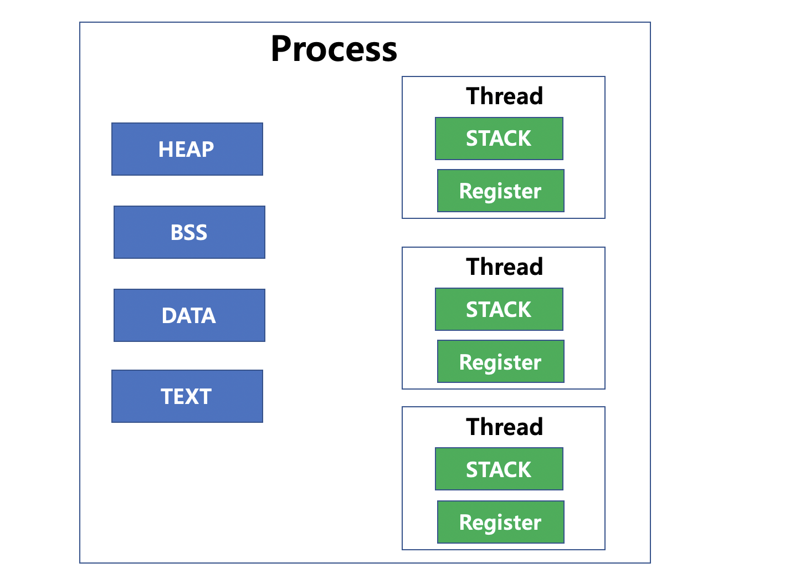

# Thread

* 하나의 프로세스 내에서 작은 여러 개의 실행을 담당하는 최소 단위

* 일반적으로 Process는 독립적인 Resource를 할당받아 사용하기 때문에 공유가 안 되고, 하나의 Process 내에 있는 Thread는 서로 데이터 공유가 된다고 함
  * Thread는 독립적인 Stack 영역을 사용하고, Process의 Text(Code), Data, Heap 영역을 공유해서 사용함
    * 독립적으로 함수 호출 및 실행하기 위해 독립적인 Stack 사용
  * Memory 영역 중 공유하는 영역이 많아서 Context Switching이 Process보다 빠름
  * Stack 영역 : 지역변수, 리턴값, 매개변수 등을 저장하는 공간

* 하나의 Process가 Heap 영역의 Data를 변경하는 경우, 다른 Thread에서도 바로 변경 이력을 확인할 수 있음

