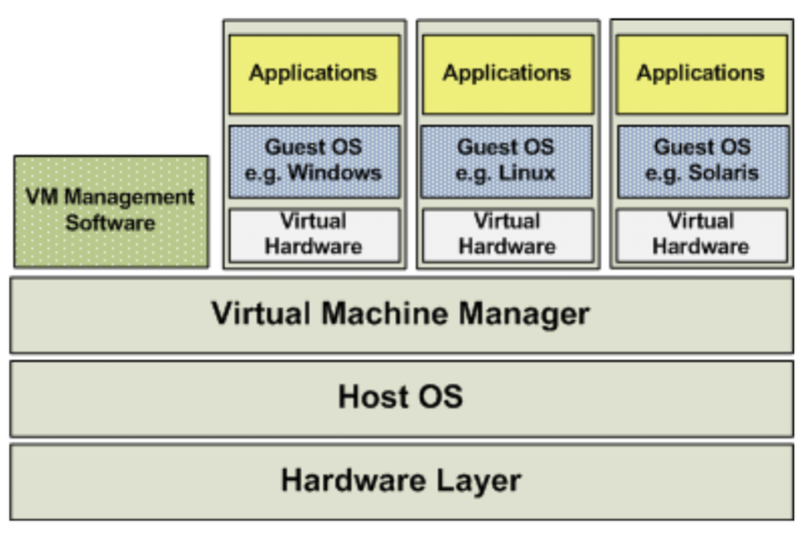
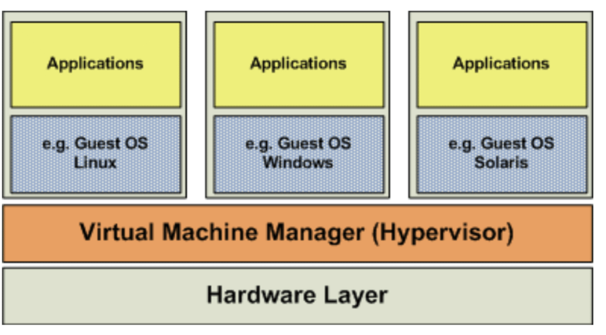
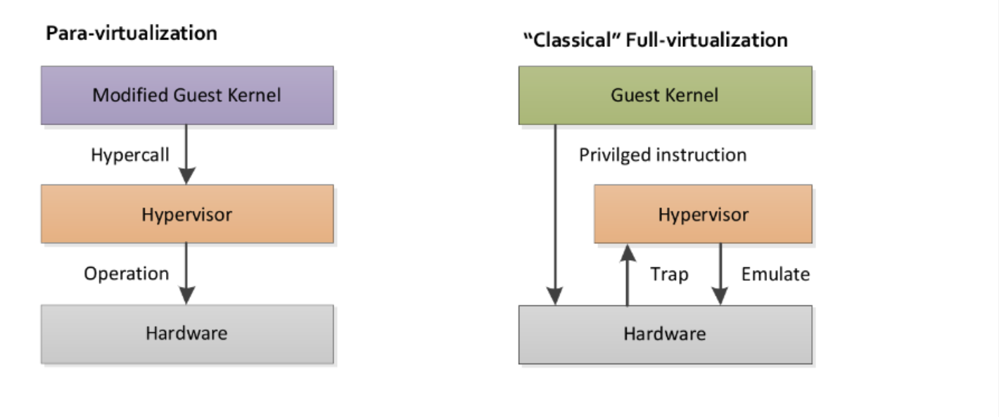
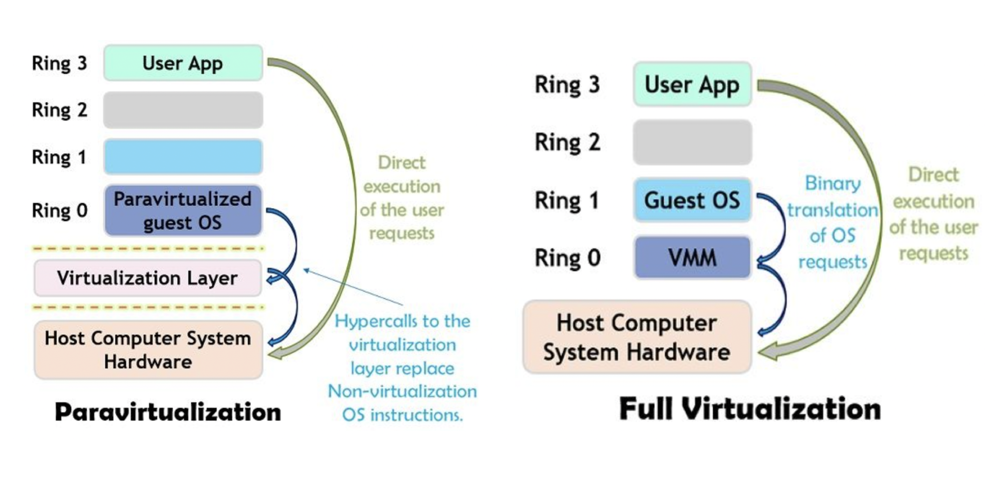
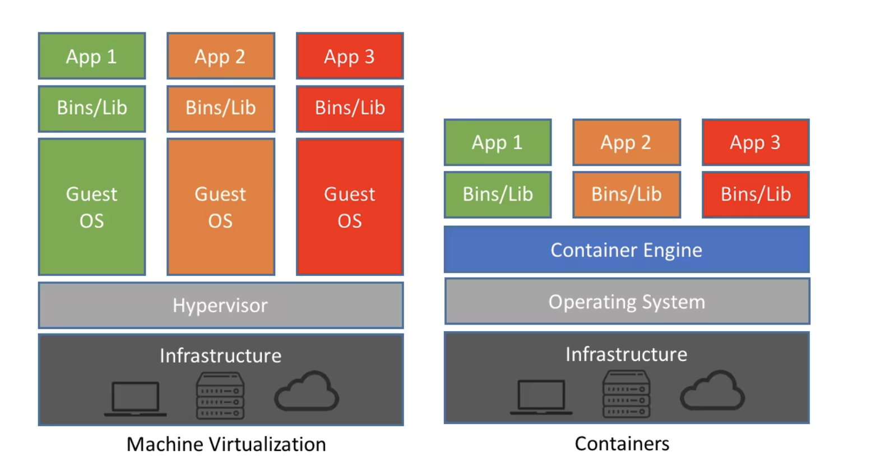

# Virtualization

가상화란 물리적인 Resource를 소프트웨어로 생성하여 복제하는 기술

* 재해 발생시 복구할 수 있는 내결함성
* 자원을 H/W에 맞추어 분배하기 때문에 효율적으로 사용하고 유지 보수에 용이
* 하나의 H/W에서 여러 운영체제를 운영할 수 있는 유연성

**System 가상머신**

* 하드웨어 가상 머신이라고도 하며, 물리적 컴퓨터를 다중화(Multiplex)함
* 물리적 컴퓨터와 동일한 환경을 VMM(Virtual Machine Manager/Monitir)이라고도 불리는 Hypervisor라는 소프트웨어로 구현
* Guest OS는 독립적으로 존재하기 때문에 서로 다른 OS를 구성할 수 있음

**Process 가상머신**

* 응용 프로그램 가상 머신이라고도 하며, JVM이나 닷넷 프레임워크의 CLR(Common Language Runtime) 등이 있음
* 운영체제 내에서 단일 프로세스로 일반 응용 프로그램을 실행
* 플랫폼의 영향을 받지 않고 독립적인 환경을 조성

### Hosted Virtualization (Hosted Hypervisor)

* Host OS 위에서 VMM과 Guest OS를 실행하는 방법
* VM Workstation, VMWare, Virtual Box 등이 Host 가상화 방법을 사용
* Hypervisor(VMM)가 직접 H/W를 핸들링 하지 않고, Host OS와 통신을 주고 받음
* Guest OS가 다른 운영체제 상단에서 실행되기 때문에 Overhead 발생 및 성능 저하

Image Ref : https://www.researchgate.net/figure/Full-Virtualization-18_fig1_350400540 

### Bare-Metal Virtualization (Native Hypervisor)

* Host OS 없이 System 가상 머신을 구현한 것
* 단일 호스트(물리적 컴퓨터)의 리소스를 가상으로 공유하기 때문에 게스트는 리소스가 있는 것으로 판단하고 독립적으로 프로그램을 실행할 수 있음
* 하이퍼바이저를 이용하여 운영 체제와 가상 머신의 리소스를 분리하여 VM을 생성 및 관리
  * 게스트의 커널 요청을 번역하여 H/W가 작업할 수 있게 지원
* 하이퍼바이저가 모든 명령을 처리해야 되기 때문에 효율 및 성능 저하 발생

Image Ref : https://www.researchgate.net/figure/OS-Layer-Virtualization-18_fig2_350400540

**전가상화(Full Virtualization)**

* H/W의 리소스를 완전히 가상화하기 때문에, Guest OS는 H/W로 명령을 요청
* CPU 단에서 Intel-VT(Virtualization Technology) 기능이나 AMD-V 기능을 제공하는 경우, Guest OS에서 발생한 명령을 H/W로 전송할 수 있음
* Privileged 권한이 없는 Guest OS에서 H/W로 Privileged instruction을 보냈을 때, Hypervisor를 거치지 않고 Host OS처럼 동작
  * OS마다 커널 명령이 다르고 Guest OS는 특권 권한이 없기 때문에 모든 명령을 Hypervisor로 Trap
  * Hypervisor는 Trap된 명령을 Binary Translation을 적용하여 H/W가 인식할 수 있게 Emulate
* H/W의 리소스를 완전히 가상화하여서 Guest OS의 수정 없이 사용할 수 있음
* Hypervisor가 모든 명령을 중재하고 Guest OS에서 CPU에 직접 접근하기 때문에 성능 저하 발생

**반가상화(Para Virtualization)**

* 전가상화에서는 Guest OS가 H/W가 전부 가상화되었다고 판단하여 H/W로 직접 요청했지만, 반가상화에서는 Guest OS가 가상화가 되지 않은 부분이 있다는 것을 인지하고 있기 때문에 H/W로 명령을 보내기 위해 드라이버를 이용
* Guest OS에서 Hypervisor로 HyperCall이라는 Interface를 이용
* Guest OS의 명령을 Hypercall로 변환하기 위해 커널 수정 필요
  * Source가 공개되지 않은 OS의 경우 사용하기 어려워 Open Source OS인 Linux에서 주로 사용
  * 윈도우 등의 OS에서는 변환하기 위해서는 별도의 프로그램을 이용해야 됨
* H/W에서 Hypervisor로 Trap/Emulate 과정을 생략하기 때문에 성능이 우수함

Image Ref : https://pediaa.com/what-is-the-difference-between-full-virtualization-and-paravirtualization-in-cloud/ 

 

x86 서버에서는 4개의 보호 Ring 구조로 Module의 권한 순위를 구성하고 있음

* OS의 시스템 커널은 Ring0, Ring1~3은 장치 드라이버 레벨	
* Ring의 Level이 낮을수록 높은 권한을 가지고 있음 

반가상화를 사용하기 위해서는 Guest OS 에서는 Ring0에 Guest OS가 있고 그 아래에(-1 Level) VMM이 존재

* 반가상화에서 전부 가상화되지 않았기 때문에 Guest OS의 Ring Level을 0으로 수정한 후 특권 명령으로 H/W를 직접 제어
  * Guest OS가 제어하기 위한 Interface 계층으로 Virtualization Layer 존재

* 전가상화의 Guest OS는 시스템 커널 레벨이라서 H/W에 Privileged instruction 실행하지만, H/W가 인식할 수 있는 언어로 제공되어야 하기 때문에 Trap & Emulate 과정을 진행

Image Ref : https://techdifferences.com/difference-between-full-virtualization-and-paravirtualization.html 

### Container 가상화

* Hypervisor를 이용하여 OS를 가상화하지 않고 애플리케이션을 Container로 가상화하기 때문에 가볍고 속도가 빠름
  * Container는 독립적인 애플리케이션 및 실행에 필요한 라이브러리 등으로 구성됨
* 필요한 리소스도 애플리케이션이 요구하는 만큼만 할당하기 때문에 자원의 효율성도 높음

* Host OS 상단에 Container Engine를 추가하여 컨테이너 할당 및 관리를 담당

Image Ref : https://www.netapp.com/blog/containers-vs-vms/ 

