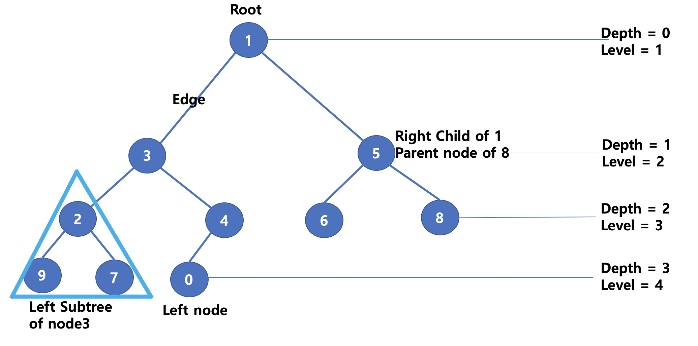
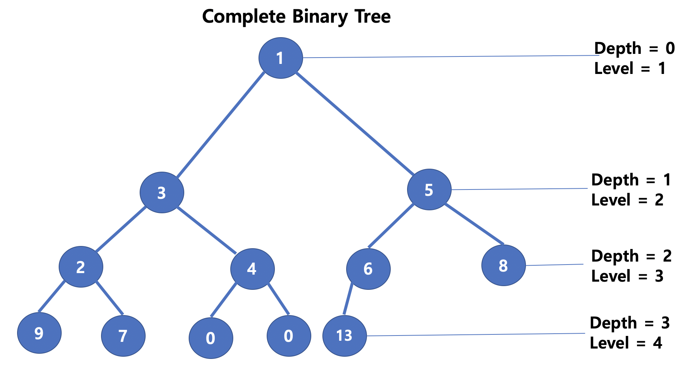
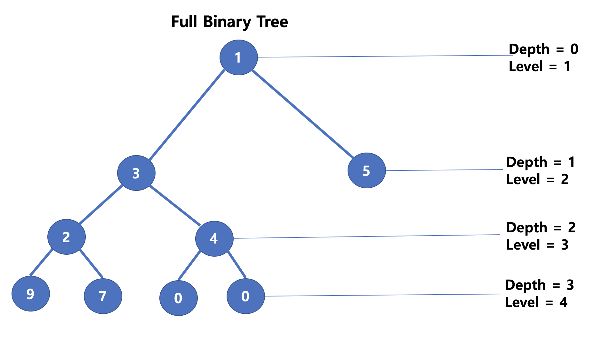
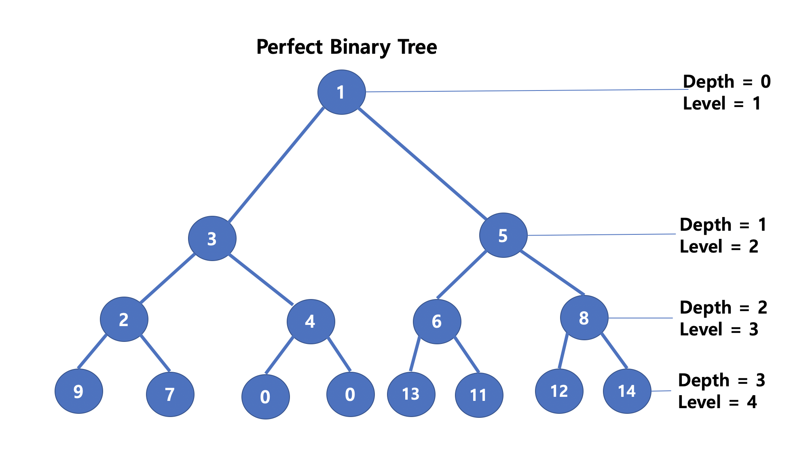
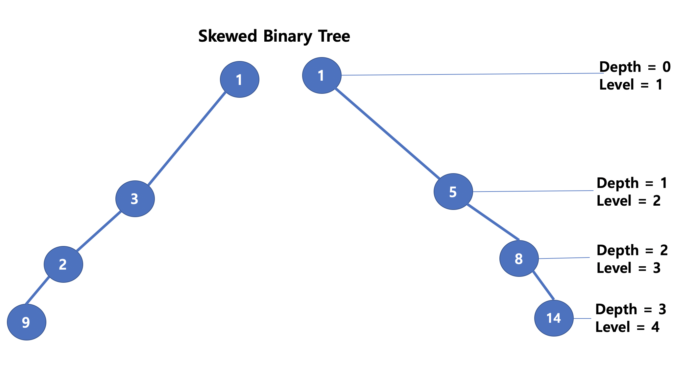
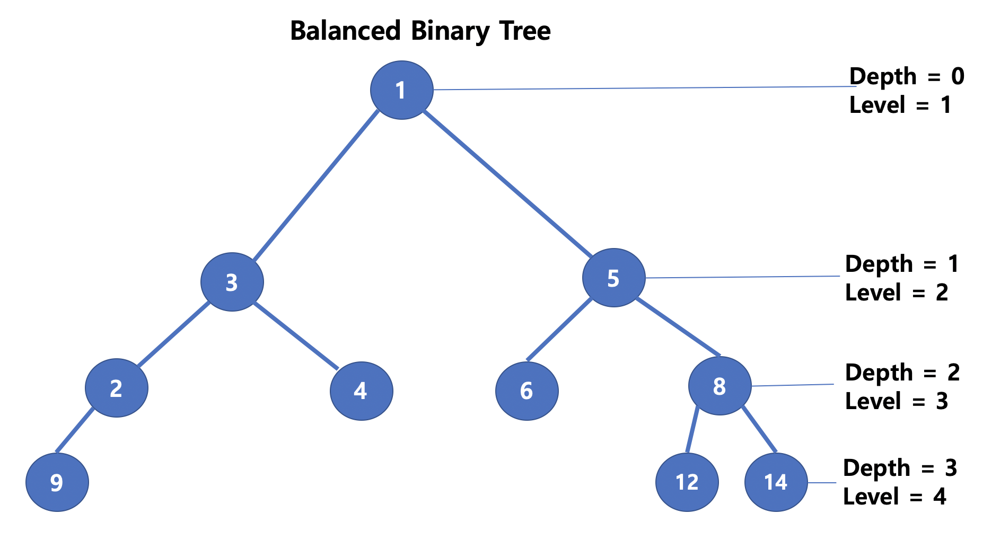

# Binary Tree

* 자식 노드의 수가 최대 2개까지로 구성된 트리
  * left chid와 right child로 구성
  * 자식수가 최대 3개인 경우, 삼항 트리(Ternary Tree)라고 함

* 순회 방법 (Travelsal) : 모든 노드를 탐색하는 방법
  * 전위 순회(Preorder) : 부모 노드 -> 왼쪽 자식 노드 -> 오른쪽 자식 노드 방문
    * 1 -> 3 -> 2 -> 9 -> 7 -> 4 -> 0 -> 5 -> 6 -> 8
  * 중위 순회 (Inorder) : 왼쪽 자식 노드 -> 부모 노드 -> 오른쪽 자식 노드 방문
    * 9 -> 2 -> 7 -> 3 -> 0 -> 4 -> 1 -> 6 -> 5 -> 8
  * 후위 순회(Postorder) : 왼쪽 자식 노드 -> 오른쪽 자식 노드 -> 부모 노드
    * 9 -> 7 -> 2 -> 0 -> 4 -> 3 -> 6 -> 8 -> 5 -> 1

이진트리는 트리 형태에 따라서 여러가지 종류로 표현될 수 있다

 

**완전 이진 트리 (Complete Binary Tree)**

* 마지막 Level의 바로 위 Level 까지 모든 Node가 채워져있고, 마지막 Level의 Node는 왼쪽부터 채워진 Tree

* Heap이 완전 이진 트리 형태로 구성됨
* 노드의 갯수가 N개일 때,  $$N <= $$ 2level -1 을 성립

**정 이진 트리 (Full Binary Tree)**

* Tree의 모든 Node는 자식이 0개 or 2개를 가지고 있음
* 노드의 갯수 N은 $$ 2*Depth + 1 <= N$$ 과  $$N <= $$ 2level -1 을 성립
  * Root 노드 1개와 Level이 추가될 때마다 최소 2개의 노드가 추가됨

**포화 이진 트리 (Perfect Binary Tree)**

* 모든 노드가 2개의 자식을 가지고 있으며, 모든 Level이 가득 채워진 Tree

* 노드의 갯수  N = 2level -1 이 성립

**편향 이진 트리 (Skewed Binary Tree)**

* Root 노드에서 한 방향으로만 노드가 채워진 Tree
  * Level마다 하나의 노드만 존재하기 때문에 탐색에 매우 부적합

**균형 이진 트리 (Balanced Binary Tree)**

* 모든 노드의 Left Subtree와 Right SubTree의 Level이 1 이상 차이가 나지 않는 Tree
* SubTree가 편향으로 구성되었을 때, 탐색시 발생하는 비정상적인 시간을 줄일 수 있음
* AVL, RedBlack Tree 등이 균형 이진 트리로 구현됨

