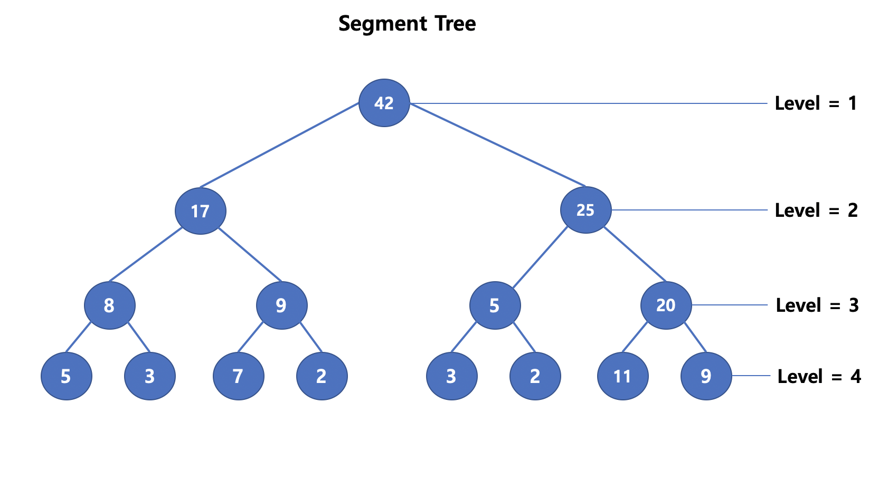
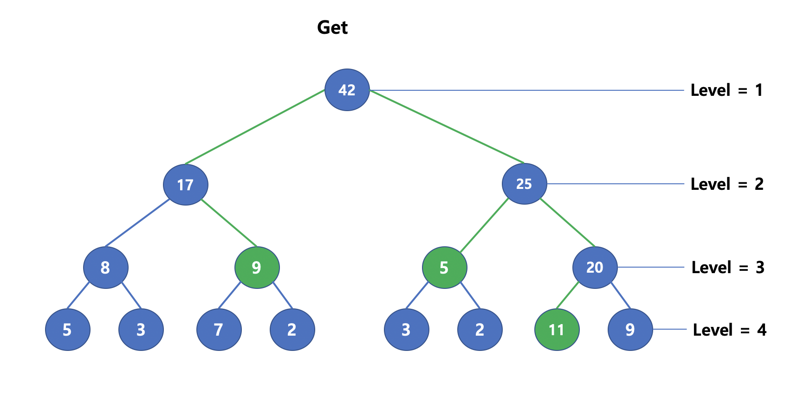
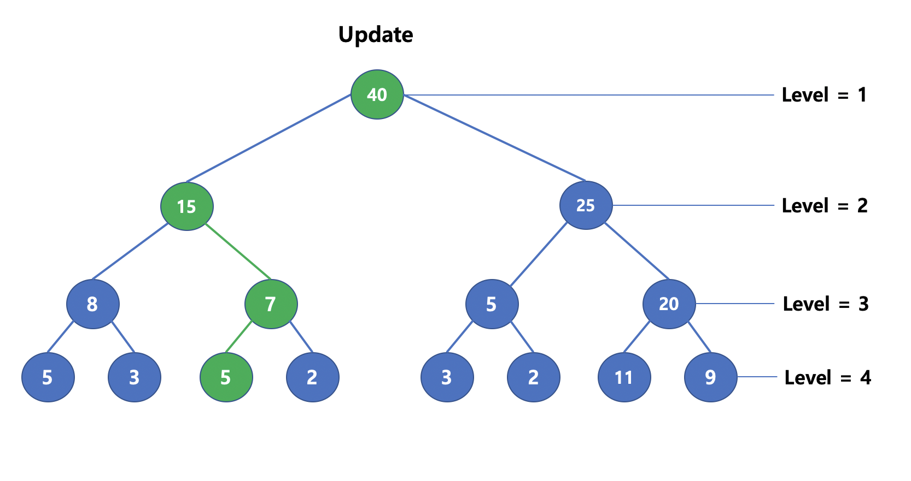

### Segment Tree

* 특정 배열의 연속적인 특징을 저장하는 트리
  * 구간합, 구간곱 등 다양하게 사용될 수 있음


* 완전 이진 트리이며, 아래와 같은 INDEX 규칙을 따름

  * 왼쪽 자식 노드 : [부모노드] * 2

  * 오른족 자식 노드 : [부모노드] * 2 + 1

* 아래와 같은 리스트가 있을 때 leaf 노드의 크기를 확인
  * 리스트의 갯수가 N인 경우, Tree의 Level은 $$log_2{N}$$+1 보다 크거나 같은 최소의 수
    * N이 8인 경우, Level = 4.  N이 9인 경우, Level = 5
  * 전체 배열의 갯수는 정적으로 할당하는 경우, 일반적으로 리스트의 크기 * 4 적용함
    * 리스트의 크기 * 2 >= leaf node와, 전체 배열의 크기 <= 2 * leaf node를 성립
    * 리스트의 크기 * 4 >= 전체 배열의 크기를 만족함
* Level을 확인하고, Leaf 노드에 배열 전체 삽입

| 0    | 1    | 2    | 3    | 4    | 5    | 6    | 7    | 8    |
| ---- | ---- | ---- | ---- | ---- | ---- | ---- | ---- | ---- |
| X    | 5    | 3    | 7    | 2    | 3    | 2    | 11   | 9    |

* 부모 노드에는 Segment Tree의 특징을 작성하는데, 구간합을 예시로 아래 Tree 구현



**Get**

* Root노드에서 시작하며 $$O(logN)$$ 의 시간으로 계산할 수 있음

* 만약 3-7의 범위에 속한 연속된 합을 계산하고 싶은 경우, 



**Update**

* Get을 할 때는 Root 노드에서 시작했지만, Update를 하는 경우 Leaf 노드에서 시작하여 $$O(logN)$$ 의 시간으로 수행할 수 있음
* 만약 3번째 노드의 값을 변경한 경우,



**Segment Tree Code**

```c++
int seg[4 * N];
int leaf_cnt, L, R;

// node start from 1
int get_sum(int node, int leftnode, int rightnode)
{
    if (L > rightnode || R < leftnode)
        return 0;
    if (L <= leftnode && rightnode <= R) return seg[node];
    int mid = (leftnode + rightnode) >> 1;
    return get_sum(2 * node, leftnode, mid) + get_sum(2 * node + 1, mid + 1, rightnode);
}

void update(int idx, int val)
{
    int index = leaf_cnt + idx - 1;
    seg[index] = val;
    while (index)
    {
        index /= 2;
        seg[index] = seg[2 * index] + seg[2 * index + 1];
    }
}

void init(int N){
    leaf_cnt = 1;
    while (N > leaf_cnt) leaf_cnt *= 2;
    // construct
    for (int i= leaf_cnt-1; i>0; i--) seg[i] = seg[2*i] + seg[2*i+1];
    L = leaf_cnt, R = 2*leaf_cnt-1; // range of leafnnode
}
```

### Lazy Segment Tree

* 기존의 Segment Tree에서 Update를 계속해서 진행하지 않고 lazy 배열에 저장
* query 진행 전, update 진행 전, lazy[node] 의 값이 변경이 있을 때 propagate 진행
  * leaf 노드에 도달하는 것이 아니면 lazy 배열에 값 저장
  * leaf 노드에 도달하면 lazy 배열이 아닌, seg 값에 반영


**Lazy Segment Tree Code**

```c++
template <typename T>
class segment
{
private:
    T height;
    vector<T> seg, lazy;

public:
    segment(T n)
    {
        height = (ceil(log2(n)));
        seg.assign(1 << (height + 1), 0);
        lazy.assign(1 << (height + 1), 0);
    }

    T create_seg(T node, T l, T r)
    {
        if (l == r)
            return seg[node] = arr[l];
        else
        {
            T mid = (l + r) >> 1;
            return seg[node] = create_seg(2 * node, l, mid) + create_seg(2 * node + 1, mid + 1, r);
        }
    }
    void propagate(T node, T l, T r)
    {
        if (lazy[node] != 0)
        {
            seg[node] += (r - l + 1) * lazy[node];
            if (l != r)
            {
                lazy[2 * node] += lazy[node];
                lazy[2 * node + 1] += lazy[node];
            }
            lazy[node] = 0;
        }
    }
    void update(T node, T s, T e, T l, T r, T val)
    {
        propagate(node, l, r);
        if (e < l || r < s)
            return;
        if (s <= l && r <= e)
        {
            lazy[node] += val;
            propagate(node, l, r);
            return;
        }
        T mid = (l + r) >> 1;
        update(2 * node, s, e, l, mid, val);
        update(2 * node + 1, s, e, mid + 1, r, val);
        seg[node] = seg[2 * node] + seg[2 * node + 1];
    }
    T query(T node, T s, T e, T l, T r)
    {
        propagate(node, l, r);
        if (e < l || r < s)
            return 0;
        if (s <= l && r <= e)
            return seg[node];
        T mid = (l + r) >> 1;
        return query(2 * node, s, e, l, mid) + query(2 * node + 1, s, e, mid + 1, r);
    }
};

```


### Persistent Segment Tree


**Persistent Segment Tree Code**


```
```

