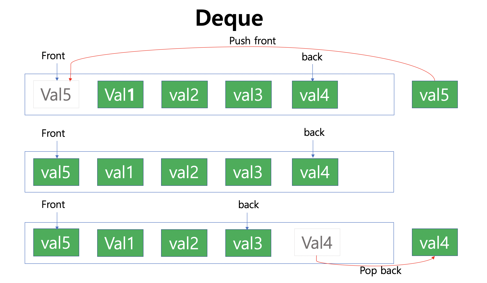
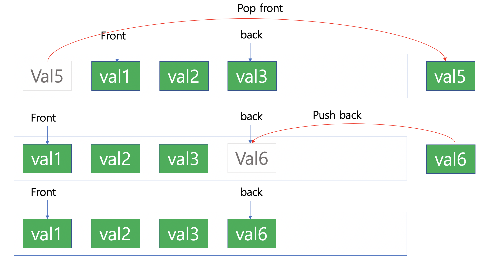

# Deque

* Stack과 Queue를 동시에 사용할 수 있는 Container
* 양 끝에 element를 추가/삭제를 진행할 때 O(1)의 속도로 수행할 수 있다.
* 양방향에 Push / Pop이 빈번하게 사용되는 경우 사용하기 좋음

* Front와 Back을 참조할 수 있으며, LinkedList로 구현하여 Size가 자동으로 변경됨

<br/>






**Code**

```c++
#include <iostream>
using namespace std;

template <typename T>
class DEQUE;

template <typename T>
class NODE
{
    friend class DEQUE<T>;

private:
    T data;
    NODE *left;
    NODE *right;
};

template <typename T>
class DEQUE
{
private:
    int _size;
    NODE<T> *head;
    NODE<T> *tail;

public:
    DEQUE()
    {
        _size = 0;
        head = new NODE<T>;
        head->left = head->right = NULL;
        tail = new NODE<T>;
        tail->left = tail->right = NULL;
    }

    ~DEQUE()
    {
        _size = 0;
        NODE<T> *pos = head;
        while (pos->right != NULL)
        {
            NODE<T> *delNode = pos;
            pos = pos->right;

            delete delNode;
        }
        delete tail;
    }

    void push_front(int val)
    {
        if (head->right == NULL)
        {
            NODE<T> *newNode = new NODE<T>;
            newNode->data = val;
            newNode->left = head;
            head->right = newNode;
            newNode->right = tail;
            tail->left = newNode;
        }
        else
        {
            NODE<T> *newNode = new NODE<T>;
            newNode->data = val;
            newNode->right = head->right;
            head->right->left = newNode;
            newNode->left = head;
            head->right = newNode;
        }
        _size++;
    }

    void push_back(int val)
    {
        if (head->right == NULL)
        {
            NODE<T> *newNode = new NODE<T>;
            newNode->data = val;
            newNode->left = head;
            head->right = newNode;
            newNode->right = tail;
            tail->left = newNode;
        }
        else
        {
            NODE<T> *newNode = new NODE<T>;
            newNode->data = val;
            newNode->left = tail->left;
            tail->left->right = newNode;
            newNode->right = tail;
            tail->left = newNode;
        }
        _size++;
    }

    void pop_front()
    {
        if (!_size)
            cout << "deque is emptied" << endl;
        else
        {
            NODE<T> *pos = head->right;
            head->right->right->left = head;
            head->right = head->right->right;
            delete pos;
            _size--;
        }
    }
    void pop_back()
    {
        if (!_size)
            cout << "deque is emptied" << endl;
        else
        {
            NODE<T> *pos = tail->left;
            tail->left->left->right = tail;
            tail->left = tail->left->left;
            delete pos;
            _size--;
        }
    }
    T front()
    {
        if (!_size) {
            cout << "deque is emptied" << endl;
            return -1;
        }
        else return head->right->data;
    }
    T back()
    {
        if (!_size) {
            cout << "deque is emptied" << endl;
            return -1;
        }
        else return tail->left->data;
    }
    int size()
    {
        return _size;
    }

    bool empty()
    {
        return !_size;
    }

    void all()
    {
        NODE<T> *pos = head;
        while (pos != NULL)
        {
            if (!(pos == head || pos == tail))
                cout << pos->data << " ";
            pos = pos->right;
        }
        cout << endl;
    }
};
```

