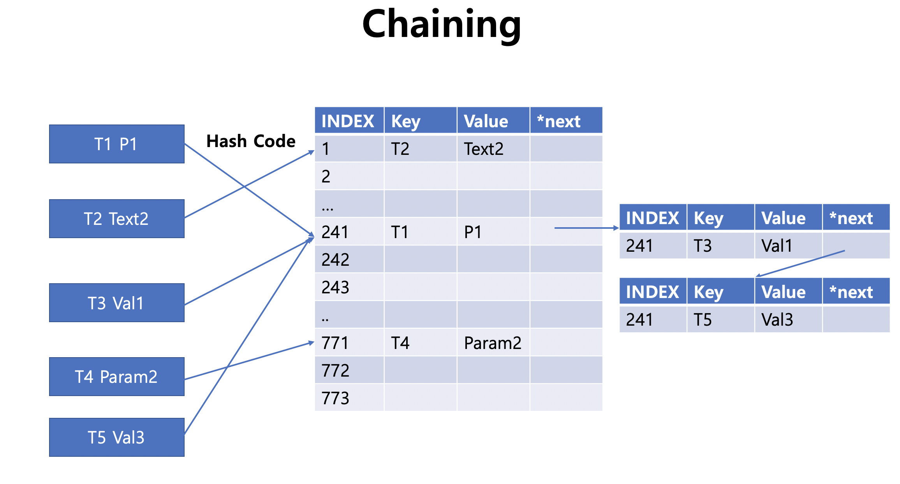

# Hash

* Key, Value로 데이터를 저장하며 빠른 속도로 Value를 검색/삽입/삭제 할 수 있는 구조
* 1:1 Mapping되어 있어 검색/삽입/삭제 시 시간복잡도는 평균 O(1)이라고 하지만, Key의 길이를 Index로 계산하는 과정이나 충돌이 났을 때 이동하는 과정을 고려해야 됨
* Key를 Hash Code에 적용하여 Index를 만들고 Hash Table 검색/저장/삭제 기능 수행
* 다른 Key라도 동일한 Index를 만들어지는 경우를 해결하기 위해, Open Addressing과 Chaining 기법이 많이 사용 됨

**Open Addressing**

* Hash Table에서 충돌이 났을 때, 비어있는 Index로 이동하는 기법
* 아래 예시는 충돌이 났을 때 +1을 했지만, 일반적으로 1,4,9와 같이 $$n^2$$ 이나 난수를 이용하여 충돌의 횟수를 줄임
* 테이블의 크기는 충돌을 고려하여 전체 Key의 수보다 크게 설정


**Code**

```c++

```


**Chaning**

* Hash 충돌이 났을 때, Index를 그대로 유지한 채 새로운 노드를 생성
* 연쇄적으로 연결을 하며, CRUD 할 때도 첫 Value에서 시작하면서 이동
* Linked로 연결되어 있기 때문에, 중간의 값을 삭제할 때는 이전의 value와 다음 value를 연결해야 됨
* 테이블의 크기는 전체 key의 숫자와 동일하게 맞추는 게 일반적임



**Code**

```c++
#include <iostream>
#include <string>
using namespace std;

template<typename T>
class HashMap{
    struct node {
        bool isfill = false;
        string key;
        T value;
        node* next = NULL;
    };
    int size, idx;
    node* arr;
public :
    HashMap(int _size){
        size = _size;
        arr = (node*)malloc(sizeof(node)*_size);
    }
    ~HashMap(){
        size = 0;
        free(arr);
    }
    int hashcode(string _key){
        int hash = 0;
        for (int i = 0; i < _key.size(); i++) {
            hash = (hash * 77 + 11 * _key[i]) % size;
        }
        cout << hash << endl;
        hash = 0;
        cout << _key << endl;
        return hash;
    }
    T get_value(string _key) {
        int hash = hashcode(_key);
        node* cur = &arr[hash];
        while(cur){
            if (cur->key == _key) {
                return cur->value;
            }
            cur = cur->next;
        }
        return "Not Found Key";
//        return -1;
    }
    void insert(string _key, T _value){
        int hash = hashcode(_key);
        if (!arr[hash].isfill) {
            arr[hash].key = _key, arr[hash].value = _value;
            arr[hash].isfill = true;
        }
        else {
            node* cur = &arr[hash];
            while (cur->next) {
                if (cur->key == _key){
                    cur->value = _value;
                    return;
                }
                cur = cur->next;
            }
            node* newnode = (node*)malloc(sizeof(node));
            newnode->key=_key, newnode->value = _value, newnode->next = NULL;
            cur->next = newnode;
            return;
        }
    }
    T remove(string _key){
        int hash = hashcode(_key);
        node *cur = &arr[hash];
        while (cur->next)
        {
            if (cur->next->key == _key)
            {
                node* delnode = cur->next;
                T res = cur->value;
                cur->next = cur->next->next;
                free(delnode);
                return res;
            }
            cur = cur->next;
        }
        if (cur->key == _key){
            T res = cur->value;
            cur->isfill = false;
            cur->key = "", cur->value = "";
            return res;
        }
        return "Not Found Key";
//        return -1;
    }
    void printall(){
        for (int i=0; i<size;i++){
            if (!arr[i].isfill) continue;
            node* cur = &arr[i];
            while(cur){
                cout << cur->value << " ";
                cur = cur->next;
            }
        }
        cout << endl;
    }
};

```


