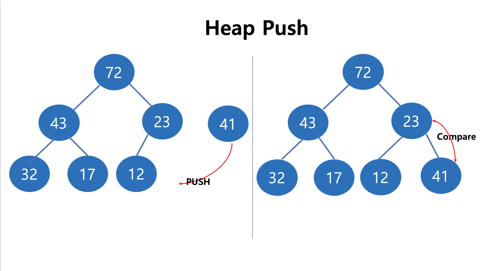
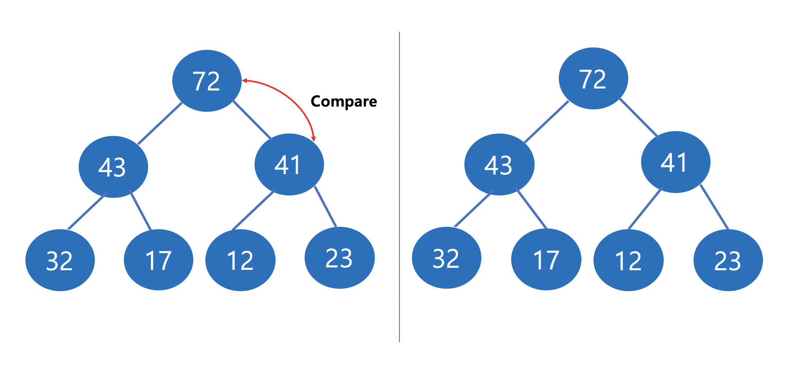
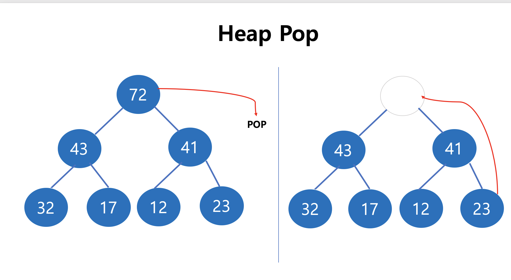
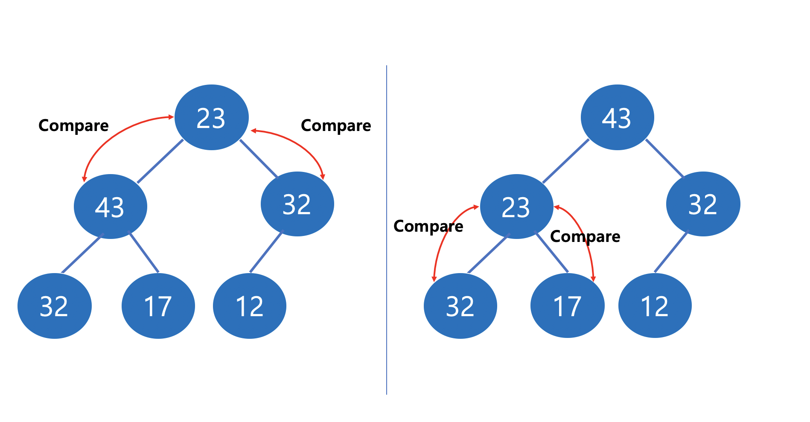
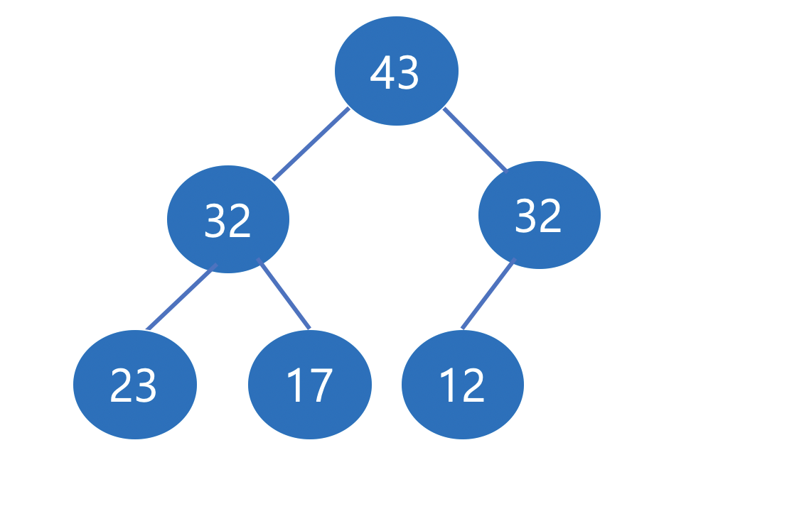

# Heap

* Tree 형태로 구성된 자료구조로서, 가장 큰 값 or 작은 값을 $$O(logN)$$ 의 시간복잡도로 Push/Pop 진행
* 최상단에 최댓값이 오는 Max Heap, 최상단에 최솟값이 오는 Min Heap
* 아래 예시는 Max Heap을 기준으로 구현

**Push**

* Tree의 가장 마지막 지점에 Component 추가
* 부모 노드와 계속 비교를 하며 부모노드보다 클 때 부모노드와 위치를 변경
* 부모 노드가 자식 노드보다 큰 지점에 도달하면 반복문 종료





**Pop**

* Tree 구조에서 최상단에 최댓값을 유지하기 때문에, 첫번째 노드 값을 return

* 첫번째 노드를 삭제하고 마지막 노드를 첫번째 노드로 위치
* 좌/우 자식 노드들과 비교
* 더 큰 값을 가지는 자식과 위치를 변경하며, 좌/우 둘 다 변경할 수 없을때까지 진행







**Code**

```c++

#include <iostream>
using namespace std;

#define MAX_SIZE 100001

template <typename T>
class heap
{
private:
    T h[MAX_SIZE];
    int _size = 1;

public:
    void swap(T *a, T *b)
    {
        T tmp = *a;
        *a = *b;
        *b = tmp;
    }

    T push(T value)
    {
        if (_size >= MAX_SIZE)
        {
            return -1;
        }

        h[_size] = value;
        int current = _size;
        int parent = _size / 2;

//        while (current > 1 && h[current] < h[parent]) // minheap
        while (current > 1 && h[current] > h[parent])
        {
            swap(&h[current], &h[parent]);
            current = parent;
            parent = parent / 2;
        }
        _size++;
        return 1;
    }

    T pop()
    {
        if (_size <= 1)
            return 0;

        T ret = h[1];
        _size--;

        h[1] = h[_size];
        int current = 1;
        int leftChild = current * 2;
        int rightChild = current * 2 + 1;
        int minNode = current;

        while (leftChild < _size)
        {
            if (h[minNode] < h[leftChild])
                minNode = leftChild;
            if (rightChild < _size && h[minNode] < h[rightChild])
                minNode = rightChild;
            /* minheap
            if (h[minNode] > h[leftChild])
                minNode = leftChild;
            if (rightChild < _size && h[minNode] > h[rightChild])
                minNode = rightChild;
            */
            if (minNode == current)
                break;
            else
            {
                swap(&h[current], &h[minNode]);
                current = minNode;
                leftChild = current * 2;
                rightChild = current * 2 + 1;
            }
        }
        return ret;
    }
    bool empty() { return !(_size - 1); }
    int size() { return _size - 1; }
};
```

