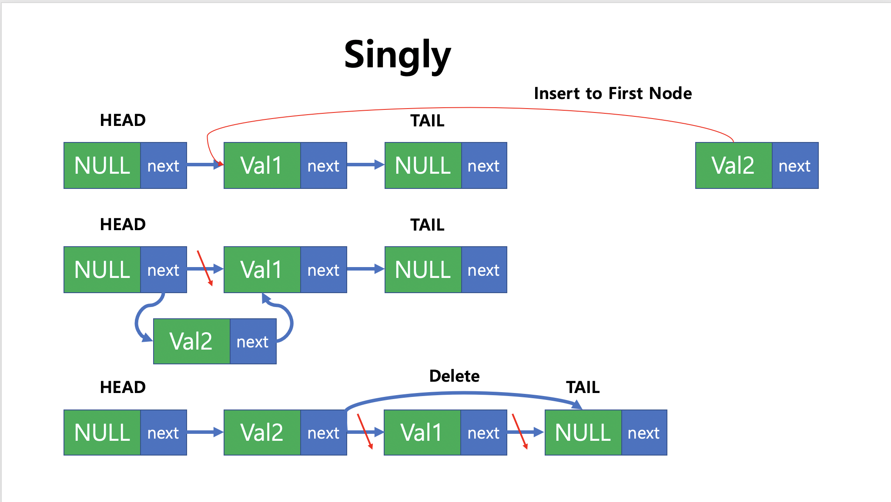

# Linked List

### 단순 링크드리스트 (Singly Linked List) 

* head와 tail은 NULL 값으로 유지한 채 처음과 끝을 알려주는 Pointer로 사용
* 새로운 노드가 추가되거나 삭제될 때, next Pointer가 가리키는 위치를 변경해서 연결
* Stack / Queue 등에서 사용되는 Linked List 



**Code**

```c++
struct node
{
    int data;
    node *next;
};

template <typename T>
class linked_list{
    node *head, *tail;
    int _size;
public :
    linked_list()
    {
        head = (node*)malloc(sizeof(node));
        tail = (node*)malloc(sizeof(node));
        head->next = tail;
        _size = 0;
    }
    ~linked_list()
    {
        clear();
        free(head);
        free(tail);
    }
    void addFront(T value){
        node* newnode = (node*)malloc(sizeof(node));
        newnode->data = value;
        newnode->next = head->next;
        head->next = newnode;
        _size++;
    }
    void addBack(T value){
        node *newnode = (node *)malloc(sizeof(node));
        newnode->data = value;
        newnode->next = tail;
        node* back = head; 
        while(back->next != tail) {
            back = back->next; // singly..
        }
        back->next = newnode;
        _size++;
    }
    int search_first_index(T value){
        int idx = 0;
        node* tmp = head;
        while (tmp->next != tail){
            tmp = tmp->next;
            idx++;
            if (tmp->data == value) return idx;
        }
        return -1;
    }    
    void remove_first_node(T value){
        node* tmp = head;
        while (tmp->next != tail){
            if (tmp->next->data == value){
                node* delnode = tmp->next;
                tmp->next = delnode->next;
                free(delnode);
                _size--;
                return;
            }
            tmp = tmp->next;
        }
        cout <<"There's no component " << value << endl;
        return;
    }
    void printall(){
        node* tmp = head->next;
        if (empty()) return;
        while(tmp != tail){
            cout << tmp->data << " ";
            tmp = tmp->next;
        }
        cout << endl;
    }
    bool empty(){return !_size;}
    int size() {return _size;}
    void clear(){
      	if (empty()) return;
        node* tmp = head->next;
        while (!empty()){
            node* delnode = tmp;
            tmp = delnode->next;
            free(delnode);
            _size--;
        }
        head->next = tail;
    }
};
```

### 원형 링크드리스트 (Circular Linked List)

* 단순 링크드리스트에서 Head / Tail의 data에 값 추가하고 연결
  * Tail의 next가 Head이므로 굳이 Head를 사용할 필요가 없음

* 노드의 마지막에 추가하는 것과 처음에 추가하는 것의 차이가 없음
  * Tail Pointer의 위치 변경 유무만 차이가 있음


**Code**

```c++
template <typename T>
class linked_list
{
    struct node
    {
        int data;
        node *next;
    };
    int _size;
    node *tail;

public:
    linked_list()
    {
        tail = NULL;
        _size = 0;
    }
    ~linked_list()
    {
        clear();
        delete tail;
    }
    void addFront(T value)
    {
        node *newnode = (node *)malloc(sizeof(node));
        newnode->data = value;
        if (empty()){
            tail = newnode;
            tail->next = tail;
        }
        else {
            newnode->next = tail->next;
            tail->next = newnode;
        }
        _size++;
    }
    void addBack(T value)
    {
        node *newnode = (node *)malloc(sizeof(node));
        newnode->data = value;
        if (empty()){
            tail = newnode;
            tail->next = tail;
        }
        else {
            newnode->next = tail->next;
            tail->next = newnode;
            tail = newnode;
        }
        _size++;
    }
    int search_first_index(T value)
    {
        if (empty()) return -2;
        int idx = 0;
        node *tmp = tail->next;
        while (tmp != tail) {
            if (tmp->data == value)
                return idx;
            idx++;
            tmp = tmp->next;
        }
        return -1;
    }
    int remove_first_index(T value){
        if (empty()) return -2;
        int idx = 0;
        node* tmp = tail;
        while(tmp->next != tail){
            if (tmp->next->data == value) {
                node* delnode = tmp->next;
                tmp->next = (tmp->next)->next;
                free(delnode);
                _size--;
                return idx;
            }
            idx++;
            tmp = tmp->next;
        }
        if (tail->data == value) {
            node* delnode = tail;
            tmp->next = tail->next;
            free(delnode);
            _size--;
            if (empty()) tail = NULL;
            else tail = tmp->next;
            return _size;
        }
        return -1;
    }
    void printall()
    {
        if (empty()) {
            cout << "There's no component\n";
            return;
        }
        node *tmp = tail->next;
        while (tmp != tail)
        {            
            cout << tmp->data << " ";
            tmp = tmp->next;
        }
        cout << tmp->data << " ";
        cout << endl;
    }

    bool empty() { return !_size; }
    int size() { return _size; }
    void clear()
    {
        if (empty()) return;
        node *tmp = tail->next;
        while (!empty())
        {
            node *delnode = tmp;
            tmp = delnode->next;
            free(delnode);
            _size--;
        }
        tail = NULL;
    }
};
```

### 이중 링크드리스트 (Doubly Linked List)

* 각 노드가 선행/후행 노드와 연결되어 있음
* Head node와 Tail node가 NULL 값으로 유지한 채 처음과 끝을 알려주는 Pointer로 사용
* 새로운 노드가 추가되거나 삭제될 때, pre/next Pointer가 가리키는 위치를 변경해서 연결
* Deque에서 이중 링크드리스트 사용


**Code**

```c++
template <typename T>
class linked_list
{
    struct node{
        int data;
        node* next;
        node* pre;
    };
    int _size;
    node* head;
    node* tail;
public:
    linked_list()
    {
        head = (node*)malloc(sizeof(node));
        tail = (node*)malloc(sizeof(node));
        head->pre = tail->next = NULL;
        head->next = tail;
        tail->pre = head;
        _size = 0;
    }
    ~linked_list()
    {
        clear();
        delete head;
        delete tail;
    }
    void addFront(T value){
        node* newnode = (node*)malloc(sizeof(node));
        newnode->data = value;
        newnode->next = head->next;
        newnode->pre = head;
        (head->next)->pre = newnode;
        head->next = newnode;
        _size++;
    }
    void addBack(T value){
        node* newnode = (node*)malloc(sizeof(node));
        newnode->data = value;
        newnode->next = tail;
        newnode->pre = tail->pre;
        (tail->pre)->next = newnode;
        tail->pre = newnode;
        _size++;
    }
    int search_first_index(T value) {
        int idx = 0;
        node *tmp = head;
        while (tmp->next != tail)
        {
            tmp = tmp->next;
            idx++;
            if (tmp->data == value) return idx;
        }
        return -1;
    }
    int search_last_index(T value){
        int idx = _size;
        node* tmp = tail;
        while (tmp->pre != head) {
            tmp = tmp->pre;
            if (tmp->data == value) return idx;
            idx--;
        }
        return -1;
    }
    void remove_last_node(T value){
        node* tmp = tail;
        while(tmp->pre != head){
            tmp = tmp->pre;
            if (tmp->data == value){
                (tmp->pre)->next = tmp->next;
                (tmp->next)->pre = tmp->pre;
                free(tmp);
                _size--;
                return;
            }
        }
        cout << "There's no component " << value << endl;
        return;
    }
    void remove_first_node(T value){
        node *tmp = head;
        while (tmp->next != tail)
        {
            tmp = tmp->next;
            if (tmp->data == value) {
                (tmp->pre)->next = tmp->next;
                (tmp->next)->pre = tmp->pre;
                free(tmp);
                _size--;
                return;
            }
        }
        cout << "There's no component " << value << endl;
        return;
    }
    void printall(){
        node *tmp = head->next;
        if (empty()) return;
        while (tmp != tail) {
            cout << tmp->data << " ";
            tmp = tmp->next;
        }
        cout << endl;
    }

    bool empty() { return !_size; }
    int size() { return _size; }
    void clear()
    {
      	if (empty()) return;
        node* tmp = head->next;
        while (!empty())
        {
            node* delnode = tmp;
            tmp = delnode->next;
            free(delnode);
            _size--;
        }
        head->next = tail;
    }
};
```

