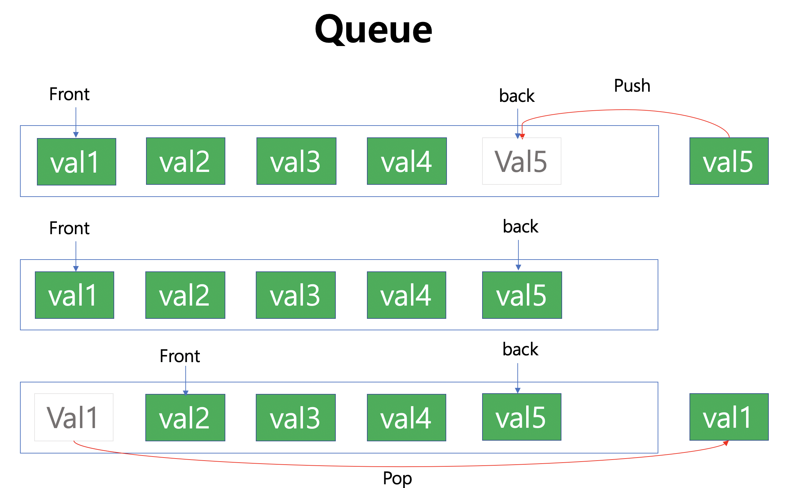

# Queue

* FIFO (First In First Out)을 따르는 Container

  * Push : 리스트의 가장 우측에 값을 넣음

  - Pop : 리스트의 가장 좌측 값을 제거
  
* Front와 Back을 참조할 수 있으며, LinkedList로 구현하여 Size가 자동으로 변경됨

<br/>



**Code**

```c++
#include <iostream>
using namespace std;

struct qnode
{
    int value;
    qnode *next;
};

template <typename T>
class _Queue
{
private:
    qnode *first, *rear;
    int _size;

public:
    _Queue()
    {
        first = rear = NULL;
        _size = 0;
    }
    ~_Queue()
    {
        while (!empty())
            pop();
    }
    void push(T data)
    {
        qnode *node = (qnode *)malloc(sizeof(qnode));
        node->value = data;
        node->next = NULL;
        if (empty())
            first = rear = node;
        else
        {
            rear->next = node;
            rear = rear->next;
        }
        _size++;
    };
    void pop()
    {
        if (empty())
        {
            cout << "There's no component\n";
            return;
        }
        qnode *delnode = first;
        first = delnode->next;
        free(delnode);
        _size--;
    }
    T front(){
        if (empty())
        {
            cout << "There's no component\n";
            return-1;
        }
        return first->value;
    }
    T back()
    {
        if (empty())
        {
            cout << "There's no component\n";
            return -1;
        }
        return rear->value;
    }

    bool empty() { return !_size; }
    int size() { return _size; }
};
```

