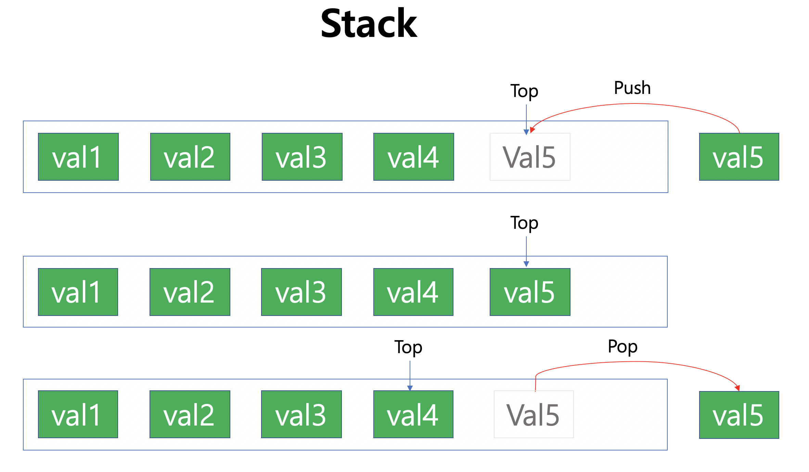

# Stack

* LIFO (Last In First Out) 을 따르는 Container
  * Push : 리스트의 가장 우측에 값을 넣음
  * Pop :  리스트의 가장 오른쪽 값을 제거
* Top에 위치한 값을 참조할 수 있으며, Linked List로 구현하여 Size가 자동으로 할당됨

<br/>



**Code**

```c++
#include <iostream>
using namespace std;

struct snode
{
    int value;
    snode *pre;
};

template <typename T>
class _Stack
{
private:
    snode *rear;
    int _size;

public:
    _Stack()
    {
        rear = NULL;
        _size = 0;
    }
    ~_Stack()
    {
        while (!empty())
            pop();
    }
    void push(T val)
    {
        snode *node = (snode *)malloc(sizeof(snode));
        node->value = val;
        node->pre = rear;
        rear = node;
        _size++;
    }
    void pop()
    {
        if (empty()) {
            cout <<"There's no component";
            return;
        }
        snode *delnode = rear;
        rear = delnode->pre;
        free(delnode);
        _size--;
    }
    T top(){
        if (empty()){
            cout << "There's no component";
            return -1;
        }
        return rear->value;
    }
    int size() { return _size; }
    int empty() { return !_size; }
};
```

