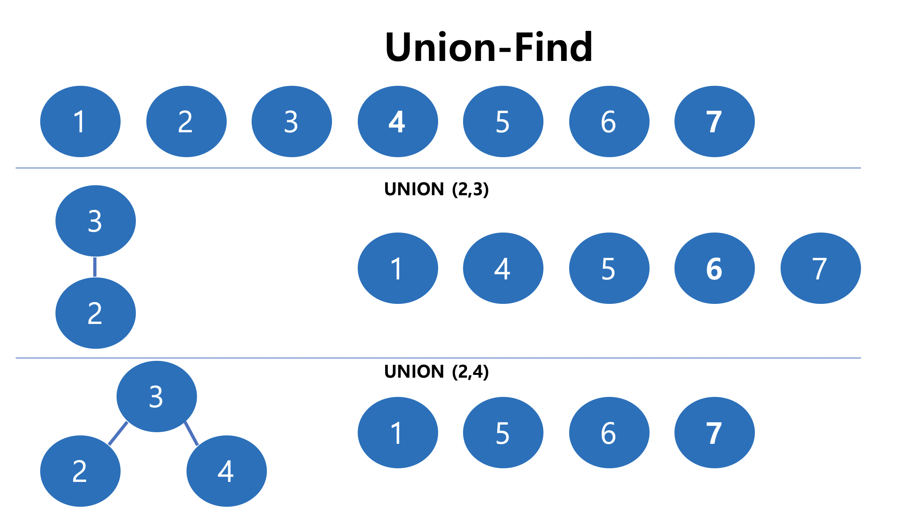
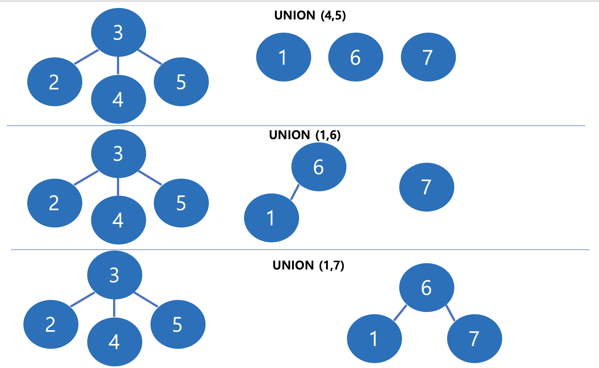
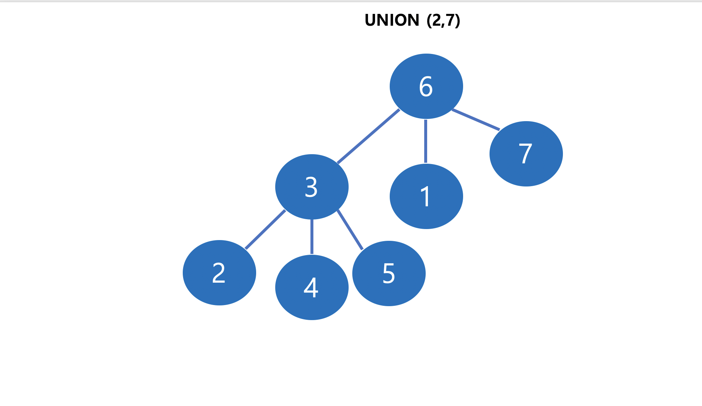

# Union Find

* 서로소 집합(Disjonit-Set), 합집합-찾기 (Union-Find), 병합-찾기(Merge-Find) 알고리즘이라고 불림

* 2개의 기능으로 나눌 수 있는데, Find 가능과 Union 기능으로 구성됨

* **Find**

  * 원소가 속한 집합을 반환하는 방법
  * 일반적으로, 최대 조상 Node를 집합의 대표로 설정하여, 최대 조상 Node가 일치하면 동일 집합으로 봄

  ```c++
  int find(int u)
  {
      if (u == parent[u]) return u;
      return parent[u] = find(parent[u]);
  }
  ```

* **Union(Merge)**

  * 두 개의 원소를 비교했을 때, 같은 집합이 아닐 때 두 개의 원소를 하나의 집합으로 만들어주는 방법
  * 한쪽으로 원소가 몰리게 되면 시간 복잡도가 느려지기 때문에 아래와 같은 최적화 코드를 넣어줌

  ```c++
  if (depth[pa] > depth[pb]) swap(pa, pb);
  if (depth[pa] == depth[pb]) depth[pb]++;
  parent[pa] = pb;
  ```








**Code**

```c++
int parent[node];
int depth[node];

int find(int u)
{
    if (u == parent[u]) return u;
    return parent[u] = find(parent[u]);
}

void _union(int a, int b)
{
    int pa = find(a);
    int pb = find(b);
    if (pa == pb) return;
    if (depth[pa] > depth[pb]) swap(pa, pb);
    if (depth[pa] == depth[pb]) depth[pb]++;
    parent[pa] = pb;
    return;
}

void init(){
    for (int i=0;i<n;i++) parent[i] = i;
}
```


**DSU**

* DSU (Disjoint Set Union)는 Union과 Find 기능을 제공하는 하나의 class로 제공

```c++
template <typename T>
class dsu
{
public:
    T p[node], _rank[node];
    T n;
    dsu(int _n) : n(_n)
    {
        for (int i = 0; i < n; i++) p[i] = i;
        for (int i=0; i<n; i++) _rank[i] = 0;
    }
    T get(T x)
    {
        return (x == p[x] ? x : (p[x] = get(p[x])));
    }
    bool unite(T x, T y)
    {
        x = get(x);
        y = get(y);
        if (x != y)
        {
            if (_rank[x] > _rank[y]) swap(x,y);
            if (_rank[x] == _rank[y]) _rank[y]++;
            p[x] = y;
            return true;
        }
        return false;
    }
};
```

