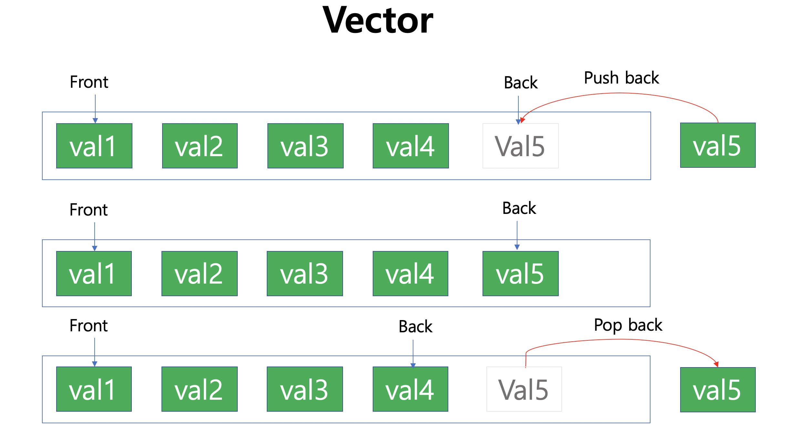

# Vector & Pair

**Vector**

* 메모리가 자동으로 할당되는 배열
* capacity를 설정하고, size가 capacity에 도달하면 capacity를 늘려주면서 이전의 배열에 저장된 값을 이동
  * Realloc 단계에서 많은 시간이 소요되어 시간/공간 복잡도를 고려하여 capacity를 늘려주는 게 중요
  * 아래 구현은 size가 다 찰때마다 capacity를 1.5에서 2 사이의 값으로 조절하는게 메모리 최적화를 위한 솔루션이라고 함
    * Windows 환경에서 돌릴 때는 1.5~1.6배씩 증가하는 것으로 확인되었는데 MacOS에서는 2배씩 늘어나는 것으로 확인됨
* 배열의 가장 앞과 마지막에 있는 값을 O(1)의 속도로 참조할 수 있으며, Push_back / Pop_back method도 O(1)로 진행할 수 있음



```c++
#include <iostream>
using namespace std;

template <typename T>
class _vector
{
private:
    int _capacity = 0;
    int _size = 0;
    T *vc;

public:
    _vector(int size = 1)
    {
        _capacity = size;
        vc = new T[size];
    }
    ~_vector()
    {
        delete[] vc;
    }
    int size() { return _size; }
    bool empty() { return !_size; }
    void resize(int size)
    {
        T *tVc = new T[size];
        for (int i = 0; i < _size; i++)
            tVc[i] = vc[i];
        delete[] vc;

        vc = tVc;
    }
    void clear()
    {
        delete[] vc;
        _capacity = 1;
        _size = 0;
        vc = new T[1];
    }
    void push_back(T val)
    {
        if (_size == _capacity)
        {
            _capacity *= 2;
            resize(_capacity);
        }
        vc[_size++] = val;
    }
    void pop_back()
    {
        if (_size == 0) return;
        vc[--_size] = 0;
//        vc[--_size] = {0, 0}; // if pair
    }
    void reverse()
    {
        for (int i = 0; i < _size / 2; i++)
        {
            // swap
            T tmp = vc[i];
            vc[i] = vc[(_size - 1) - i];
            vc[(_size - 1) - i] = tmp;
        }
    }
    T front(){
        if (!_size) {
            cout <<"There's not Component" << endl;
            return -1;
        }
        return vc[0];
    }
    T back()
    {
        if (!_size)
        {
            cout << "There's not Component" << endl;
            return -1;
        }
        return vc[_size-1];
    }
    T &operator[](const int &i) { return vc[i]; }
    T operator[](int i) const { return vc[i]; }
    void operator=(const _vector &tvc)
    {
        _capacity = tvc._capacity;
        _size = tvc._size;
        delete[] vc;
        vc = new T[_capacity];
        for (int i = 0; i < _size; i++)
            vc[i] = tvc[i];
    }
};
```


**Pair**

* 두 개의 객체 (first, second)를 하나의 객체로 묶어서 사용하는 클래스
* 두 개의 객체 내에 값이 존재하기 때문에 값이 저장되는 객체를 참조할 때는 `.first / .second` 와 같이 실제 값이 저장되는 객체로 접근해야 됨

**Code**

```c++
template <typename T1, typename T2>
class _pair
{
public:
    T1 first;
    T2 second;

    bool operator<(const _pair<T1, T2> &a)
    {
        if (first == a.first)
            return second < a.second;
        return first < a.first;
    }
};
```

