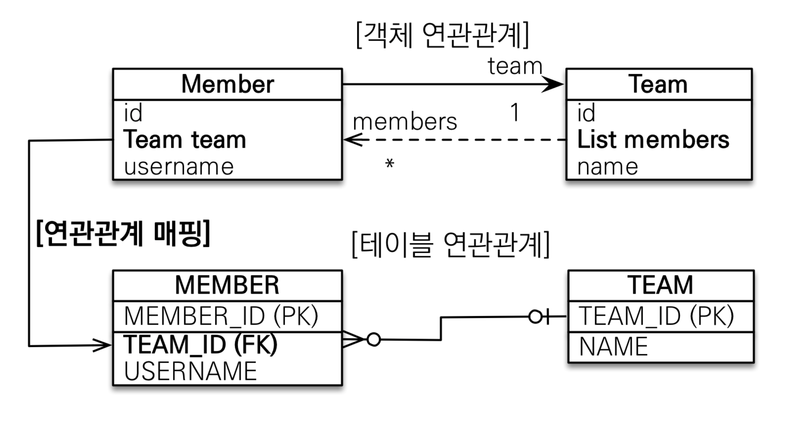
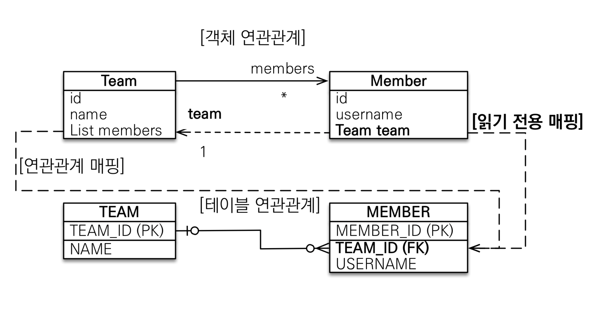
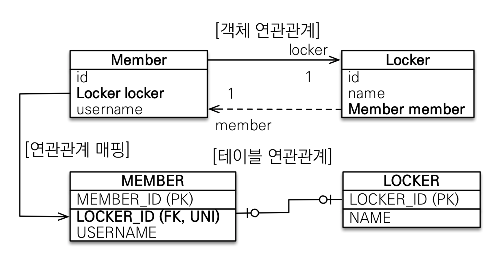
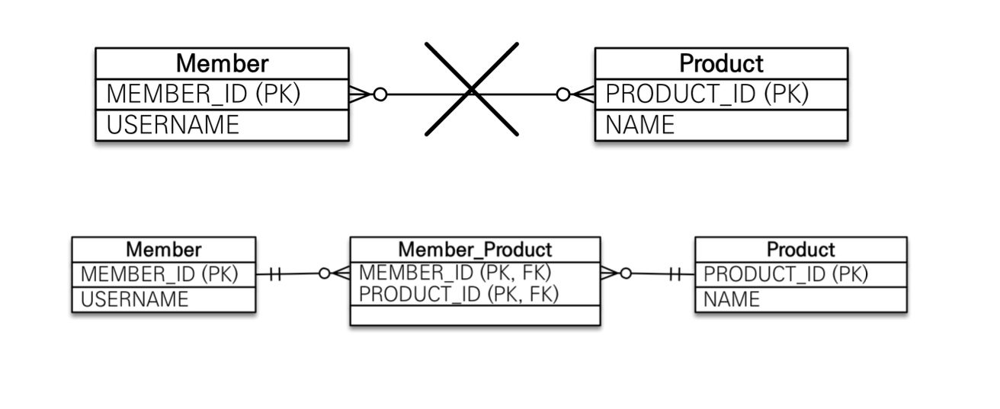

# Cardinality

* 양쪽이 서로 참조하는 경우 양방향이라고 하는데, 두개의 단방향으로 구성되어 있음
* 참조용 필드가 있는 연관관계의 주인은 CRUD 할 수 있으나, 주인이 아닌 객체는 조회만 할 수 있음

### 다대일 @ManyToOne

* N:1 인 경우, N을 가지는 엔터티가 연관관계의 주인으로 설정
* 외래키가 있는 곳에 참조를 걸어서 연관관계 매핑
* 연관관계가 아닌 쪽에서는 조회만 가능하기 때문에, 객체만 추가

```java
양방향
public class Member {
    @ManyToOne
    @JoinColumn(name = "TEAM_ID")
    private Team team;
}

public class Team {
    @OneToMany(mappedBy = "team") // 멤버 변수명 작성
    private List<Member> members = new ArrayList<>();
}
```



<div style="text-align: right"> Image ref : https://www.inflearn.com/course/ORM-JPA-Basic/dashboard</div>


### 일대다 @OneToMany

* 1:N 관계에서 1을 연관관계의 주인으로 설정
* 외래키는 N이 가지고 있기 때문에, 값을 업데이트 하기 위해서는 추가 쿼리 발생
* 객체와 테이블의 차이 때문에 반대편 테이블의 외래키를 관리
* 아래 코드를 실행했을 때, 2번의 insert 쿼리가 발생하고, 이후 update query가 추가 발생
  * 주인이 아닌 엔터티와 매핑된 테이블의 데이터가 변경됨
  * 주인이 아닌 테이블에 update query가 발생하니 유지보수 측면에서 어려움
* 양방향으로 사용할 경우, @joinColumn(insertable = false, updatable = false) 추가하여 읽기 전용으로 사용

```java
public class Team {
    @OneToMany
    @JoinColumn(name="TEAM_ID") // 추가하지 않으면 중간 테이블이 생김
    private List<Member> members = new ArrayList<>();
}


Member member = new Member();
member.setUsername("TESTNAME");
em.persist(member);

Team team = new Team();
team.setName("TESTTEAM");
team.getMembers().add(member);
em.persist(team);
```



<div style="text-align: right"> Image ref : https://www.inflearn.com/course/ORM-JPA-Basic/dashboard</div>


### 일대일 @OneToOne

* 다대일 단방향 관계와 유사하나, 주 테이블이나 대상 테이블 중 외래키를 선택할 수 있음
* default가 `unique = False`라서 외래키에 유니크 제약조건을 걸어줘야 데이터베이스와 매핑되어 저장할 수 있음
* 외래키가 있는 곳이 Owner이고, 반대쪽에는 `mappedby` 를 걸어줌
* Mapping 되는 테이블과 연관관계 매핑을 해서 다른 테이블을 조회

```java
public class Locker {
    @Id
    @GeneratedValue
    @Column(name="LOCKER_ID")
    private Long id;
    private String name;
    
    @OneToOne(mappedBy = "locker")
    private Member member
}


public class Member {
    @OneToOne
    @JoinColumn(name="LOCKER_ID", unique = true)
    private Locker locker;
}
```




<div style="text-align: right"> Image ref : https://www.inflearn.com/course/ORM-JPA-Basic/dashboard</div>

### 다대다 @ManyToMany

* RDB에서 다대다 관계를 한번에 표현할 수 없고, 중간 테이블을 만들어서 다대일 관계로 해결해야됨
* 중간 테이블에 데이터를 추가할 수 없으니, 실무에서 사용하기에는 무리가 있음
  * 비지니스 관련된 내용이 아닌, 매핑 정보만 담을 수 있음
* @ManyToMany를 다대일/일대다로 변경하고, 중간 테이블을 직접 관리할 수 있는 엔터티로 생성

```java
public class Product {
    @Id
    @GeneratedValue
    private Long id;
    private String name;
    @ManyToMany(mappedBy = "products")
    private List<Member> members = new ArrayList<>();
}

public class Member {
    @ManyToMany
    @JoinTable(name="MEMBER_PRODUCT")
    private List<Product> products = new ArrayList<>();
}

---------------------------------------------------------------------
  
  
  
public class Member {
    @OneToMany
    private List<MemberProduct> memberProducts = new ArrayList<>();
}
  
  
public class MemberProduct {
    @Id @GeneratedValue
    private Long id;
  
  	@ManyToOne
    @JoinColumn(name = "MEMBER_ID")
    private Member member;

    @ManyToOne
    @JoinColumn(name= "PRODUCT_ID")
    private Product product;
}


public class Product {
    @Column(name="PRODUCT_ID")
    private Long id;
   
    @OneToMany(mappedBy = "product")
    private List<MemberProduct> memberProducts = new ArrayList<>();
}

```



<div style="text-align: right"> Image ref : https://www.inflearn.com/course/ORM-JPA-Basic/dashboard</div>

