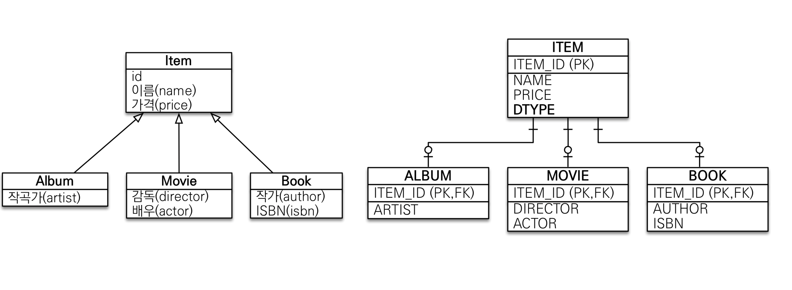
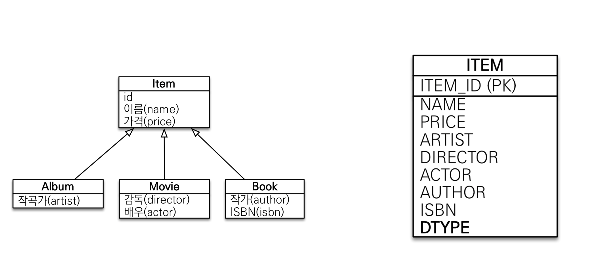
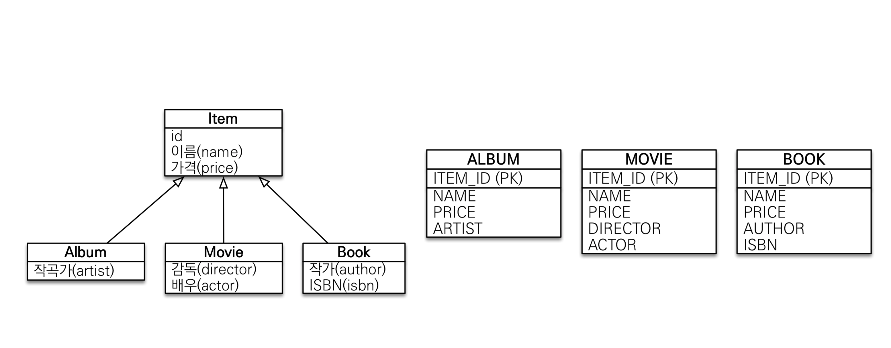

# Inheritance Mapping

* 관계형 DB에서는 상속관계가 없으므로 Super/Sub 타입 모델링 기법을 적용
* JOIN / SINGLE_TABLE / TABLE_PER_CLASS 3가지 방법으로 상속 관계를 매핑할 수 있음

**JOIN**

* 상속받는 객체를 각 테이블로 변환함
* 데이터가 정규화 되었기 때문에, 저장 공간을 효율적으로 사용
* 조회시 조인을 사용하기 때문에 성능 저하되고, 데이터 삽입시 INSERT 쿼리 2번 발생 (부모 테이블/자식테이블)

```java
@Entity
@Inheritance(strategy = InheritanceType.JOINED) // 설정하지 않으면 Item 테이블에 상속받은 Column들이 전부 들어감
@DiscriminatorColumn // DB에서 부모에서 상속받는 엔터티를 확인할 수 있음 - 상속받는 객체에서 DiscriminationValue로 이름 변경 가능
public class Item {
    @Id @GeneratedValue
    private Long id;

    private String name;
    private int price;
}

@Entity
public class Movie extends Item {
    private String director;
    private String actor;
}


```




<div style="text-align: right"> Image ref : https://www.inflearn.com/course/ORM-JPA-Basic/dashboard</div>

**Single Table**

* 여러개의 테이블로 나누는 것이 아니라, 단일 테이블에 모든 속성을 넣음
* DType 속성을 이용하여 구분하기 때문에 DTYPE이 필수로 생성됨
* 조회나 데이터 삽입시 최소한의 쿼리만 발생
* 사용하지 않는 Column이 있기 때문에 null을 허용
* 불필요한 공간을 사용하기 때문에 성능 저하가 발생할 수 있음

```java
@Entity
@Inheritance(strategy = InheritanceType.SINGLE_TABLE) // 설정하지 않으면 Item 테이블에 상속받은 Column들이 전부 들어감
public class Item {
    @Id @GeneratedValue
    private Long id;

    private String name;
    private int price;
}

@Entity
public class Movie extends Item {
    private String director;
    private String actor;
}
```




<div style="text-align: right"> Image ref : https://www.inflearn.com/course/ORM-JPA-Basic/dashboard</div>

**Table Per Class**

* 부모 클래스를 없애고, 부모가 가지고 있던 속성들을 모든 테이블이 가지고 있음
* 부모 클래스를 추상 클래스로 만듦
* 부모 클래스의 PK를 공유하기 때문에, 모든 테이블을 조회해서 상당히 비효율적임

```java
@Entity
@Inheritance(strategy = InheritanceType.TABLE_PER_CLASS)
@DiscriminatorColumn
public abstract class Item {
    @Id @GeneratedValue
    private Long id;

    private String name;
    private int price;
}

@Entity
public class Movie extends Item {
    private String director;
    private String actor;
}
```



### Mapped SuperClass

* 부모 클래스의 속성들을 사용하고 싶을 때 @MappedSuperclass 어노테이션 사용
* 공통으로 사용할 속성이 있을 때 정의
* 상속관계 매핑이 아니고, MappedSuperclass는 엔터티가 아님
  * 자식 클래스에 매핑 정보만 제공하기 때문에 조회가 안 됨
  * 직접 사용하지 않기 때문에, 추상 클래스로 구현하는게 관리에 용이

```java

@MappedSuperclass
public abstract class BaseEntity {
  	@Column(name="Insert MEMBER") // 상속받는 모든 클래스에 적용됨
    private String createBy;
    private LocalDateTime createDate;
    private String lastModifiedBy;
    private LocalDateTime lastModifiedDate;
}

public class Member extends BaseEntity{
}

public class Team extends BaseEntity{
}

Member member = new Member();
member.setUsername("TEST NAME");
member.setCreateBy("TEST1");
member.setCreateDate(LocalDateTime.now());
```

