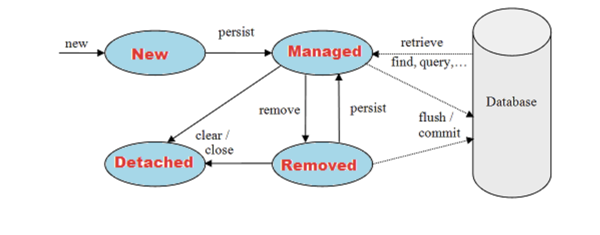

# Persistence Context

애플리케이션과 DB 사이에서 Entity를 영구적으로 저장하는 논리적 개념

<br/>

Entity Manager Factory는 하나만 생성하며, 애플리케이션 전체에서 공유

Entity Manager는 트랜잭션 단위로 독립적으로 존재하며 스레드 간 내용을 공유하지 않음

* 트랜잭션과 동시에 생성되고, 트랜잭션이 종료되면 close
* Entity Manager를 통해 영속성 컨텍스트(Persistence Context)에 객체를 보관




<div style="text-align: right"> Image ref : https://www.javaguides.net/2019/01/jpa-entity-object-life-cycle-new-managed-removed-detached.html</div>

**Status**

* 비영속 (new/transient)

  * 객체를 생성하고 영속성 컨텍스트에서 관리되기 전 상태

* 영속 (Managed)

  * 영속성 컨텍스트에서 관리되고 있는 상태
  * 1차 Cache에 올라간 상태를 의미
    * 새로운 객체를 생성해서 persist로 영속 상태로 만들거나, DB 조회한 객체를 1차 Cache에 저장
  * 영속 상태로 객체를 저장하기 위해서는 PK가 반드시 필요

  ```java
  // persistence unit name / Factory 생성
  EntityManagerFactory emf = Persistence.createEntityManagerFactory("pdb"); 
  // Entity Manager 생성 및 Transaction Get
  EntityManager em = emf.createEntityManager(); 
  EntityTransaction trx = em.getTransaction();
  trx.begin();
  // DB Query Insert Query 발생
  Member member = new Member();
  member.setId(2L);
  member.setName("NAME2");
  // 1차 Cache에 저장 - 이후 영속상태
  em.persist(member);
  // DB에 저장
  trx.commit();
  em.close();
  ```

* 준영속 (Detached)

  * 영속성 컨텍스트에서 저장되었다가 분리된 상태
  * Detach()는 특정 entity만 준영속 상태로 변경하는 것이고, clear()는 모든 엔터티를 준영속 상태로 변경
  * entity manager가 종료될 때 close()를 진행해도, 준영속 상태로 변경 (1차 cache 초기화)

```java
Member findmember = em.find(Member.class, 1L);  // select query
findmember.setName("Change-Name"); 
Member findmember2 = em.find(Member.class, 2L); // select query
findmember2.setName("change-name2");
em.detach(findmember); // findmember2의 update만 진행
```

```java
Member findmember = em.find(Member.class, 1L); // select query
findmember.setName("Change-Name");
Member findmember2 = em.find(Member.class, 2L); // select query
findmember2.setName("CHA");
em.clear();  // update query 미진행
```

* 삭제 (remove)
  * DB에서 delete query 발생

```java
Member findmember = em.find(Member.class, 1L); // select query
findmember.setName("Change-Name222");
Member findmember2 = em.find(Member.class, 3L); // select query
em.remove(findmember2);
trx.commit(); // update 진행 / delete query 진행
```


**1차 캐시**

* 트랜젝션 내에서 동작하며, DB를 조회하기 전에 확인하는 캐시

```java
// DB Query Insert Query 발생 (비영속 상태)
Member member = new Member();
member.setId(2L);
member.setName("NAME2");
// 1차 Cache에 저장 (영속 상태)
em.persist(member);

// Select Query 발생
Member findmember = em.find(Member.class, 1L);
System.out.println("Name =" +findmember.getName());
// Select Query 미발생
Member findmember2 = em.find(Member.class, 2L);
System.out.println("Name =" +findmember2.getName());
```

**동일성(Identity) 보장**

* 1차 캐시가 존재하기 때문에, 동일한 Transaction 내에서 반복 호출했을 때 동일성을 보장할 수 있음
  * Repeatable Read 등급의 Transaction 격리 수준을 DB가 아닌 App Level에서 제공

```java
Member findmember = em.find(Member.class, 1L);
Member findmember2 = em.find(Member.class, 1L);
// (findmember == findmember2)); True
```

**트랜잭션을 지원하는 쓰기 지연 Transactional write-behind**

* persist로 객체를 Persistence Context에 저장을 하지만, SQL을 바로 보내지 않음 (Buffering)
* Write SQL 저장소에서 보관 상태로 대기하다가, Transaction Commit() 명령이 발생하면 Write SQL 저장소에 저장되고 있던 객체를 한번에 DB에 저장 
* JPA에서는 SQL 실행이나 Transaction commit 전에 Flush() 명령을 포함하고 있음
  * flush란 persistence context 변경 내용을 db와 동기화 하는 작업
  * Query가 실행될때마다 Flush가 진행되므로, Flush Mode Option을 변경하여 불필요한 작업을 줄일 수 있음

**변경 감지 Dirty checking**

* JPA는 변경된 값을 감지하는 기능이 있어서, Update 시 Set으로 값을 변경만 해주면 됨
  * Set으로 값을 변경하고 persist를 진행하지 않아도 commit하면 update query 발생
* Entity 조회를 했을 때 1차 캐시에 저장하면서 최초의 값을 Snapshot을 찍어 놓음
* Commit 명령이 발생하는 시점, snapshot과 비교하여 변경된 값을 update query 진행 

```java
Member findmember = em.find(Member.class, 1L);
findmember.setName("name-change");
trx.commit(); // update query 발생
```

**지연 로딩 Lazy Loading**

