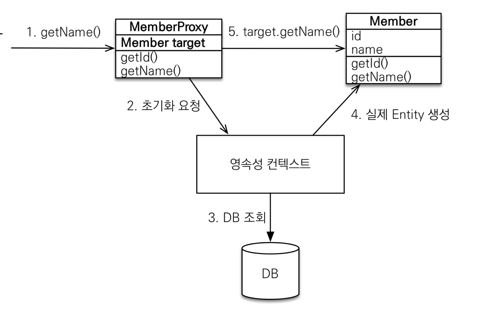

# Proxy

* 객체를 가져올 때, 연관관계를 포함한 엔터티까지 조회를 하게되는 경우 최적화 이슈가 발생

* 필요한 테이블만 조회하기 위해 Hibernate가 Proxy 엔터티를 생성

  * 프록시 객체는 처음 사용할 때 한번만 초기화를 진행
  * getReference() 메소드를 사용하여 Proxy 엔터티 생성

  * 원본 엔터티를 상속받아서 생성하기 때문에 구조가 동일하지만 타입은 다름
    * Instance of를 사용하여 비교해야 됨
  * 실제 객체를 연결해주는 target이라는 참조를 가지고 있음
  * Proxy 객체가 변경되는 것이 아니라, 실제 엔터티와 연결시켜줌
  * 원본 엔터티가 영속성 컨텍스트에 생성된 후, GetReference()를 호출하면 원본 엔터티를 return
    * proxy를 초기화하면서 DB를 조회하게 되고 이 때 실제 엔터티가 생생됨. 이후에 find()를 이용하면 proxy 엔터티를 return
  * close() / detach() / clear() 등 영속성 컨텍스트에서 관리하지 않는 경우, Proxy 엔터티를 초기화할 수 없음 



<div style="text-align: right"> Image ref : https://www.inflearn.com/course/ORM-JPA-Basic/dashboard</div> 

```java
Member member = new Member();
member.setUsername("TEST NAME");
em.persist(member);

em.flush();
em.clear();

// Member findMember = em.find(Member.class, member.getId());

Member findMember = em.getReference(Member.class, member.getId());
System.out.println("findmember.id = " + findMember.getId());
// DB에 있는 값이라서 호출되는 순간 SELECT 쿼리문 발생
System.out.println("findmember.username = " + findMember.getUsername());
```


### Lazy Loading

* 사용하려는 속성에서 `fetch =FetchType.LAZY` 옵션을  사용하여 Proxy 객체로 생성할 수 있음
  * 즉시 로딩은 `FetchType.EAGER` 옵션을 사용하며, 한번에 모든 테이블을 JOIN하여 가져옴
  * 즉시 로딩은  영속성 컨텍스트에 모두 저장되어 있기 때문에 Proxy 객체를 생성하지 않고, 실제 객체로 생성됨
  * 연관된 테이블이 많아지고 데이터가 많을수록 많은 부하를 발생시키므로 실무에서 즉시로딩은 사용 X
  * 즉시로딩은 N+1 Problem을 유발 (초기 쿼리 1개 + N개의 쿼리)
  * @ManyToOne 어노테이션은 Default가 Eager로 설정되어 있음
* proxy 객체의 속성을 사용할 때, 초기화가 진행되며 Query 발생

```java
@ManyToOne(fetch = FetchType.LAZY)
@JoinColumn(name="TEAM_ID", insertable = false, updatable = false)
private Team team;

-------------------------------------------------

Team team = new Team();
team.setName("Teamname");
em.persist(team);

Member member = new Member();
member.setUsername("TEST NAME");
member.setTeam(team);
em.persist(member);

em.flush();
em.clear();

Member m = em.find(Member.class, member.getId());
System.out.println("m = " + m.getTeam().getClass()); // Proxy 객체 생성

// Proxy 객체가 초기화되면서 쿼리 발생
m.getTeam().getName();
```


### CASCADE

* 특정 엔터티를 영속 상태로 만들 때, 연관된 엔터티도 영속 상태로 만듦
* CASCADE 선언한 Collection 내에 있는 엔터티를 영속화
* 다른 Entity에서도 종속된 Entity와 연관관계가 있을 때는 사용하게 되는 경우, 관리가 어려워짐
  * 단일 Entity에 완전히 종속일 때 사용

```java

@OneToMany(mappedBy = "parent", cascade = CascadeType.ALL)
private List<Child> childList = new ArrayList<>();

-------------------

Child child1 = new Child();
Child child2 = new Child();

Parent parent = new Parent();
parent.addChild(child1);
parent.addChild(child2);

em.persist(parent);
//            em.persist(child1);
//            em.persist(child2);
```


### 고아객체

* 부모 Entity와 연관관계가 끊어진 자식 Entity를 자동으로 삭제
* 특정 Entity가 소유하고 있어, 참조하고 있는 곳이 하나일 때 사용
* `orphanRemovel` 옵션을 사용

```java
@OneToMany(mappedBy = "parent", orphanRemoval = true)
private List<Child> childList = new ArrayList<>();

-----------------------
Child child1 = new Child();
Child child2 = new Child();

Parent parent = new Parent();
parent.addChild(child1);
parent.addChild(child2);

em.persist(parent);
em.persist(child1);
em.persist(child2);

em.flush();
em.clear();

Parent findParent = em.find(Parent.class, parent.getId());
em.remove(findParent);  // 부모 Entity를 삭제하면 연관된 모든 자식 Entity 삭제
//findParent.getChildList().remove(0); 자식 Entity를 제거
```


**CASCADE + 고아객체**

* 부모 Entity를 이용하여 자식 Entity의 생명 주기를 관리할 수 있음

```java
@OneToMany(mappedBy = "parent", cascade = CascadeType.ALL, orphanRemoval = true)


-----------------------
Child child1 = new Child();
Child child2 = new Child();

Parent parent = new Parent();
parent.addChild(child1);
parent.addChild(child2);

em.persist(parent);

em.flush();
em.clear();

Parent findParent = em.find(Parent.class, parent.getId());
findParent.getChildList().remove(0); // 자식 Entity를 제거
```

