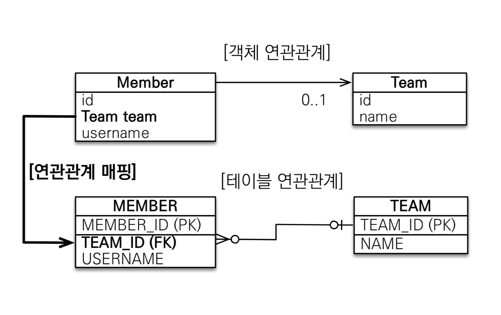

# Related Mapping

테이블은 외래키 `join` 을 사용하여 연관된 테이블을 찾지만, 객체는 참조를 사용하여 연관된 객체를 찾음

JDBC에서 테이블의 PK값을 멤버 변수로 가지고 있으므로 아래와 같은 테이블 연관 관계를 구현

* Member N - 1 Team 관계에서 멤버를 조회할 때, 외래키 식별자를 직접 다룸

```java
// Member class
@Id @GeneratedValue
private Long id;

@Column(name = "USERNAME")
private String username;

@Column(name = "TEAM_ID")
private Long teamId;


// Team Class
@Id @GeneratedValue
private Long id;
private String name;


// Implementation

Team team = new Team();
team.setName("TeamA");
em.persist(team);

Member member = new Member();
member.setUsername("member1");
member.setTeamId(team.getId());
em.persist(member);

Member findmember = em.find(Member.class, member.getId());
Long findTeamId = findmember.getTeamId();
Team findTeam = em.find(Team.class, findTeamId);
```


객체 연관관계에서는 객체를 외래키에 자동으로 매핑함

```java
// Member class
@Id @GeneratedValue
private Long id;

@Column(name = "USERNAME")
private String username;

@ManyToOne
@JoinColumn(name = "TEAM_ID")
private Team team;

// Implementation

Team team = new Team();
team.setName("TeamA");
em.persist(team);

Member member = new Member();
member.setUsername("member1");
member.setTeam(team);
em.persist(member);

em.flush();
em.clear(); // 영속성 컨텍스트를 비움

Member findmember = em.find(Member.class, member.getId());
Team findTeam = findmember.getTeam();
System.out.println("findteam = " + findTeam.getName());
```



<div style="text-align: right"> Image ref : https://www.inflearn.com/course/ORM-JPA-Basic/dashboard</div>


**양방향 Mapping**

* 양방향 매핑에서 테이블인 경우, 외래키를 Mapping하여 양방향 데이터를 가져올 수 있음
* 객체에서는 두 객체의 양방향 관계는 단방향 관계가 두개 연결되어 있는 것임
  * 둘 중 하나는 외래키를 관리하는 방식으로 설계해야 됨 (연관관계 주인, Owner)
  * 연관관계의 주인만 외래키를 CRUD 가능하고, 주인이 아닌 객체는 Read만 가능
  * Owner이 아닌 객체에서만 `mappedby` 속성 사용
  * Owner은 Table에서 외래키를 가지고 있는 테이블을 Owner로 설정하는 것이 관리에 용이 (1:N 관계에서 N인 테이블)

연관관계의 Owner가 아닌 객체에서 값을 넣었을 때, 읽기 전용이라 반영되지 않음

```java
Member member = new Member();
member.setUsername("member1");
em.persist(member);

Team team = new Team();
team.setName("TeamA");
em.persist(team);
team.getMembers().add(member);
```

| ID   | SetName | TEAMID |
| ---- | ------- | ------ |
| 1    | member1 | null   |

연관관계의 Owner에서 값을 넣엇을 때는 값을 변경할 수 있기 때문에 변경된 값이 반영됨

```java
Team team = new Team();
team.setName("TeamA");
em.persist(team);

Member member = new Member();
member.setUsername("member1");
member.setTeam(team);
em.persist(member);
```

| ID   | SetName | TEAMID |
| ---- | ------- | ------ |
| 1    | member1 | 1      |

객체 지향적으로 고려하면 양방향에 값을 삽입해야됨

Owner에만 Set을 할 경우 아래와 같은 문제가 발생할 수 있음

* flush를 하지 않고 조회를 했을 때, 1차 캐시에 로딩된 순수한 객체 상태로 조회하기 때문에 중간에 삽입한 값을 가져오지 못함
* TC 작성할 때, 반대의 경우도 사용하는 경우 문제가 생길 수 있음

```java
Team team = new Team();
team.setName("TeamA");
em.persist(team);

Member member = new Member();
member.setUsername("member1");
member.setTeam(team);
em.persist(member);
// team.getMembers().add(member);


public class Member {
    public void setTeam(Team team) {
        this.team = team;
        team.getMembers().add(this)
    }
}
```

Member라는 Owner 객체에서 추가해도 되지만, Owner가 아닌 객체에서 추가해도 됨

* 무한 루프에 빠질 수 있으니, 추가하기 편한 곳에서 한번만 추가

```java
Team team = new Team();
team.setName("TeamA");
em.persist(team);

Member member = new Member();
member.setUsername("member1");
em.persist(member);

team.addMember(member);	sleep0909!

public class Team {
    public void addMember(Member member){
        member.setTeam(this);
        members.add(member);
    }
}
```

